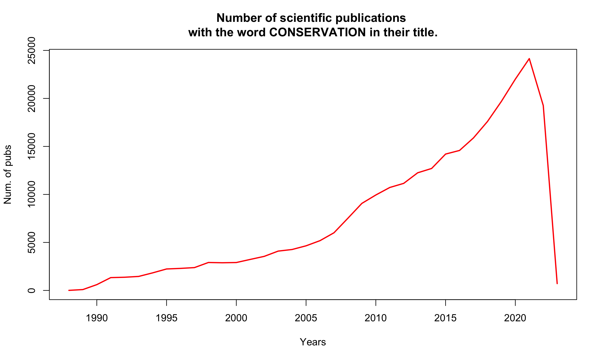
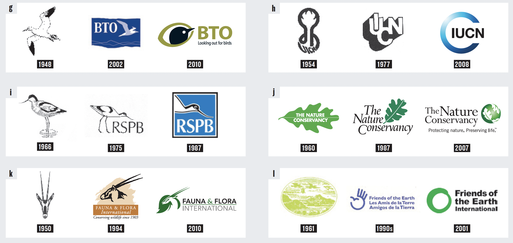
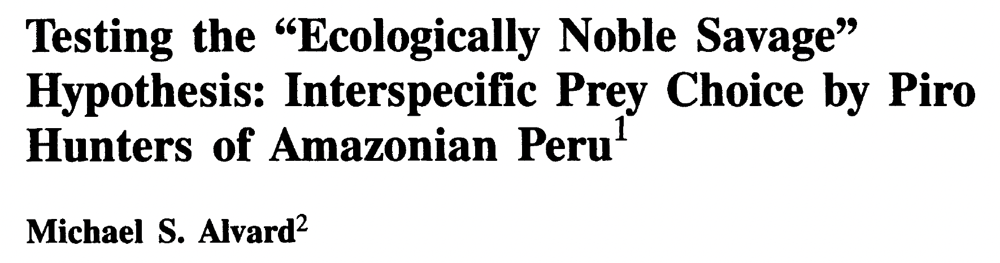
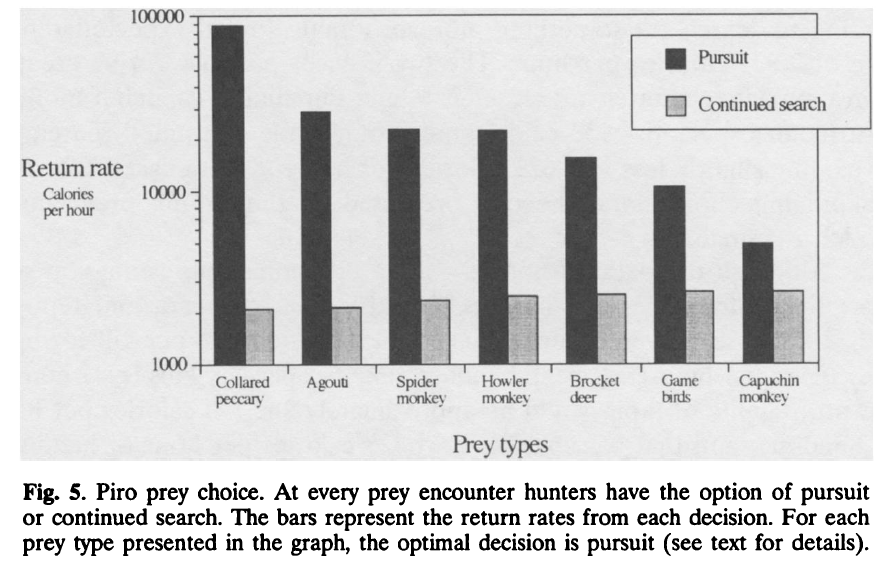
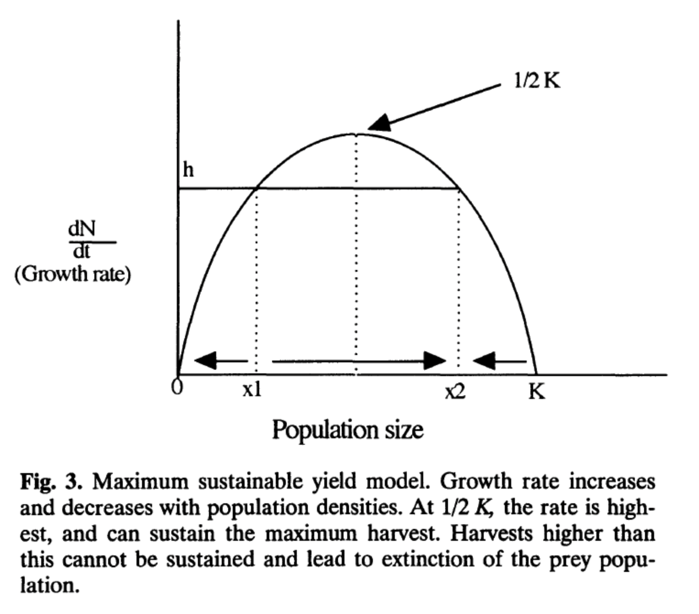
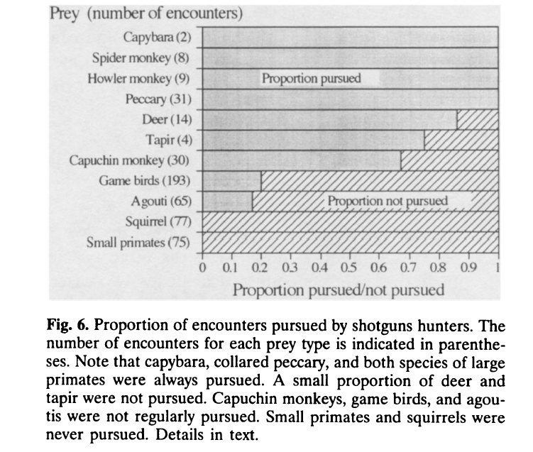
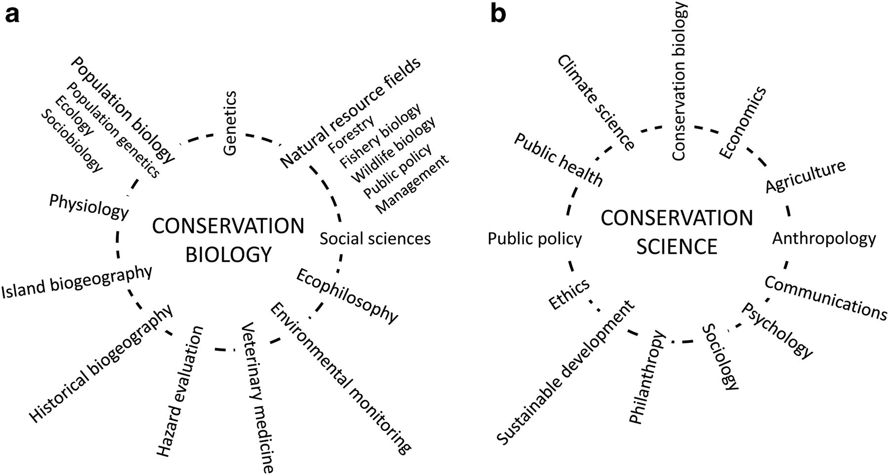

```{r setup, include=FALSE}
knitr::opts_chunk$set(echo = TRUE)
library("readxl")
library("tidyverse")
library("plotly")
library("reshape2")
library("DiagrammeR")
```

# Overview

## The course

-   This is a mandatory module for master level students enrolled in "Biologia Ambientale". It is worth **5 CFU** for a total of 40 hours (i.e., 20 classes of 2 hours each) to be administered in person during the first semester of academic year 2025/2026.

-   Classes are on Monday (14:00-16:00) and Thursday (14:00-16:00) in "Aula Centro Studi Pesca" (Laboratori di Ecologia Sperimentale ed Acquacoltura).

-   The course will be thought in Italian unless international students are present or unless you want me to teach it in English. All the material and the literature used will be in English.

## Resources

- The material presented is largely sourced from the book Conservation Biology [@VanDyke2020].

  - Introduction to conservation genetics [@Frankham2010]
  - Conservation and the Genomics of Populations [@Allendorf2022]
  - Literature I will provide every class
  
- My office hours are between 10:00 and 12:00 every Wednesday. It is best to first send me an e-mail: giuliano.colosimo@protonmail.com  

## Pre-requisites

- There will be a basic refresher on every single topic discussed throughout the course. Nevertheless, this is a master level course and students participating to this class are expected to have a good grasp of basic concepts in zoology, ecology, population biology, genetics, and molecular biology.

- Throughout the course I will go over examples and exercises to better grasps the concepts and methodologies that we will be discussing. My software of election is \textsf{R}, which is a freeware and runs on all platforms. I strongly encourage you to bring your computer and try and replicate the examples we discuss about. 


## Learning objectives

-   The course aims at providing students with the most fundamental tools to understand, acknowledge, describe, and address problems related to the conservation of Biodiversity. More broadly, students will develop an appreciation of the concept of Conservation.

-   Topics covered during the course include: loss of genetic variability in small populations; inbreeding and decreased fitness; fragmentation of populations; definition and maintenance of evolutionary potential; population size and estimators; climate change; conservation technology and conservation economics.

---

-   By the end of the course you should be able to identify, understand, analyse and solve issues related to the conservation of biological diversity, especially at the level of population and species.

-   Students are expected to develop professional language and communication skills through a continuous interaction with the teacher and discussion during classes.

## Course evaluation

-   \textcolor{red}{Two mid term exams.} The first mid term will cover the material studied up until the exam date. The second mid term will cover the new material thought after the first mid term. At the end, if you are satisfied with the average of the votes you can keep the grade. If you are not satisfied you can improve (or decrease!!) your vote with an oral exam. If you are completely dissatisfied with the outcome of your mid term exams you will have a chance to do a final comprehensive written exam covering everything we did in class.

-   \textcolor{red}{Students presentations.} Each student will be assigned a manuscript that he/she will present to the rest of the class in a 15 minutes presentation.

## Course website

- I prepared website for this course that you can access \href{https://giulianocolosimo.github.io/conservation_biology/}{here}.

- All slides will be posted here immediately before or after the class, so that you can download them and review the material for later study.

- Make sure to periodically check the website because that is where I will post the changes to the schedule and the list of manuscripts and dates for everyone's presentation.

# Introduction

## What is Conservation Biology?

. . .

- Conservation biology is \textcolor{red}{not defined by a discipline, but by its goal} [@VanDyke2020].

-   Ecologists, geneticists, zoologists, botanists, microbiologists, evolutionary biologists, bio-engineers, politicians, (etc. etc. etc.) do not stop their job and career but unite their expertise towards a common goal.

- A \textcolor{red}{crisis discipline}, providing knowledge and tools to preserve biodiversity. It does not draw all its theory and models only from biology [@Soule1985].

- \textcolor{red}{May 8 1985}, Society for Conservation Biology (SCB), Ann Arbor (MI, USA)

---

- Genuine conservation can occur only when humans intentionally use resources at less than maximum sustainable rates or forego the use of some resources altogether. This kind of conservation is motivated by appreciating an intrinsic value of the resource itself or from the desire to provide a long-term supply of the resource for others, including others still to come in future generations [@VanDyke2020].

- Conservation has benefits for humans but \textcolor{red}{requires restrain and incurs costs}. Conservation that involves neither restraint nor cost is not conservation. 

- If we are careless in defining conservation it is easy to make historical generalizations that are not true.

---

{width="90%"}

---




## The origins of conservation

- For thousands of years humans have \textcolor{red}{\emph{managed}} natural resources and have always appreciated the importance of preserving the natural environment.

  - Plato (\~427—348 b.c.), through the words of Critia, laments the bad conditions of the land that is no longer productive and rich how it used to be [@Platone].
  - Judaism extended the principle of the Sabbath to agricultural land [@Levitico25].
  - During the Song dynasty (China, 960---1279 AD) it was common practice to set aside *fengshui* (sacred) portions of the land, mostly forest, to help regulating spiritual and physical power. Modern china forgo this view.

## Fossil fuel consumption

 on 2023-02-07](./ffconsumption.png){width="85%"}


## New record in $CO_2$ atmosphere

](./8_co2_ifq.png){width="76%"}

## Earlier EOD (Earth Overshoot Day)

)](./9_eod.png){width="100%"}

## Deforestation

 on 2023-02-07](./deforestation.png){width="90%"}

## Biodiversity loss


 on 2024-03-05](./glplan_wrld.png){width="90%"}

::: {.notes}
The index value measures the change in abundance in 31,821 populations across 5,230 species relative to the year 1970 (i.e. 1970 = 100%).
:::

# Ecologically Noble Savage

## Why are we so bad at "conservation"?

. . .

-  Many have argued that our incapability to conserve is driven by greed. It may be deeper and more complicated than that!
  


---

-  Are indigenous people really better than the industrialized civilization at conserving nature? Can we learn from them how to conserve it?

-  Many of the misconceptions concerning the apparent conservation proclivities of traditional peoples are the result of an imprecise understanding of what constitutes conservation [@Alvard1993].

. . .

-  It is hard to imagine the evolution of behavioral traits beneficial to a group of individuals if these traits are contrary to the individual's best interest [@Williams1966].

-  There is little theoretical justification for expecting individuals to conserve open access resources [@Alvard1993].

---

-  A small group of individuals living in an abundant and productive environment can easily manage their resources in a sustainable way! For example, in a place with great abundance of prey, hunters can even be wasteful in their hunting, and yet cause little to no damage to the environment.

## Defining conservation using the foraging theory

-   Obtaining the highest quantity of food is expected to augment fertility and survivorship and to allow engaging in other fitness enhancing activities. Individuals that follow this strategy are defined: *rate-maximizers*.

-   Non *rate-maximizers* will be selected against by natural selection.

. . .

::: callout-important
# Question(?)

Based on the premises described above, can you think of a scenario in which a *conservation* strategy/behavior could evolve?
:::


---

-   Conservation should not be defined based on the effect of a certain behavior. Rather, we can here define conservation based on foraging theory as a [specific restrain behavior that endures a cost in the present to have a benefit in the long run]{style="color: red;"} [@Alvard1993].

-   No restraints in foraging behavior means no conservation, even if the behavior produces a sustainable outcome!

::: callout-note
# Working hypotheses

-   Native people are conservationists!

-   Native people will over-exploit resources whenever it is to their advantage to do so!
:::


---

::: callout-tip
# Expectation
- Evidence for conservation would consist of hunters forgoing opportunities to kill vulnerable species that are nonetheless predicted by foraging theory to be pursued.

:::

- The native people considered in this study are the **Piro** community of Diamante, situated in the lowland rain forest environment of southeastern Peru.

- The profitability of prey type $i$ is $e_i/h_i$. The prey are ranked according to their profitability, such that is $e_1/h_1 > e_2/h_2... > e_n/h_n$. 

---

-   $h_i$ = handling time with an individual of type $i$ after encounter
-   $e_i$ = average expected net energy gain after encounter with prey type $i$
-   $\lambda_i$ = rate of encounter with prey type i

Beginning with the most profitable type (which is always included in the diet), prey are added to the diet, one by one, until a prey item is found that has a lower return rate upon encounter than could be obtained from searching for more profitable prey. 

$$
\frac{\sum_{i=1}^n \lambda_i e_i}{1+\sum_{i=1}^n \lambda_i h_i} > \frac{e_{n+1}}{h_{n+1}}
$$

After @Alvard1993, but see also @Stephens1986

---

{width=80%}

---

{width=80%}

---

{width=80%}

---

## Take home messages from Alvard (1993)

-   Development and use of an operational definition of conservation that allows empirical tests.

-   The prey items that are always pursued by Piro shotgun hunters closely match those predicted by foraging theory. These are large, high ranked animals in the optimal diet.

-   The observation that no restraint was shown killing the large primate species is the strongest evidence contrary to the conservation hypothesis.

-   Native populations are expected to desire the same material benefits than other, more developed peoples, enjoy such as adequate nutrition, shelter, health care, and education.

-   Is conservation behavior something that still needs to evolve?

## Core merits of conservation biology

| Merit | Conservation biology... |
|----------------------|--------------------------------------------------|
| Basis in preserving biodiversity. | ...focuses on preserving and conserving biodiversity rather than managing individual species. |
| Value laden and value driven. | ...is committed to valuing biodiversity, regardless of its utilitarian value. |
| Mission- and advocacy- oriented. | ...emphasizes intentions and actions to save species and habitats. |
| Crisis-oriented. | ...requires rapid investigation and response even before risk or replication studies can be performed. |


------------------------------------------------------------------------

| Merit  | Conservation biology...(continued) |
|--------------------|----------------------------------------------------|
| Integrative and multidisciplinary. | ...synthesizes information across disciplines (biology, ecology, ethics, politics, and others). |
| Concerned with evolutionary times. | ...seeks preservation of genetic information and processes that promote speciation for future biodiversity, not just conservation for present organisms. |
| Adaptive. | ...treats management options as experimental and imprecise, where outcomes may be risky or unpredictable. |

After @VanDyke2020

# A modern take on Conservation Biology



## Synthesis

-   Conservation finds its origin in moral arguments about the intrinsic value of nature.
-   Conservation biology can succeed only if its purpose is sought through the application of the best scientific knowledge to preserve nature and its intrinsic value.
-   Conservation cannot be accomplished without moral and economic restraint.
-   "The success of conservation efforts depends also on how we are perceived by decision makers and the public at large. Although we must alert these groups to impeding ecological challenges, we must also give them reason for hope" [@Beever2000].

## To read for next time...

-   [Testing the "Ecologically Noble Savage" hypothesis: Interspecific Prey Choice by Piro Hunters of Amazonian Peru](https://drive.proton.me/urls/D7G03YCHHG#bZKNKTe533fv)

# References {.allowframebreaks}
