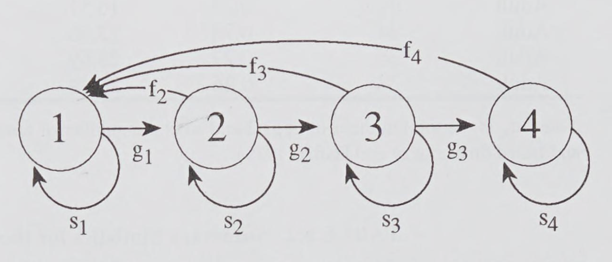
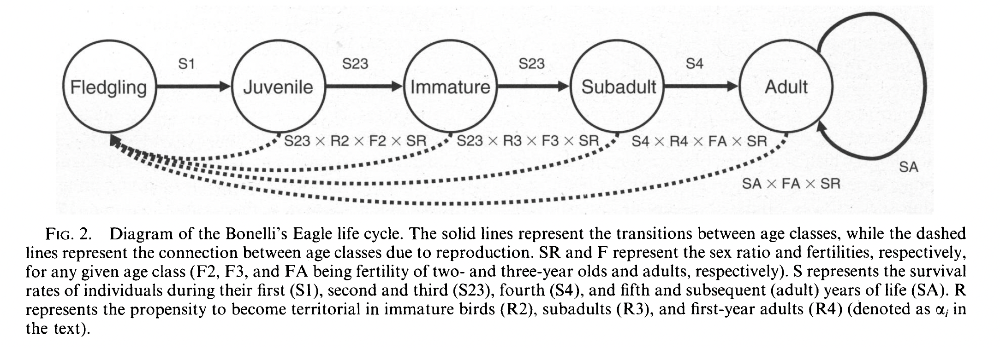
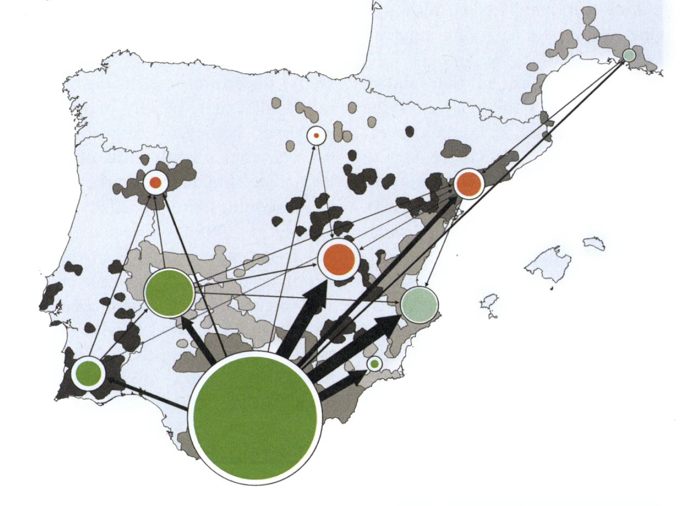
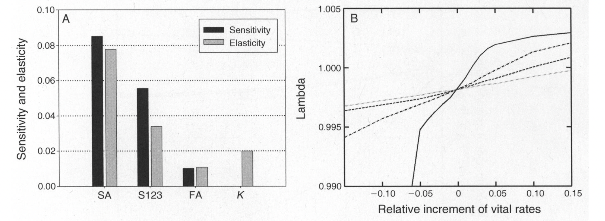

```{r setup, include=FALSE}
knitr::opts_chunk$set(echo = TRUE)
x <- c("DT", "tidyverse", "RColorBrewer", "learnPopGen")
lapply(x, require, character.only = T)
rm(x)
```

## Sequential steps in population conservation

1.  [Inventory]{style="color: red;"}: assessing the presence of rare taxa documenting their presence and within geographic and political units
2.  [Survey]{style="color: red;"}: ecologically based assessement of such units to identify population specific habitat(s) and andangerement factors
3.  [Habitat protection]{style="color: red;"}: application of land use restrictions tha can be applied/negotiated and that generate the least political resistence to immediately benefit the endangered population(s)
4.  [Management]{style="color: red;"}: human intervention to remedy whatever is causing the population decline or small size
5.  [Monitoring]{style="color: red;"}: systematic measures and sampling of the population(s) and processes related to it over time
6.  [Recovery]{style="color: red;"}: when the population numerical level is such to make extinction by natural catastrophe or environmental, demographic or genetic stochasticity an unlikely event [@VanDyke2020]

## Minimum Viable Population

-   When dealing with critically endangered species one question that we often ask is: [what is the minimum number of individuals needed in a population to ensure its persistence]{style="color: red;"}?

-   Much of the genetic tools we discussed so far are useful in answering this question

-   The "rule of thumb" of $N_e = 50$ to prevent deleterious effects of inbreeding or the minimum size of 500 individuals to maintain sufficient genetic variation counter the effects of genetic drift are, unfortunately, too general

------------------------------------------------------------------------

-   The genetics of a population/species is not the only concern! Many authors, discuss the fact that in small populations greater threats to their persistence comes from random variation in various demographic parameters (birth and death rates, survival, recruitment) and the effects of random environmental variation on the population's rate of increase (i.e., environmental stochasticity) [@VanDyke2020].

-   The above considerations constitute the background for the formulation of a new concept: MVP - Minimum Viable Population [@Shaffer1981]

------------------------------------------------------------------------

-   MVP is a concept that should help to underatand and figure out [the minimum number of individuals needed to make sure that the population survives for a given period of time with an associated probability of persistence]{style="color: blue;"}

-   Conventionally, MVP was the number to ensure a 95% probability of persistence of a population for 100 or 1000 years

-   Unfortunately, given the inherently stochastic nature of natural phenomena, the idea of coming up with a MVP value has been abandoned, especially when we consider the larger context of conservation biology [@VanDyke2020]

------------------------------------------------------------------------

-   The focus has initially switched from MVP to Persistence Likelihood (PL), and eventually it has been refined in what is today known as [PVA or Population Viability Analysis]{style="color: red;"}, a type of assessment based on the analysis and model of long term population data

-   [PVAs]{style="color: red;"} make a quantitative assessment of the probability of extinction of a given population or species and estimates the probability of stochastic events in a population

## Population Viability Analysis

-   PVA is a specific application of what is known as **risk assessment**, specifically purposed to analyse and identify risks for endangered species

-   Like the more usual forms of risk analysis applied to issues of public health and safety, PVA attempts to estimate the likelihood of future events based on currently available data and theory, both of which contain some degree of uncertainty [@Shaffer1981].

------------------------------------------------------------------------

-   A more precise definition of PVA is provided by @Lacy1993 according to whom [a PVA is the estimation of extinction probabilities using analyses that incorporate identifiable threats to population survival in to models of the extinction process]{style="color: red;"}

-   To accomplish, measure, and communicate the goals of evaluating extinction risks and estimating population persistence, PVAs generate [viability measures]{style="color: blue;"} that quantify different characteristics of a studied population essential for its persistence [@VanDyke2020]

------------------------------------------------------------------------

| Viability measure               | Number of cases |
|---------------------------------|-----------------|
| Probability of extinction       | 39              |
| Population size at a given time | 19              |
| Time to extinction              | 18              |
| Probability of quasi-extinction | 7               |
| Occupancy                       | 7               |
| Probability of decline          | 6               |
| Growth rate                     | 6               |
| Time to quasi extinction        | 5               |
| Minimum viable population       | 5               |
| Minimum area required           | 2               |

Viability measures summarized from 78 PVAs studies covering 82 species [@Matsinos2013].

## What is PVA used for?

-   Identifying relative importance of factors affecting population dynamics and viability

-   Assessing extinction risk

-   Identifying critical habitats

-   Weighing ecological and socio-economic tradeoffs

-   Prioritizing management alternatives

-   Communicating conservation problems to stakeholders

-   Identifying conservation knowledge gap to guide further research

------------------------------------------------------------------------

-   PVA models assume that enough is known about the ecology, dispersal, genetics, demography, and distribution of the population under study to make an accurate estimate of the probability of persistence.

-   One of the added values of PVAs is that they can also model the influence of specific causes in determining how the probability of persistence varies over time.

-   PVA are also extremely useful when working with particularly small populations, where direct experimental manipulation will have low statistical power (due to the low number of samples and potential replicates).

------------------------------------------------------------------------

-   We can broadly distinguish two types of PVA models: deterministic ones, where elements are not determined by random processes; stochastic ones, where elements are determined by random processes.

-   The latter class of models is more complicated, but also more accurate as many of the elements that a PVA tries to model are inherently stochastic.

------------------------------------------------------------------------

## A stage based PVA model

-   Many species of animals and plants have life cycles with distinct ages, life history stages or sizes that influence population growth [@VanDyke2020].

-   Therefore, to perform a PVA, we need a model in which age, size, sex and stage specific demographic parameters are known and properly related to one another.

{width="65%" fig-align="center"}

## Incorporating stochasticity

-   In deterministic models transition probabilities are held constant over time, and populations are free to increase withouth bounds. This is a useful mathematical model, but very unrealistic from the biological point of view.

-   To incorporate the array of possible variation that can influence population growth in nature stochastic models are better suited and incorporate elements that deterministic models do not [@VanDyke2020]!

------------------------------------------------------------------------

-   For example, stochastic models can incorporate climatic changes and environmental stochasticity (drought and wet years), or demographic stochasticity (unexpected changes in birth or death rates).

-   Further, stochastic models usually incoroporate the concept that natural population often have growth bounds related to the environmental carrying capacity ($K$), posing a limit beyond which the population cannot grow.

-   Finally, stochastic models can also incorporate probability values for uncommon and usually catastrophic events [@VanDyke2020].

------------------------------------------------------------------------

## Evaluating elasticity

-   Understanding how to translate PVA results into meaningful management actions requires that we know what are the most important variables in our model, and how they affect the persistence of our population.

-   Large changes in some variables may have little to no changes on our PVA results, while small changes in some very specific variables may have a great impact on our results [@VanDyke2020].

-   We can conduct an elasticity analysis to figure out what variables are the most important to our PVA and determine the the effect of proportional changes of these analysis on our results.

-   The variable (or variables) with the greatest proportional effect on values of $\lambda$ (i.e., the discrete time rate of increase) are also the ones that should be considered more carefully for management.

------------------------------------------------------------------------

-   @Hernandez2013 provide a good example of stage-based analysis on an animal model.

{width="80%"}

------------------------------------------------------------------------

-   12 different populations monitored for 20 years, with the collection of important demographic parameters.

-   Their analysis revealed that a single large population on the Iberian peninsula was the primary source for the other populations which had lower rates of reproduction and survival (a classic source-sink dynamic as described in a previous lesson).

---

{width="70%"}

------------------------------------------------------------------------

-   Based on the results of the elasticity analysis it was clear that population growth was most sensitive to adult survival.



------------------------------------------------------------------------

## PVA are complicated. How to make a good one?

1.  Inform the PVA with real and solid data, collected over an extended period of time and under a variety of conditions.

2.  Make clear and explicit assumptions based on what is known about the species.

3.  Initial performance of a PVA are subject to a sensitivity analysis of all variables included.

4.  The PVA is able to identify and address uncertainties in the analytical process.

---

5.  Modelers are able to identify parameters that can be manipulated directly by management actions.

6.  The PVA analyzes and ranks the outcome of different management scenarios based on the effects on one or more variables included in the model.

7.  The PVA is able to prescribe real population levels necessary for the species to persistence, which then serves as guidelines for recovery criteria

## Software to produce a PVA

. The original software was developed by @Lacy1993 and recently restyled as described in @Lacy2023](./class_16_6.png)

## Useful R tools to perform a PVA

-   There is an R package providing useful tool to run commands and visualize results from the Vortex program (Vortex needs to be installed on your computer for this to work). A description of how the package works is provided in @Pacioni2017b.

-   A very good introduction to the simulation process of a PVA in R is available [here](https://kevintshoemaker.github.io/NRES-470/LECTURE12.html). This is part of a series of on-line lessons in Applied Population Ecology.

-   [Here](https://cran.r-project.org/web/packages/PVAClone/PVAClone.pdf) there is a whole package that should allow to perform a Population Viability Analysis in R using pre-compiled functions and visualization tools.

## Predict extinction risk using PVA

-   The next few slides are borrowed from an on-line class available [here](https://rushinglab.github.io/WILD3810/index.html)

-   The WILD3810 package includes an R function that simulates the dynamics of a user-defined number of populations that are subject to both environmental and demographic stochasticity. This function has a number of parameters that you can change to alter the deterministic and stochastic processes that govern population growth. In this lab, you will selectively change several of these parameters to see how each influences extinction risk.

```{r pva1, echo=TRUE, eval=FALSE}
install.packages("devtools")
devtools::install_github("RushingLab/WILD3810")
```

## 

```{r pva2, echo=TRUE, eval=FALSE}
library(WILD3810)
sim_test <- pva(N0 = 20, number.of.years = 100, 
                r0 = 0.05, variance.r = 0.05)
sim_test
```

# References {.allowframebreaks}
