```{r setup, include=FALSE}
knitr::opts_chunk$set(echo = TRUE)
x <- c("DT", "tidyverse", "RColorBrewer", "learnPopGen")
lapply(x, require, character.only = T)
rm(x)
```

\vspace{1cm}

. Image downloaded from [here](https://showyourstripes.info/s/globe).](./class_20_1.png){width="100%"}

------------------------------------------------------------------------

\vspace{1cm}

.](./class_20_2.png)

------------------------------------------------------------------------

\vspace{1cm}

.](./class_20_3.png)

------------------------------------------------------------------------

-   Traditionally, habitat destruction and invasive species constituted the two main obstacles to biodiversity conservation.

-   While this still holds true, climate change is expected to function as new as well as intensifier of already existing threats.

-   Global climate change has the potential to completely debunk existing local, regional, and national conservation plans, regardless of their good intention and design.

------------------------------------------------------------------------

-   ...upon the North American continent, one single factor does seem to loom up as being the most frequent delimiter of distribution, or even the ultimately effective one, in greater or lesser degree, even thhough other factors may play a role too [@Grinnell1917].

-   Grinnel considered temperature a *limiting* factor, but not a *changing* one! Moreover, he did not think as temperature (and other climate factors) as time-dependent and mutating!

------------------------------------------------------------------------

-   ...climate change probably has the greatest potential to alter the functioning of the Earth system; its direct effects on natural and managed systems ultimately could become overwhelming...nevertheless, the major effects of climate change are mostly in the future, while most of the others are already with us [@Vitousek1992].

-   Climate change is a problem right now [@Molina2014], so we do not have to wait for future scenarios. The speed of contemporary changes is faster than most of the past events and is actively challenging the effectiveness of twenty century conservation [@VanDyke2020].

------------------------------------------------------------------------

-   ...the stated purpose of the Prince Albert National Park is to protect for all time the ecological integrity of a natural area of Canadian significance representative of the souther boreal forest...Yet, all six vegetation change scenarios examined projected the eventual loss of boreal forest in this park suggesting that the park's mandate would be untenable in the long term [@Lovejoy2008].

## Periodicity in annual variation.

[Video credits: NASA/JPL-Caltech. Video source](https://climate.nasa.gov/news/2948/milankovitch-orbital-cycles-and-their-role-in-earths-climate/).

## Discontinuities

-   In contrast to regular changes, discontinuities, jumps, trends or increasing variability all represent forms of climate change.

-   In such cases means of climate variables do not remain the same or stationary over long time periods, but are altered.

-   Climate discontinuities and climate jumps occur when climate variables, relative to the length of the temporal cycle, show a large change in magnitude over a relatively short amount of time. After the jump a new baseline emerges that is different from the previous one.

------------------------------------------------------------------------

-   Increasing variability occurs when the mean of the variable remains the same, but its range of variation increases significantly. In such case, individual weather events become more unpredictable and dramatic.

-   Variational trends refer to changes in which the range of variation remains within historical norms, but with movement of the mean in one direction (increasing or decreasing).

------------------------------------------------------------------------

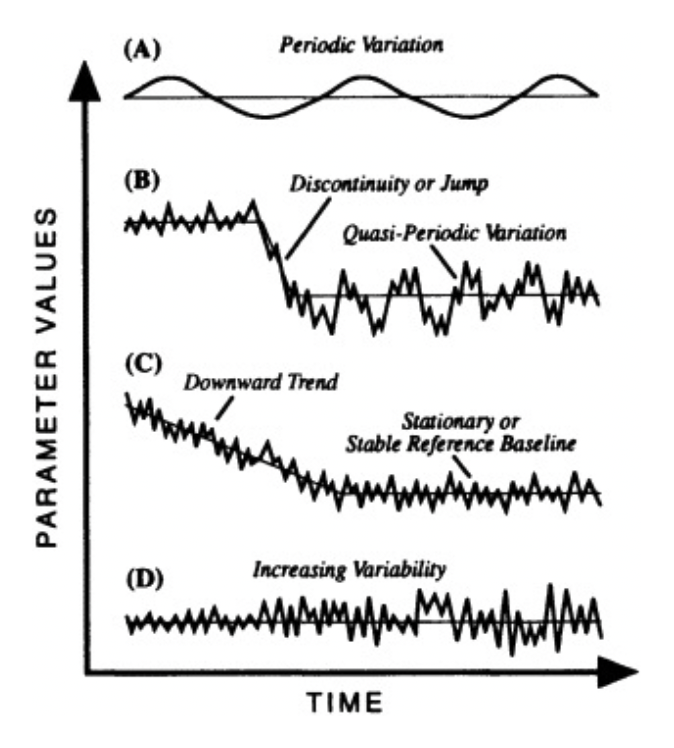{width="50%"}

## Contemporary changes VS past changes

-   The range of temperatures on earth is driven by the absorpion of solar radiation from the sun.

-   The average earth net income of such solar radiation is $342 \ W/m^2$ [@Lovejoy2008].

-   About $31\%$ of such energy is reflected back in space and never reaches the surface.

------------------------------------------------------------------------

-   The rest of the radiation is reflected and when it happens the emitted radiation is changed in wave length to long infrared radiation. This is an important passage because infrared radiation can become trapped by the so called Greenhouse gasses (GHG) such as water vapor ($H_2O$), methane ($CH_4$), ozone ($O_3$), nitrous oxide ($N_2O$), and carbon dioxide ($CO_2$).

-   This absorption creates an additional net influx of energy on earth.

-   To conserve the energy balance of the system there must be some change in non-radiative energy, including temperature!

------------------------------------------------------------------------

\vspace{1cm}

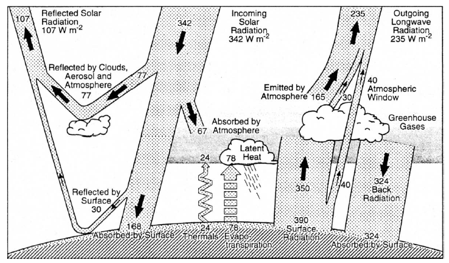{width="85%"}

------------------------------------------------------------------------

-   Each GHG varies in its capacity to absorb longwave radiation and in other ways it can affect its overall contribution to the warming produced

    1.  The amount of gas released in the atmosphere per year

    2.  The length of time the gas stays in the atmosphere (also known as residence time)

    3.  Its capacity to affect the atmosphere chemistry

    4.  Its concentration and capacity to interact with other GHG

-   Considering all these factors together, water vapor ($H_2O$) and carbon dioxide ($CO_2$) contribute for $60\%$ and $26\%$ of the warming respectively.

## Rapidly rising CO2

-   Humans, through their, activities are contributing to the dramatic increase of greenhouse gasses.

-   Of these, $CO_2$, through the burning of fossil fuel, is the one increasing the most and having the largest effect on the absorption of energy, as in normal conditions it contributes for about $26\%$ of the warming effect [@Kiehl1997].

-   Direct measurements of $CO_2$ (and other GHG) emission began in 1958 in Hawaii, but older records can be estimated by measuring the concentrations of GHG trapped in, for examples, ice cores.

-   Ice cores collected in antarctica helped to estimate GHG concentrations over the last 800K years.

------------------------------------------------------------------------

.](./class_20_5.png){width="85%"}

------------------------------------------------------------------------

-   Drawing on ice cores and other inferential data, climatologist M. J. Apps and colleagues were able to estimate temperature and $CO_2$ levels going back to 1.5 million years ago!

-   Throughout at least the last 4 glacial cycles, spanning nearly 1.5 million years, ..., the amtmospheric concentration of $CO_2$ only varied \~180ppmv during glatiations ... and \~280ppmv during the interglacial periods. This narrow range of variation is remarkable, given that its concentration is determined by a highly dynamic biogeochemical cycle...[@Bhatti2006].

-   Current concetration levels of $CO_2$ are \~410ppm

------------------------------------------------------------------------

-   More troubling is the rate of increase of such concentration, which is 5 times greater than every other historical $CO_2$ increase on record, and 100 times faster than the rate of increase at the end of the last ice age.

-   Because overall $CO_2$ concentrations, and human contributions to them are still rising, and are expected to continue rising at least until the first half of the $21^{st}$ century, the world appears to be decades from climate stability [@VanDyke2020].

------------------------------------------------------------------------

.](./class_20_6.png)

## Common ecological response to climate change

-   A range of species-specific responses have been identified along with a range of common patterns of response shared among taxonomic or ecological guilds [@VanDyke2020].

-   @Parmesan2003 conducted a meta-analysis evaluating over 1700 species to determine if recent biological shifts in range and timing of the analyzed species matched predictions from climate change analysis.

-   In 2013 another group of researchers, including Camille Parmesan, conducted a new analysis on marine organisms documenting that $83\%$ of observed changes in single species were according to what was predicted by climate change [@Poloczanska2013].

------------------------------------------------------------------------

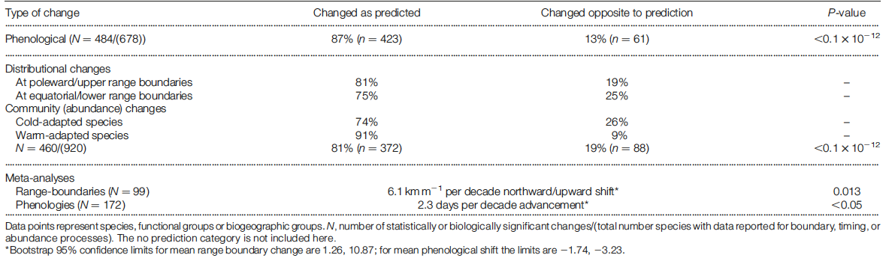

-   These changes in species response are not random, but consistent with the directions predicted by climate change. The range of responses is scattered across species and ecosystems, indicating global and widespread implications of climate changes [@VanDyke2020].

## Phenological changes

-   Changes in species phenology, the seasonal timing of life history traits, is one of the most unambiguous consequence of climate change.

-   Life history traits, fecundity, development and survivorship, are highly plastic (they show adaptive response) to variation in temperature.

-   This means that species and individuals can have their physiology, behavior and even morphology modified by changes in temperature patterns and climate changes.

-   @Inouye2000 documented that over the time-span of 23 years the yellow bellied marmots, *Marmota flaviventris*, had advanced their emergence date by 38 days as a result of warmer local spring air temperature in Colorado (USA).

------------------------------------------------------------------------

![Marmot appearance. [After @Inouye2000]](./Marmot%20appearence.png){width="65%"}

## Pollination patterns

-   Climate change is affecting the flowering date of many plants, advancing the flowering in the spring [@Calinger2013].

-   Accordingly, many fo the pollinator species that feed and contribute to plant pollination are now appearing earlier in the year.

-   When phenological changes in plants (i.e., earlier flowering time) and pollinators (i.e. earlier emergence in the season due to early emergence from eggs or awakening from hibernation) happen at the same time the degree of sinchronization is maintained. However, when the timing of one species changes faster than the other, or when the shifts happens in different directions such disagreement can cause plants population depression or pollinators starvation [@Morton2017].

------------------------------------------------------------------------

\vspace{1cm}

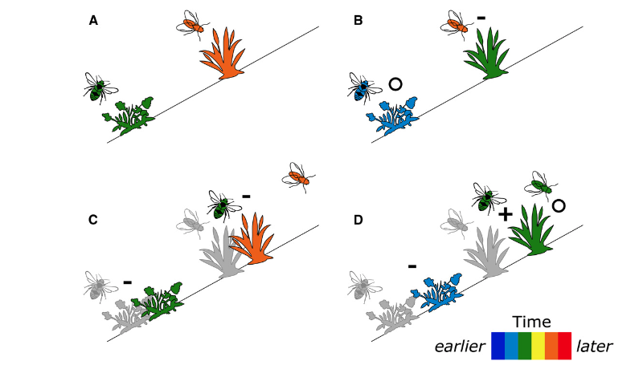{width="80%"}

## Predator-prey dynamics

-   The Skagit river is a key wintering site for bald eagles in Washington (USA).

-   @Rubenstein2018 considered trends in habitat use, salmon escapement (the proportion of salmon that does not get caught by the prey) and the timing and instensity of flood events.

-   The authors found that peak presence of salmons and eagles has advanced of about $0.45$ days/year in the past 30 years. The predator demonstrated the ability to rapidly respond and take advantage of ephemeral resources across the landscape.

------------------------------------------------------------------------

-   The authors also noticed that the population of prey also showed an asynchronous response to flood events. The interval between population peak and first flow event grew approximately of $1$ day/year [@Rubenstein2018].

-   The ecological outcome of this shift are still not completely understood, but could have a cascade effect in the way trophic components of the fresh water ecosystem interact with the marine ecosystem.

## Range shifts

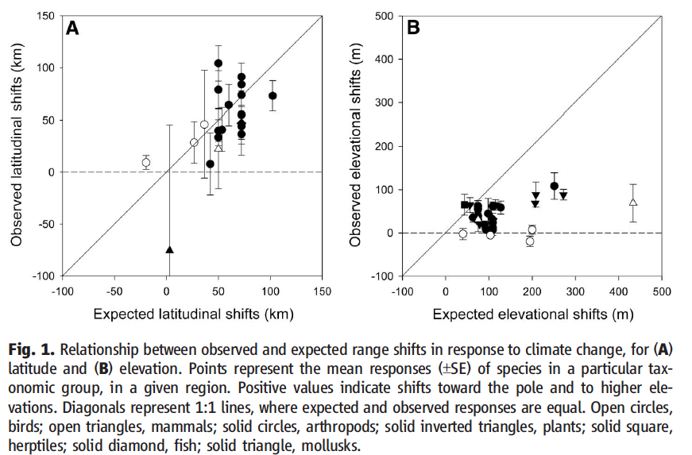{width="70%"}

## Other effects of climate change

-   Rising sea temperatures and deepening fish assemblages

-   Contracting ranges.

-   Spread of pathogens.

-   Competitive advantages of invasive species.

-   Increasing threat of extinctions.

-   Declining health and local disappearing of coral reefs.

-   Disappearing ecosystems and the species that rely on them.

## Tools for assessing future climate changes

-   Accurately anticipating the effects of climates change on biodiversity requires a multidisciplinary approach and numerous and diverse lines of evidence.

-   Reviewing paleoecological observations, recent phenological and microevolutionary responses, experiments and computational models, @Dawson2011 concluded that reliance on a single scientific approach creates risks of policy or management failures.

------------------------------------------------------------------------

-   *Vulnerability* to climate change is defined as the extant to which a species or population is threatened with decline, reduced fitness, genetic loss of extinction due to climate change as a function of three primary components: \textcolor{red}{exposure}, \textcolor{green}{sensitivity} or \textcolor{blue}{adaptive capacity}.

-   \textcolor{red}{Exposure} is defined as the extant of climate change likely to be experienced by a species or locale [@Dawson2011].

------------------------------------------------------------------------

-   The rate and magnitude of the change provide an indication of how strong and disruptive the change will be to the ecosystem enduring it.

-   The drivers of this change are societals demands and needs which results in associated variation in GHG emessions [@VanDyke2020].

-   A range of potential future changes can be developed via Global Climate Models (GCMs) and can downscaled to highlight abiotic pressures or resulting effects on the physical environment.

------------------------------------------------------------------------

-   These climate scenario are also the ones used within Ecological Niche Models (also referred as climate envelop models), which use statistical relationship between climate variables and species distributions.

-   ENMs are useful to map how species' preferred environmental space moves according to climate changes.

-   \textcolor{green}{Sensitivity} is defined as the degree to which the survival, persistence, fitness, performance, or regeneration of a species or population is dependent on the prevailing climate, particularly on those variables that are more likely to change in the near future [@Dawson2011; @VanDyke2020].

-   Here the focus is on species- specific factors that may indicate higher risk relative to specific changes in climate variables.

------------------------------------------------------------------------

-   The more sensitive is a species the greater the changes in survival and fecundity under small changes in climate conditions.

-   This second component of vulnerability is important for management since species across the same spatial domain may exhibit very different sensitivity and respond in radically different ways to the same climate variations [@Foden2019].

-   Finally, \textcolor{blue}{adaptive capacity} is the last component of species vulnerability to climate changes.

-   This is the capacity of a species or population to cope with climate change by persisting in-situ, but shifting to more suitable local microhabitats, or migrating to more suitable regions [@Dawson2011].

------------------------------------------------------------------------

-   Utilizing empirical and observations studies along with modeling and prediction studies, scientists have worked to characterize the adaptive capacity of a species or population starting from intrinsic factors such as phenotypic plasticity, dispersal ability, colonization ability or evolvability [@VanDyke2020; @Foden2019].

-   Given the high number of species under threat it is important to organize and mine the information and literature available to look for clues about inherent species capacities. Along this strategy, it is important to create empirical models that can estimate a range of ecological and evolutionary responses to forecasted environmental changes [@VanDyke2020].

------------------------------------------------------------------------

\vspace{.5cm}

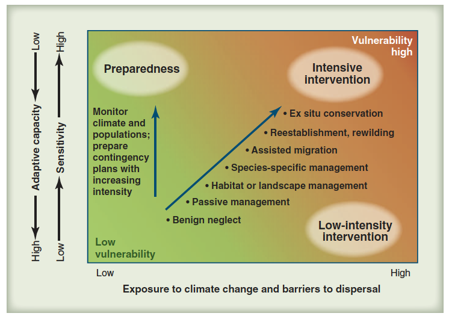{width="80%"}

------------------------------------------------------------------------

\vspace{.5cm}

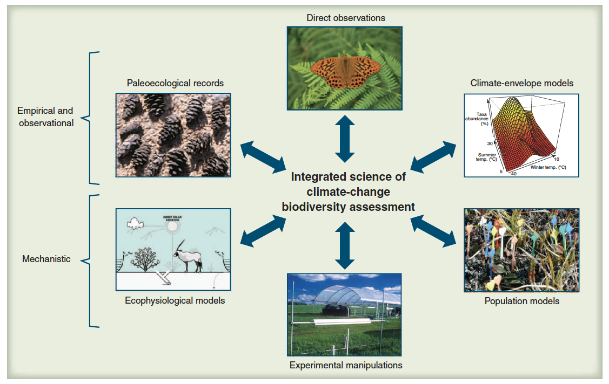{width="80%"}

## An example of ENM

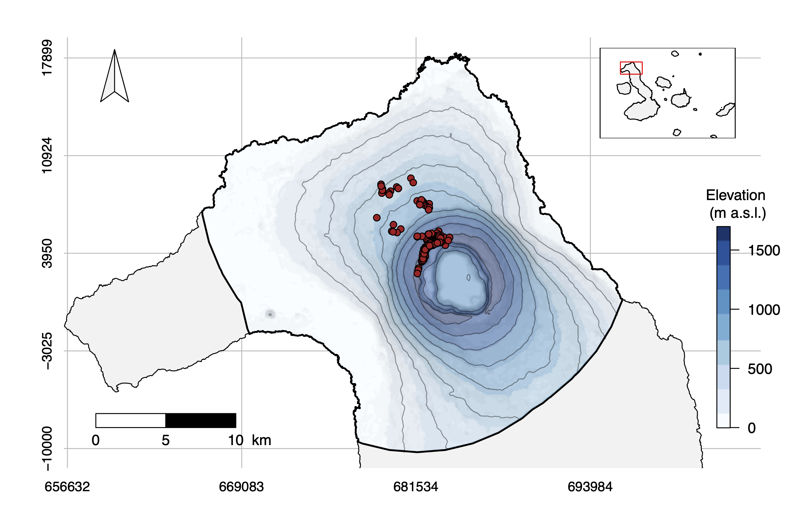{width="80%"}

------------------------------------------------------------------------

\vspace{1cm}

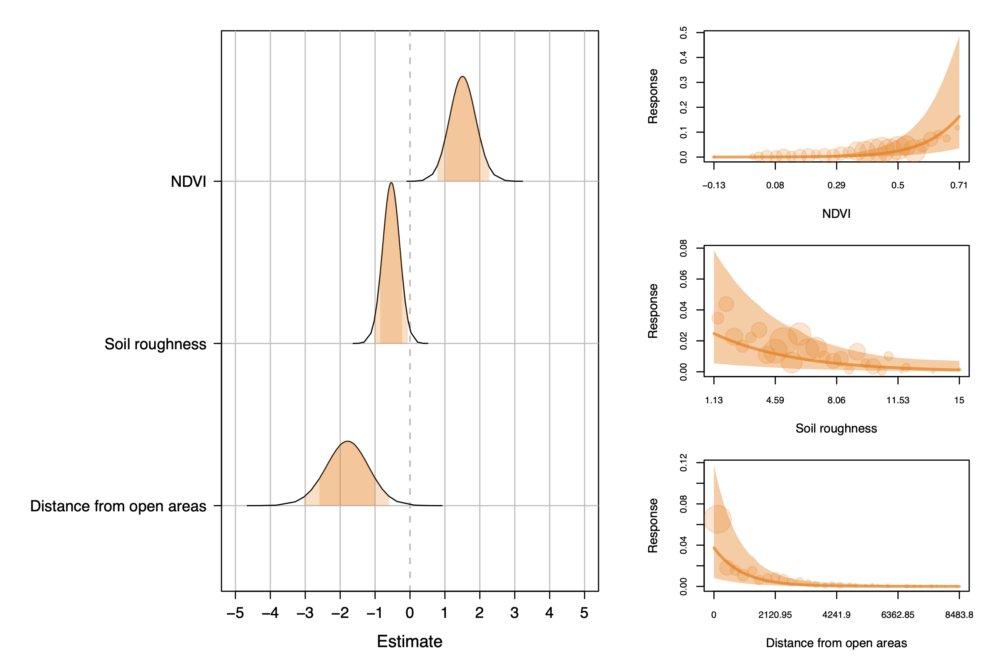{width="80%"}

------------------------------------------------------------------------

\vspace{1cm}

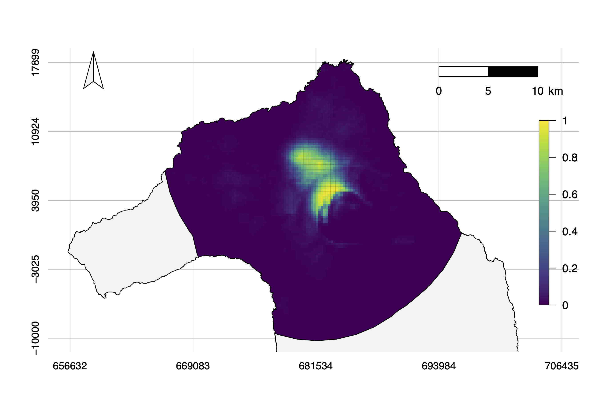{width="80%"}

------------------------------------------------------------------------

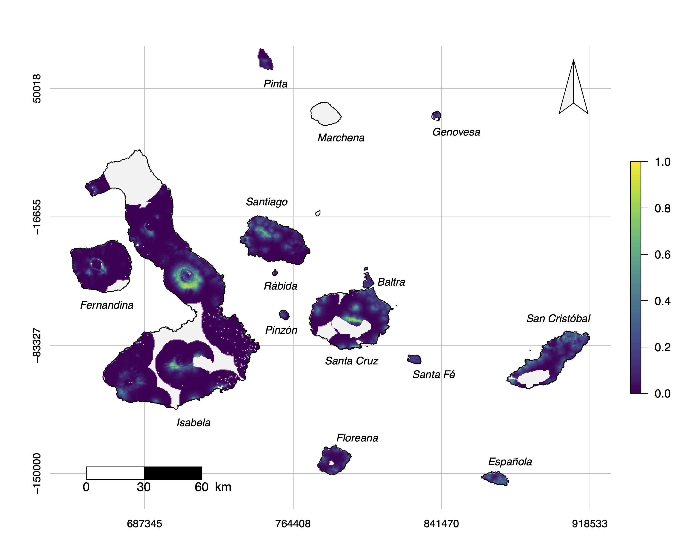{width="80%"}

------------------------------------------------------------------------

## Policies against climate change

-   With the availability of spatial tools, modeling algorithm, increasing data collection, it is not a question of whether we should engage in climate informed conservation, but of which tools to apply under what conditions and to which species conditions [@Tingley2014].

-   According to @Tingley2014, it could be possible to classify conservation actions as either fine-filter or coarse-filter, with a portfolio of strategies that can be implemented. The authors further use the metaphor of a theater to better explain the rationale behind chosing a stratey that would save the actors or the stage.

-   Decision on what are the best strategies to use depends on the answers to three key management questions: Where? When? Why?

------------------------------------------------------------------------

\vspace{1cm}

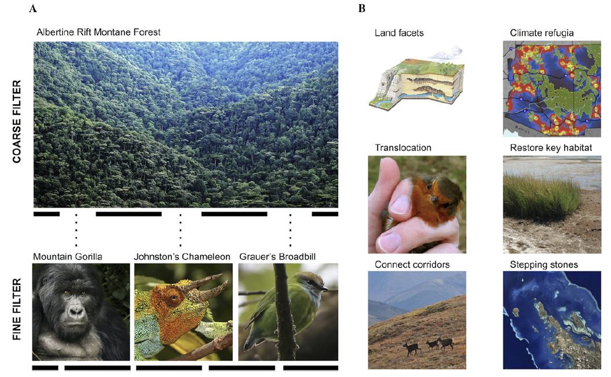{width="80%"}

------------------------------------------------------------------------

-   Conservation responses to climate change require two components:

1.  to adapt conservation strategies to manage dynamic biodiversity and mitigate the overall effects of climate change;
2.  to engage policy makers to take actions and reduce GHG emissions to levels that will keep biological changes manageable.

-   We have definitely managed to engage policy makers with [Paris Agreements](https://en.wikipedia.org/wiki/Paris_Agreement) (2015). Negotiated by 196 countries and currently signed by 195 and ratified by 185. The ultimate goal of the agreement is to reduce GHG emission to ensure a global warming no greater than $1.5\ ˚C$.

-   This agreement builds on the United Nations Framework Convention on Climate Change and works to overcome some of the difficulties presented during and after the [Kyoto Protocol](https://en.wikipedia.org/wiki/Kyoto_Protocol) (1997).

## How things are looking?

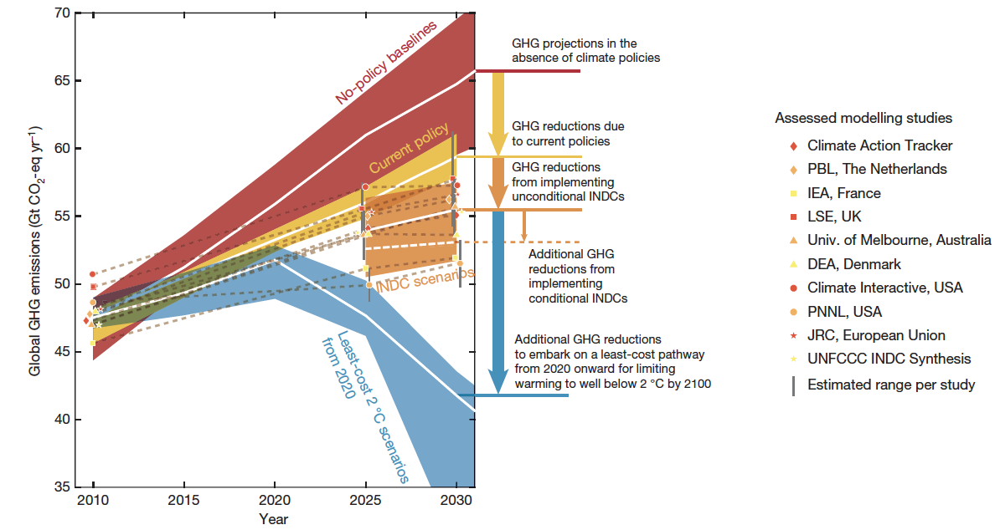

------------------------------------------------------------------------

-   Italy pledged to keep warming at or below $1.5\ ˚C$

-   How are we doing?

-   Lets take a look...[Eurostat](https://ec.europa.eu/eurostat/web/climate-change/visualisations).

-   Given ongoing opportunities for synchronized climate change mitigation and adaptation, conservation biologists are poised to advance solutions that both slow climate change and protect biodiversity.

------------------------------------------------------------------------

-   Many international activities, such as the Intergovernmental Science-Policy Platform on Biodiversity and Ecosystem Services ([IPBES](https://www.ipbes.net)), provide a platform for the scientific engagement on a global scale.

-   Every country must be involved in this process, and when individual countries, especially the ones that contribute most GHG, remove themselves from the solution-building conversations on the global scale, they put both people and ecosystems at risk [@VanDyke2020].

# References {.allowframebreaks}
