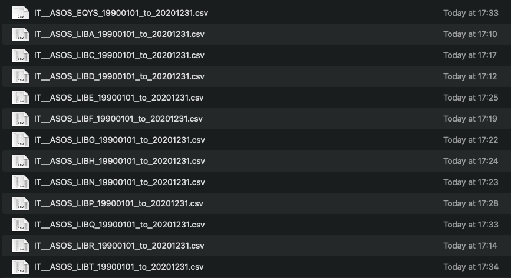

## On-line data resources

-   [Eurostat](https://ec.europa.eu/eurostat/web/main/data)

-   [NOAA](https://www.noaa.gov)

-   [NASA](https://data.nasa.gov/browse)

-   [Our World in Data (via GitHub)](https://github.com/owid/co2-data)

-   [Copernicus](https://cds.climate.copernicus.eu/cdsapp#!/search?type=dataset)

-   [Automated Surface Observing System (ASOS)](https://mesonet.agron.iastate.edu/ASOS/)

------------------------------------------------------------------------

-   We will be downloading historical data from the ASOS data repository available at Iowa State.

-   We will working on data from the Italian network of automated weather stations.

-   First lets take a look at the website to see how we can use R to automate the process of downloading the data and eventually analyse them.

-   [Automated Surface Observing System (ASOS)](https://mesonet.agron.iastate.edu/ASOS/)

## The packages we will be using

```{r echo=TRUE, eval=FALSE}
# Installing the appropriate libraries
install.packages(c("jsonlite", "RCurl", "lubridate",
                   "dplyr", "ggplot2"))
```

\vspace{.5cm}

```{r echo=TRUE, eval=TRUE}
# Load libraries in the working environment
library(jsonlite)
library(RCurl)
library(lubridate)
library(dplyr)
library(ggplot2)
```

## Input from the user

-   Now that we know the web site, we can set up a script to automate data downloading

```{r echo=TRUE, eval=TRUE}
# first, we need to specify the date boundaries
# start date in year, month, day format
startDate <- ISOdate(1990, 1, 1) 
# end date in year, month, day format
endDate <- ISOdate(2024, 12, 31) 

# second, we need to specify the data network parameter 
# we want to download the data from
# and the state we want to download the data from
user.network <- c("ASOS")
user.state <- c("IT") #state
```

------------------------------------------------------------------------

-   We can now start and retrieve the identifier of all the weather stations we are interested in.

```{r echo=TRUE, eval=TRUE}
network <- paste(user.state, 
                 user.network, sep = "__")
uri <- 
  paste("https://mesonet.agron.iastate.edu/geojson/network/",
        network, ".geojson", sep="")
uri
```

------------------------------------------------------------------------

-   We use the URL address we have prepared and try to retrieve the information we want.

```{r echo=TRUE, eval=TRUE}
# first we tell R that that we work with an URL
# URL = Uniform Resource Locator
# in this way R will be opening a connection to that URL 
# and we will be able to access the website
data <- url(uri)
data
```

------------------------------------------------------------------------

-   Now we can use that connection to read the information.

```{r echo=TRUE, eval=TRUE}
jdict <- fromJSON(data)
# to see what kind of object we have
# you can type and execute jdict at the prompt
```

------------------------------------------------------------------------

\vspace{.5cm}

```{r echo=TRUE, eval=TRUE}
#| fig-width: 4
#| fig-height: 3

stationsPlot <- 
  matrix(unlist(jdict$features$geometry$coordinates),
                       nrow = 2 )
plot(stationsPlot[1,], stationsPlot[2,], asp = 1)
```

------------------------------------------------------------------------

-   Now that we have all the codes of the weather stations we can work on the URL address were all the specific information of each weather station is stored.

```{r echo=TRUE, eval=TRUE}
service <- 
"https://mesonet.agron.iastate.edu/cgi-bin/request/asos.py?"
service <- paste(service, 
  "data=all&tz=Etc/UTC&format=comma&latlon=yes&", sep="")
service <- paste(service, "year1=", year(startDate),
                 "&month1=", month(startDate), "&day1=",
                 mday(startDate), "&", sep="")
service <- paste(service, "year2=", year(endDate),
                 "&month2=", month(endDate),
                 "&day2=", mday(endDate), "&", sep="")
it_stations_id <- jdict$features$id
```

------------------------------------------------------------------------

-   Set the working directory where to store data.

```{r echo=TRUE, eval=FALSE}
setwd("path/to/your/folder/of/choice")
```

------------------------------------------------------------------------

-   This is the main for loop to download the all the data.

::: callout-important
## Beware!!

The original loop downloads about 4.4GB of data! You should only run it when you have a stable and fast internet connection. Right now we will run a simplified version of the script that should download data from only two stations.
:::

------------------------------------------------------------------------

\vspace{.5cm}

```{r echo=TRUE, eval=FALSE}
it_stations_nm <- jdict$features$properties$sname

for (i in 2:3){
  uri <- paste(service, "station=",
               it_stations_id[i], sep = "")
  print(paste("Network:", network, 
              "Downloading:", it_stations_nm[i],
              it_stations_id[i], sep=" "))
  data <- url(uri)
  datestring1 <- format(startDate, "%Y%m%d")
  datestring2 <- format(endDate, "%Y%m%d")
  outfn <- paste(network, "_", it_stations_id[i],
                 "_", datestring1, "_to_", datestring2, 
                 sep="")
  download.file(uri, paste(outfn, ".csv"), "auto")
}

```

------------------------------------------------------------------------

\vspace{.5cm}

{width="80%"}

------------------------------------------------------------------------

-   Time to load the data and look at them.

```{r echo=TRUE, eval=FALSE}
# path_to_csv <- "path/to/your/data"
suffix <- c("LIBA", "LIBC")
files <- list.files(path = path_to_csv, 
            pattern = "*.csv", full.names = T) 
files_names <- list.files(path = path_to_csv, 
            pattern = "*.csv", full.names = F)
myfiles  <-  lapply(files, read.csv, skip = 5, 
              header = T, na.strings = "M")
names(myfiles) <- suffix
myfiles_df <- bind_rows(myfiles, .id = "station_label")
format <- "%Y-%m-%d %H:%M"
myfiles_df$valid <- as.POSIXct(myfiles_df$valid,
          format = format, tz = "UTC")
myfiles_df[1:13, 2:7]
```

------------------------------------------------------------------------

```{r echo=FALSE, eval=TRUE}
path_to_csv <- "/home/giuliano/Documents/data/climate data/IT_ASOS/"
suffix <- c("LIBA", "LIBC")
files <- list.files(path = path_to_csv,
          pattern = "*.csv", full.names = T) 
files <- files[c(2,3)]
myfiles  <-  lapply(files, read.csv,
             skip = 5, header = T, na.strings = "M")
names(myfiles) <- suffix
myfiles_df <- bind_rows(myfiles, .id = "station_label")
format <- "%Y-%m-%d %H:%M"
myfiles_df$valid <- as.POSIXct(myfiles_df$valid,
            format = format, tz = "UTC")
myfiles_df[1:13, 2:7]
```

------------------------------------------------------------------------

```{r echo=TRUE, eval=FALSE}
plot(date(myfiles_df[myfiles_df$station ==
                       "LIBA", ]$valid),
     myfiles_df[myfiles_df$station == "LIBA", ]$tmpf,
     type = "o", 
     xlab = "Year", ylab = "Temp.",
     main = "LIBA, Amendola")
```

------------------------------------------------------------------------

\vspace{.5cm}

```{r echo=FALSE, eval=TRUE}
plot(date(myfiles_df[myfiles_df$station == "LIBA", ]$valid),
     myfiles_df[myfiles_df$station == "LIBA", ]$tmpf, type = "o", 
     xlab = "Year", ylab = "Temp.", main = "LIBA, Amendola")
```

------------------------------------------------------------------------

```{r echo=TRUE, eval=FALSE}
plot(date(myfiles_df[myfiles_df$station ==
                       "LIBC", ]$valid),
     myfiles_df[myfiles_df$station == "LIBC", ]$tmpf,
     type = "o", 
     xlab = "Year", ylab = "Temp.",
     main = "LIBC, Crotone")
```

------------------------------------------------------------------------

\vspace{.5cm}

```{r echo=FALSE, eval=TRUE}
plot(date(myfiles_df[myfiles_df$station == "LIBC", ]$valid),
     myfiles_df[myfiles_df$station == "LIBC", ]$tmpf, type = "o", 
     xlab = "Year", ylab = "Temp.", main = "LIBC, Crotone")
```

------------------------------------------------------------------------

```{r echo=TRUE, eval=FALSE}
plot(stationsPlot[1,], 
     stationsPlot[2,], 
     asp = 1, pch = 21, bg = "gray")
points(stationsPlot[1,2:3],
       stationsPlot[2,2:3], 
       pch = 21, bg  = "green")
```

------------------------------------------------------------------------

\vspace{.6cm}

```{r echo=FALSE, eval=TRUE}
plot(stationsPlot[1,], 
     stationsPlot[2,], 
     asp = 1, pch = 21, bg = "gray")
points(stationsPlot[1,2:3],
       stationsPlot[2,2:3], 
       pch = 21, bg  = "green")
```
