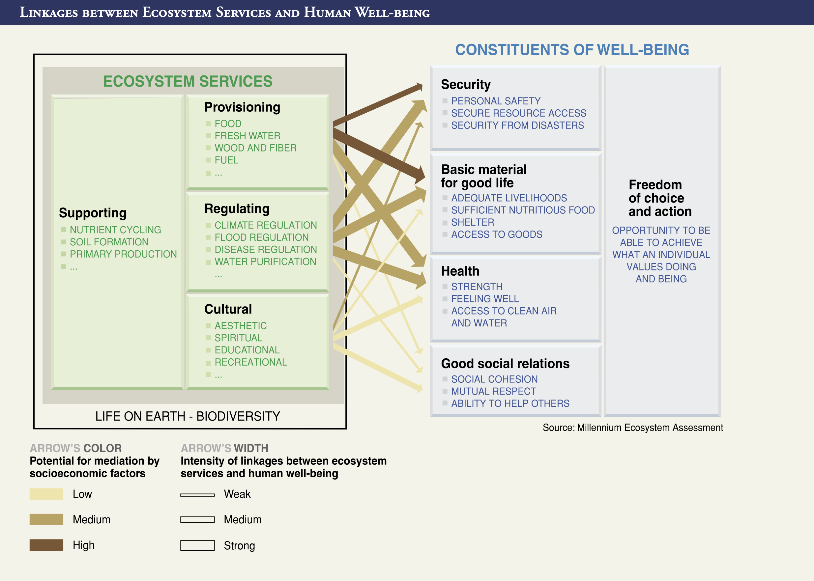
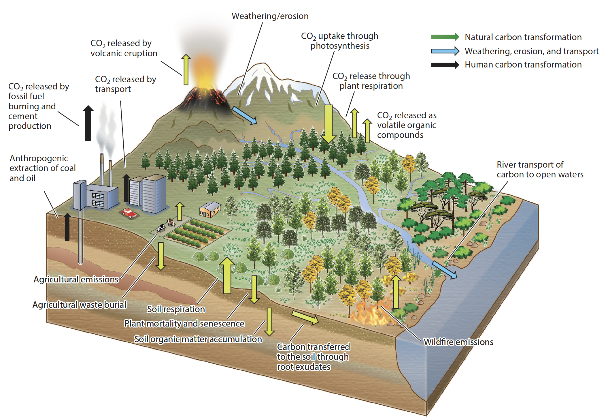
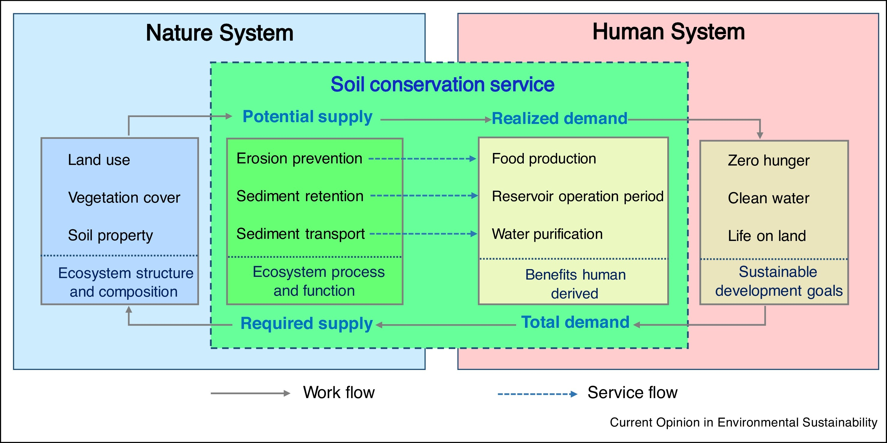

```{r setup, include=FALSE}
knitr::opts_chunk$set(echo = TRUE)
x <- c("DT", "tidyverse", "RColorBrewer", "learnPopGen")
lapply(x, require, character.only = T)
rm(x)
```

## Conservation economics

-   Economics is the study of how people make choices under condition of scarcity. Economics also studies the results of these choices and how they affect the society [@Frank2012]

-   Speaking of economics within conservation science may seem a paradox, because economics is often an obstacle or a limit to the development of conservation strategies and the achievement of conservation goals

-   After all, we live in a largely capitalistic world, and increasing the capital, which often translates to increasing the bank account, is the goal of most corporations worldwide

-   Despite this, thinking like an economist or at least including a few economics notions in the way we think and develop conservation strategies can help to device appropriate conservation actions when resources are lacking or very few

------------------------------------------------------------------------


-   No conservation effort or practice can ultimately endure without an intimate connection to value [@VanDyke2020]
-   Adopting an economic behavior to conservation does not mean that the intrinsic value and motivation of conservation are less important or undermined by money

-   Moral intents do not require an economic justification!!!

-   Learning some economics principles should be viewed as an additional set of tools to help us better navigate human biases, emotions, irrationality and the social context of economic-based decision process in conservation science.

## Neoclassical economic theory

-   **Microeconomics**, centers on incentives that influence individual behavior.

    -   It is a branch of economics focused on markets!
    -   What factors influence the goods and services users consume.
    -   It tries to consider the externalities (true costs and benefits of a product/service not considered in the market analysis).
    
-   **Macroeconomics**, is an extension of microeconomics.

    -   It applies to a multitude of individuals and to a larger and wider scale.
    -   Involves the decision making process that determines the appropriate level of economic activity in a society.
    -   It also involves all processes determining how governments ought to think about its spending and revenue streams [@VanDyke2020]

--- 

\vspace{.5cm}

-   There are three foundational economic concepts embedded in many conservation efforts:

    -   \textcolor{red}{Ecosystem-services}
    
    -    \textcolor{green}{Stock-flow} and  \textcolor{green}{fund-service resources}
    
    -    \textcolor{blue}{Nonexcludable} and \textcolor{blue}{nonrival goods}
    
-   Over the past few decades efforts to capture the value of nature through a market price have led to many creative programs and projects around the globe

-   Some research show that when social interaction become financial ones, economic interests overcome altruistic motivation, causing people to become even less likely to conserve nature for the common good [@Fisher2015]

## Ecosystem-services

-   Economic value is manifested in tangible goods (material resources) and services (functions of value to us performed by some other entity)

-   Ecosystem services refer to particular ecosystem conditions and functions that have value to humans

-   Consider the services that, for example, a forest can provide.

    -   Gas regulation
    
    -   Climate regulation
    
    -   Disturbance regulation
    
    -   Water supply
    
    -   Soil formation

---

::: callout-important
## Question (?)

-   For how many of the above mentioned services do you think about paying on a daily basis?
::: 

---

\vspace{.5cm}

{width="80%"}

------------------------------------------------------------------------

- In an effort to clarify ecosystem terms for an economic assessment some authors describe the following terms using an economic mindset :

    -   \textcolor{red}{Ecosystems}: are combinations of interacting species and their environment. They do many things, not all of which are ecosystem services (e.g., a wetland)

    -   \textcolor{red}{Ecosystem services}: the subset of natural processes that actually generate benefits to people (e.g., water purification). Sometime the service is the production of a good

    -   \textcolor{red}{Benefits}: the actual things that increase human welfare (e.g., clean water)
    
    -   \textcolor{red}{Value}: the importance of a given benefit to a person or group, measured using a specific currency or some other metrics (e.g., \$30/gal/year)


---

-   The strength of connections between services varies across ecosystems and regions, but it is clear that their depletion and degradation will have serious consequences on a global scale

-   Of the 24 services examined by the Millennium Ecosystem Assessment ([World Resource Institute](https://www.wri.org)), 15 were being used in an unsustainable way

-   As ecosystems and services they provide are degraded, global biodiversity is diminshed

-   Results from the MEA demonstrated that failing to include the value of ecosystems has left critical dimensions of human well-being out of economic decision making

## Stock-flow and Fund-service resources

-   The material goods we use and derive from ecosystems and their associated biodiversity are various and diverse. A comprehensive list is hard to make. So, we can classify them based on how we use them

-   \textcolor{green}{Stock-flow resources} are those goods produced via a transformation process, usually self-renewing, occurring within the ecosystem itself. Goods extracted can then be used at a certain rate (flow) from the resource's stock

-   Timber from a forest is the classical example of a stock-flow resource. A standing stock of mature trees transforms water, sunlight and nutrients from the soil into new biomass and new individuals. It is important in the process of creating the resource, and becomes itself the resource


## 

- If a stock-flow resources is extracted at a rate $\le$ than its renewal rate, we can consider that resource self-perpetuating

-   All stock-flow resources share similar attributes

Stock-flow resources:

1.  have all been materially transformed by ecosystem processes in to usable goods;
2.  can be used at any desired rate, but in many case usage rates are too high to make the resource self-perpetuating;
3.  can be stock-pilled or stored for future use!

---

-   Ecosystems also provide \textcolor{green}{fund-service} resources. It is something that can gradually be reduced or worn out, and it does not become a part of the resource it produces

-   The fund provides a service at a fixed rate so that the service is best measured in some metric that describes the output over time

-   For example, from 2007 to 2016 terrestrial ecosystems globally removed an estimated 3.61 Pg (petagrams) C per year from the atmosphere which amounts to 33.7% of total anthropogenic emissions from industrial activity and land-use change [@Keenan2018]

---

-   By removing the carbon at a fixed rate the ecosystem provides a collective service for the community

-   We can expand this capacity via afforestation, but we cannot stockpile this service

-   Although the service cannot be used up, it can be worn out if the habitat providing the service is degraded or in suboptimal conditions

-   By clearly distinguishing between these two resource types we are better able to define the parameters of the so called sustainable use

---

{width="80%"}


## Non-excludable and non-rival goods

-   Natural goods and resources have been proven hard for traditional economic theory

-   An \textcolor{blue}{excludable good} or resource is one in which ownership of the resource permits the owner exclusive use of the resource and provides the owner with the ability to exclude others from its use

-   A \textcolor{blue}{rival good} or service is one for which its uses infringes with someone else's ability to enjoy the same good or service

-   Many ecosystem goods and services are \textcolor{blue}{non-excludable}. Can you exclude someone from breathing oxygen?

---

-   Some ecosystem and good services are also \textcolor{blue}{non-rival}, in that the use of the good does not infringe on the use from other

-   Because of these characteristics (non-excludable and non-rival) these goods (like climate and water surfaces) are outside of the marketplace and are considered public goods

-   The need for some form of governance for public goods arises when there is some degree of rivalry and when changes in land usage and management threatens non-excludability

---

-   Over exploitation of freshwater by one person or group in a discrete location may limit the availability of fresh water to other users at that same location, effectively changing it from a public good to a common pool resource

-   If a good is not excludable someone can use it whether or not any producer of the good allows it. If people can use the good regardless of whether or not they have to pay for it, they are considerably less likely to pay for it. If people are unwilling to pay for a good there will be no profit in its production and in a market no one will invest in it in a substantial way [@Daly2011]

## Fundamentals of supply and demand

-   In neoclassical economic theory, market price for any good or service stems from supply and demand.

-   Higher demand for a particular resource is generated because the price gets lower while the resource or good is supplied with higher quantities.

---

](./class_13_3.png){width="60%"}

--

\vspace{.5cm}

{width="80%"}

---

-   While most analysis focus on maintaining steady the supply portion of an ecosystem service, through conservation actions aiming at directly preserving the resource, the authors [@Zhao2018] suggest that quantification of both supply and demand would improve decisions made about both of them.

-   By quantifying the benefits of soil conservation, based on the health of ecosystem services, they could help clarify the economic value of the service to people.

-   The authors focused on both the maximum allowable erosion rate (how much we can use the resource without depleting it out) and the current erosion rate.

---

-   If the current erosion rate exceeded the maximum there were negative consequences for ecosystem supply. However, if the current erosion were lower than the maximum, the implication for the ecosystem supply were positive.

-   Properly developed, environmental markets can stimulate market efficiency and improve overall economic efficiency while supporting higher level of biodiversity conservation.

-   To do this, economists must address externalities, the costs or benefits that are not explicitly captured in a decision or action!

## Cost Benefit Analysis

-   Cost Benefit Analysis (CBA) is a tool used even in conservation economics.

    -   Will we gain more than we loose in economic terms?
    
    -   What are our options?
    
    -   What if we do nothing?
    
-   The main issue in CBA is to clarify how to quantify costs and benefits.

---

-   The Trump administration had long argued that the EPA (Environmental Protection Act), under the previous Obama administration overestimated the risk of various environmental regulation to the determent of industry [@VanDyke2020].

-   For example, Trump's EPA had initially calculated that replacing Obama's Clean power Plan, with his proposed Affordable Clean Energy Act (CEA), would result in an additional 1400 deaths per year. His administration proposed a new set of rules to calculate CBA and this number was drastically reduced.

---

-   In Microeconomics there are two general classes of evaluation techniques for putting a price tag on ecosystem services: **revealed preference** and **stated preference**.

-   **Revealed preference** use observed behavior such as market purchases to make inferences on values of goods and services. Such approaches work with either actual markets or proxy market for property which reflects the various environmental attributes of the property itself.

-   **Stated preference** methods ask people how much they are willing to pay for a non-market good or service. Stated preference approaches create hypothetical markets for environmental benefits where there are no current market prices.

## References {.allowframebreaks}
