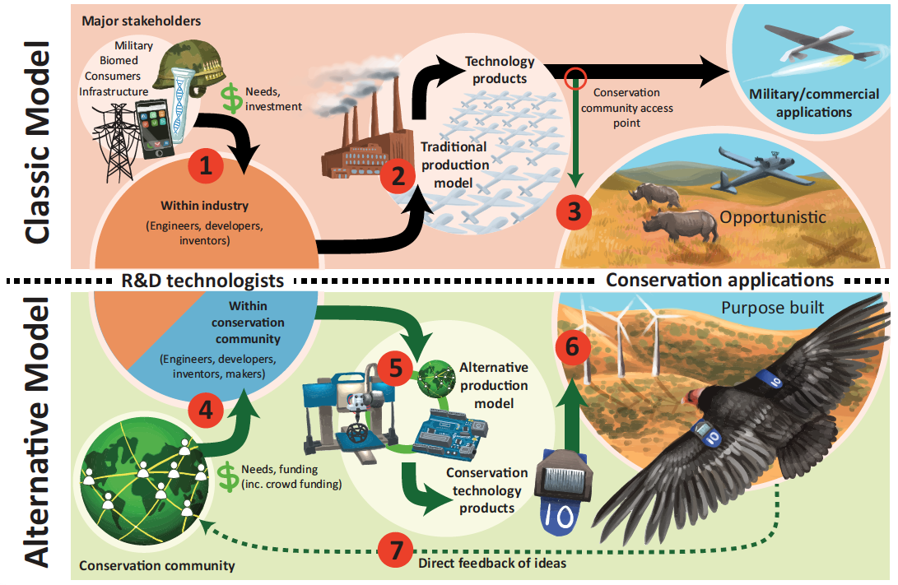
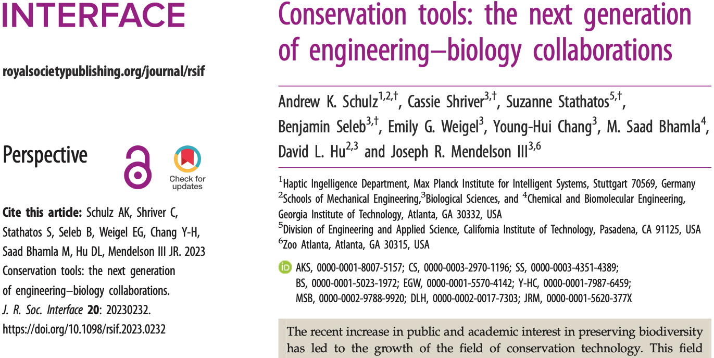
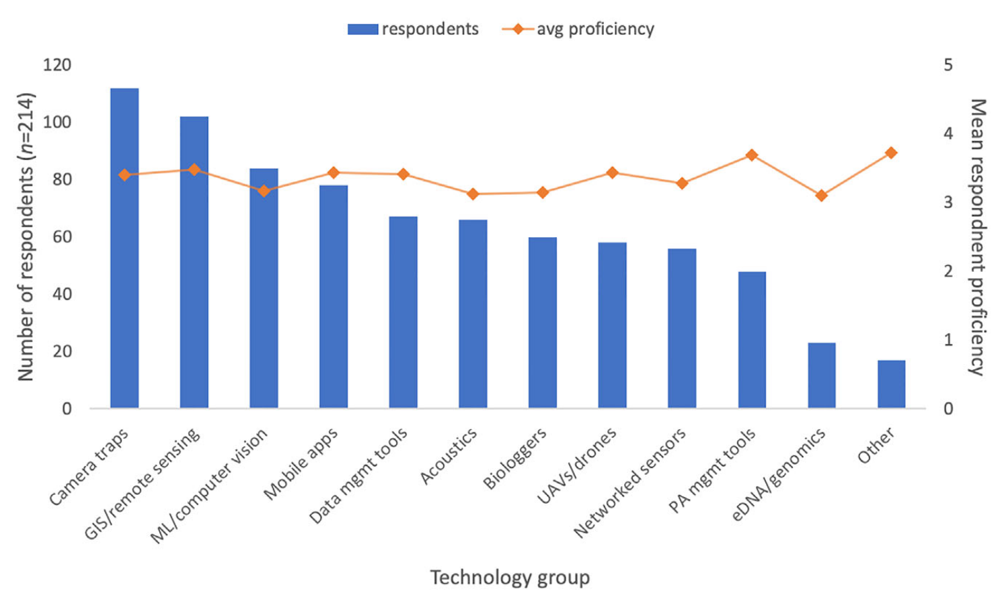
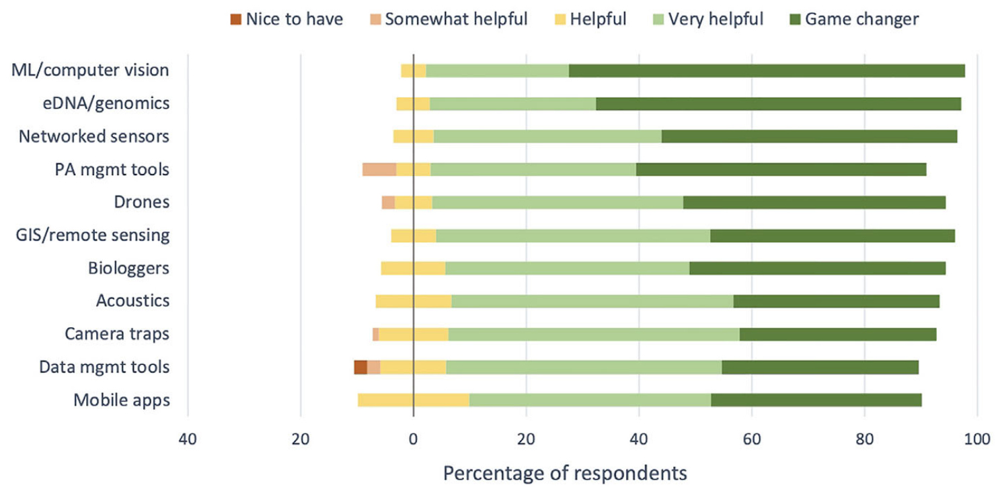
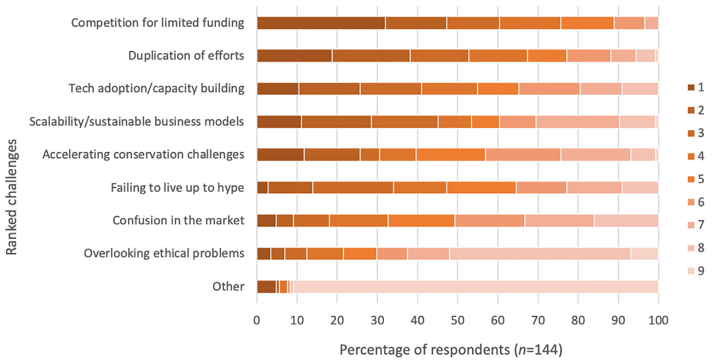

```{r setup, include=FALSE}
knitr::opts_chunk$set(echo = TRUE)
x <- c("DT", "tidyverse", "RColorBrewer", "learnPopGen")
lapply(x, require, character.only = T)
rm(x)
```


## Conservation technology

- Conservation technology is defined as: "devices, software platforms, computing resources, algorithms, and biotechnology methods that can cater to the needs of the conservation community" [@Speaker2022]

---

\vspace{1cm}

{width="85%"}

--- 

\vspace{1cm}



---

- Although no singular technology can solve the current global ecological crisis, devices such as camera traps, acoustic sensors, drones, biologgers, and satellites, as well as increasingly powerful genomic and artificial intelligence applications, hold the potential to empower conservationists to better understand and manage the socioecological systems in which they work [@Speaker2022]

---

- Recent literature suggests that despite meaningful developments in this discipline, systemic issues such as unsustainable funding and development cycles, inadequate evaluation of solutions, and duplication of efforts are reducing its capacity to keep pace with escalating and emerging conservation challenges [@BergerTal2018; @Speaker2022]

---

{width="80%"}

---

{width="80%"}

---

{width="80%"}

## References {.allowframebreaks}
