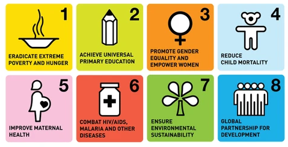
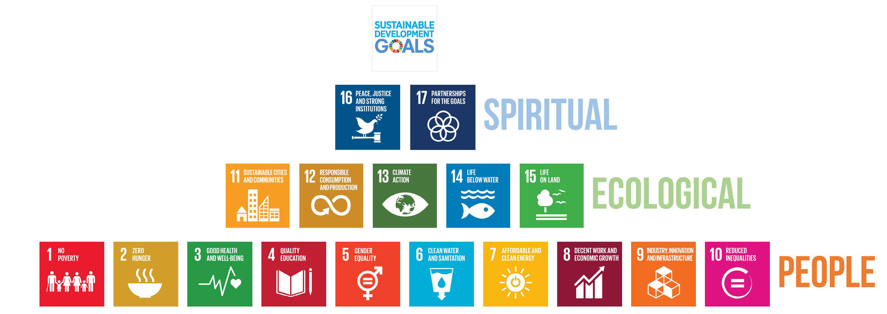

```{r setup, include=FALSE}
knitr::opts_chunk$set(echo = TRUE)
x <- c("DT", "tidyverse", "RColorBrewer", "kableExtra")
lapply(x, require, character.only = T)
rm(x)
```

##

- In democratic governments, laws are grounded in a constitution and carried out trough specific policies

- A policy can be defined as a definite course or method of action selected from among alternatives and in light of given conditions to guide and determine present and future decisions

- The specific actions of the government are generally considered to be examples of public policy, or actions taken by the government on behalf of the public in service of a specific goal

- According to @Salzman2014, "*environmental law and policy can be defined as the use of government authority to protect the natural environment and human health from the impacts of pollution and development*" 

---

- At any level of government, the policymaking process is complex and includes a wide variety of values, stakeholders, and sources of information as decision -makers try to select a definite course of action among a range of alternatives

- Most of the times laws originate when issues gain the attention of politician and government bureaucrats, but issues do not become laws and laws are not translated in to policies without lengthy examination and development by all concerned parties

- Laws are specifically designed to influence behavior and reinforce approved values by establishing normative rules that everyone must follow or else face punishment [@VanDyke2020]

---

- On a global stage, international cooperation through international conservation law is critical to the world of conservation enterprise

- Unfortunately, even today with a body of growing international law designed to to empower the world of conservation efforts, international laws and treaties invariably suffer constraints

- Due to the very nature of the diversity of nation and states the least common denominator approach in species and habitat protection is usually trade and/or other economic interest [@VanDyke2020]

---

- The actions needed to preserve endangered species and their habitats must almost always be resolved at national and local levels

- Breeding populations of endangered species are found locally and and that is where communities are more likely to reach a consensus of shared values and that support more aggressive and effective actions needed to achieve conservation goals

- International conservation laws become meaningless without national and local enforcement

- The engagement of conservation biologists is required at all these levels as much participation is essential for evaluating the effectiveness of monitoring and enforcement

---

- New generations of conservation biologists who are both policy-savvy and scientifically grounded will be on the front lines of solving the world most challenging conservation problems [@VanDyke2020]

- Globally there are thousands of environmental law, and corresponding policies, that regulate humans interactions with the environment. Generally speaking, environmental law is rooted in three conceptual frameworks [@Salzman2014]:

    - ethical rights;
    
    - utilitarian interests;
    
    - equitable distributions of risks.
    
## Ethical right laws

- In ancient cultures (Roman, Chinese and Jewish) non-human animals and even the land were protected against forms of abuse and mistreatment

- The intent of those laws was not directed towards conservation as we intend it today, nevertheless they set the basis for treating non-human animals and ecosystems as *moral subjects* 

- Non-human entities in the natural world were perceived as morally considerable and they could be treated in a morally right or wrong way! [@VanDyke2020]

## Utilitarian interest laws

- Laws designed to forbid the use of plants and or animals found on private property, especially on the property belonging to people of high social extraction

- These laws aimed at protecting the right of the landowner to enjoy and use a healthy and productive environment

- Even though these laws protected non-human species, the rights they protected were expression of privilege and not of conservation 

- Laws rooted in utilitarian interests often use cost-benefit analyses as the primary guide to make decisions [@VanDyke2020]

## Equitable distribution of risks laws

- Environmental justice and its intersection with civil right law provides a frame for preventing the unequal distribution of environmental risk and harm focusing on the role of socioeconomic status along with race

- Originally, most of these kind of laws focused on the issue of environmental pollution and associated health risks

- Recently, intergenerational equity and the rights of future generations has been a focus of discussion, particularly with respect to the ongoing impact of climate change and the sustainability of our current economic, social and ecological system [@VanDyke2020]

# International Conservation Law

- Although international conservation law does, in some cases, implicitly recognize the intrinsic value of the species or habitats it preserves, it is primarily driven by utilitarian interests and equalization of risks, usually in the form of increased mutual international interdependence and concern for intergenerational equality [@VanDyke2020]

- The primary agent that brokers international conservation initiative is the United Nations (UN) and, within the UN, the Environmental Program (UNEP)

---

- The UN has entered over 325 treaties, conventions and agreements focusing on international conservation during the last 45 years and today over 1000 international legal instruments, most of them binding, contain one section or provision that addresses environmental conservation ([https://www.informea.org/en](https://www.informea.org/en))

- Advisement and enforcement is operated by the International Court of Justice (ICJ) of which members of the UN are automatic members

## Examples of multilateral treaties

```{r echo=FALSE, eval=TRUE}
treaties <- data.frame(Name = c("Convention on International Trade in Endangered Species of Wild Fauna and Flora (CITES)","Convention on Biological Diversity (CBD)",  "Rotterdam convention", "Minamata convention on mercury", "Tehran convention"),
                       Year = c(1975, 1993,  2004, 2017, 2006),
                       Parties = c(183, 196,  161, 118, 5),
                       Objective =c("Ensures the international trade of wild animals and plants do not threaten their survival. Degree of protection depends on Appendix level designation","Promotes the conservation of biological diversity\n through the sustainable use of its components and the equitable sharing of genetic resources", "Promotes cooperation and shared responsability in the international trade of hazardous chemicals to protect the environment and human health", "Protects the environment and humans from damaging effects of mercury pollution by controlling anthropogenic rreleases throughout its lifecycle", "Provides a framework for the sustainable use and environmental protection of the Caspian Sea region"))

kbl(treaties, booktabs = T) %>%
  kable_styling(latex_options = c("scale_down")) %>%
  column_spec(1, width = "15em") %>%
  column_spec(4, width = "30em")
```

- The number of parties listed in this table is updated to 2019 and represents the number of countries that have ratified the treaty and make it legally binding on themselves

---

- The beginning of coordinated conservation and environmental law is the Stockholm Conference of 1972

- The conference aimed at providing a framework within which the UN could comprehensively assess the problems of the human environment and place the focus of national governments and the public on such problems

- One of the most important achievements of the conference was the creation of the very first environmental agency: the UNEP (United Nations Environmental Program)

- UNEP made environmental concerns and programs a permanent fixture of the UN agenda

---

- The creation of UNEP had an immediate impact on world conservation

- In 1973 the UNEP Governing Board declared regional seas to be an important conservation priority

- This emphasis led directly to the development of the Barcelona Convention of 1976 for the protection of the Mediterranean Sea Against Pollution

- By 1988 more than 100 nations and 50 international organizations were cooperating in regional seas programs

## CITES

- The Convention on International Trade in Endangered Species of Wild Flora and Fauna (CITES, 1975) arose from the combined efforts of the IUCN and UNEP

- CITES is one of the most important international conservation agreements operating today because it specifically regulates or prohibits commercial trade in globally endangered species or their products

- The heart of the CITES convention is described via three appendices that list three categories of species regulated under the term of the treaty

---

### Appendix I

- Commercial trade for species listed in this Appendix is prohibited and permits from both the importing and exporting country must be obtained even for non commercial transport

### Appendinx II

- Species listed here are those that either could be threatened by large volumes of trade or that cannot be distinguished from a threatened species. Trade involving species in this category requires a permit from the exporting country

### Appendix III

- Species listed here are not globally threatened but may be listed at the initiative of an individual state seeking international cooperation for that species protection. For these species, nations are asked not to issue importation permits without an export permit from the listing country

---

- As of January 2017 there were 35801 species and 68 subspecies in the Appendices comprising 1045 in Appendix I (3\%), 34608 in Appendix II (97\%) and 216 in Appendix III (<1\%)

- CITES is an evolving document and amendments and changes are common. Parties to the treaty meet every two years to make amendments to the appendices and develop new species and animal product lists and identification manuals to improve enforcement 

- Originally a treaty that equated conservation with strict protectionism in international trade, more recent meetings of CITES participants have shown a growing tendency to permit some trade in formerly protected species if it can be shown that such trade actually enhances species conservation

## Combining conservation and development

- In June 1992 a major global environmental gathering occurred in Rio De Janeiro to integrate efforts to protect the planetary ecosystems with economic development of the poor nations of the world

- The most important document signed during the Rio Summit was *Agenda 21*, an 800-page work plan addressing social and economic dimensions of environment and development, conservation and management of resources and means of implementation

---



---



---

- Unfortunately, to account for the competing political socioeconomic, and environmental interests that are common in conservation policy, compromises are typically made during target development and implementation, which can weaken their primary objectives [@Doherty2018]

- Furthermore, with limited regulatory and enforcement power countries face few to no legal consequences for failing to meet identified targets [@Doherty2018]

## References {.allowframebreaks}
