```{r setup, include=FALSE}
knitr::opts_chunk$set(echo = TRUE)
library("readxl")
library("diagram")
library("grid")
library("gridExtra")
library("plotrix")
library("tidyverse")
library("dendextend")
library("vegan")
library("gt")
library("gtExtras")
library("gtsummary")
library("knitr")
library("kableExtra")
```

# Changing paradigm

-   One of the most pervasive environmental changes of recent history is the loss of Earth's diversity of life.

-   This loss is a systemic problem embedded in the normal ways the human species lives on planet earth, especially with: its ability to \textcolor{red}{convert and manipulate natural habitats} to system designed to maximize human benefit, its \textcolor{red}{use of energy} and waste production, its \textcolor{red}{high rate of population growth}, its ability to \textcolor{red}{move} themselves, and all sorts of plants and animal around, its capacity and supporting technology to \textcolor{red}{harvest a large quantity of animals and plants} in little time, its industrial-level production of many substances that destroy many kinds of life, its ability to influence and \textcolor{red}{change the climate}.

---

-   Conservation biology origins were driven by studies and discoveries in basic sciences such as genetics and population dynamics, but soon became manifest in applied sciences like forestry, fisheries, wildlife management, and more.

-   The traditional view of recent extinctions as a collection of tragic individual case histories was replaced by a conviction that the global extinction crisis was produced by the fundamental disruption of ecosystem processes.

-   The extinction crisis created an urgency to develop an alternative concept and transition from loss of endangered species to loss of Biodiversity [@VanDyke2020].

# What is Biodiversity?

. . .

-   The first use of the term \textcolor{red}{biodiversity} in the scientific literature was in a 1980 government report by biologist Eliot Norse [@Pimm2001]. 

-   In origin, the word is a contraction of \emph{biological diversity}, but today \textcolor{red}{biodiversity} not only has multiple definitions, but also multidimensional concepts and applications.

. . .

- To those engaged in the study of natural history biodiversity represents the biotic elements that can be described and classified. The tool for such description and classification is taxonomy.

- To environmental activists biodiversity is an intrinsic quality of natural systems that should be preserved for its own sake, expressed using the tools of environmental ethics [@VanDyke2020].

---

- To conservation biologists, biodiversity is an aspect of living systems to be descriptively characterized and explained, a measurable parameter providing insight into community structure, environmental processes, and ecosystem functions determined by the tools of site-specific survey and study.

. . .

-   \textcolor{PineGreen}{The structural and functional variety of life forms at genetic, population community and ecosystem levels} [@Sandlund1992].

-   Genes and their variety of forms (alleles) are the most fundamental units at which biodiversity can be measured, and their are the basis for all other measures of diversity.

---

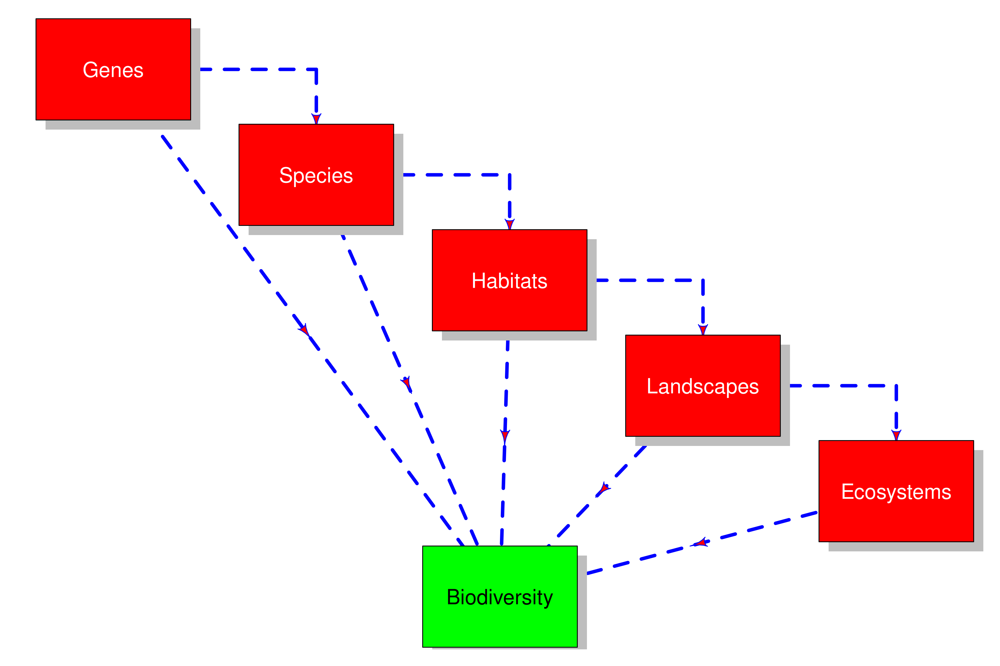{width="83%"}

## Why should we care about Biodiversity?

-   A more diverse combination of species (biological community) or, in other words, a more biodiverse system...

    -   ... translates in to a more productive environment [@Hooper2005; @Duffy2009].
    
    -   ... produces a more resistant environment [@Tilman1997; @Naeem2000].
    
    -   ... produces a more resilient environment [@Wilsey2000].
    
    -   ... produces more stable ecosystem processes and a more stable environment in general [@Cardinale2012; @VanMeerbeek2021].

---

-   A key concept when talking about Biodiversity is that of **emergence**. This occurs when a complex entity has properties or behaviors that its parts do not have on their own, and emerge only when they interact in a wider whole [@enwiki1310041482]

. . .

-   [Biodiversity is essential for food security and nutrition and offers key options for sustainable livelihoods]{style="color: red;"} (Convention on Biological Diversity, <https://www.cbd.int>)

## Emergence...

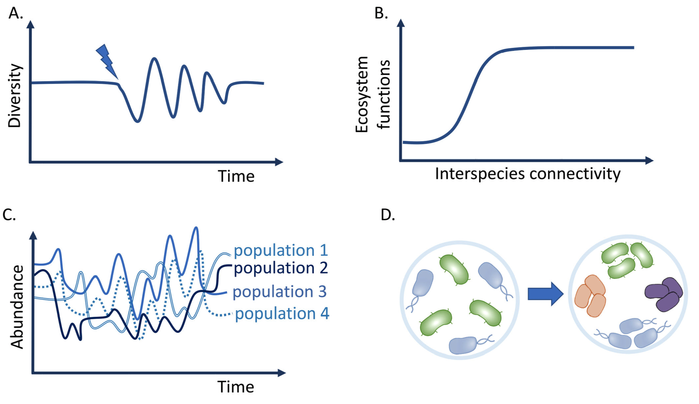{width="93%" fig-align="center"}


## Emergence...

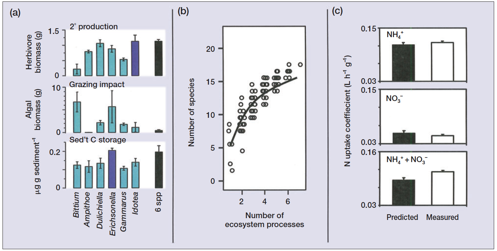{width="93%" fig-align="center"}

## Resistent environment

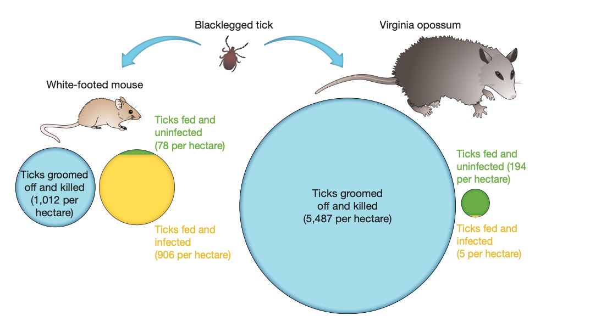{fig-align="center"}

---

## Higher productivity

::::: columns
::: {.column width="50%"}
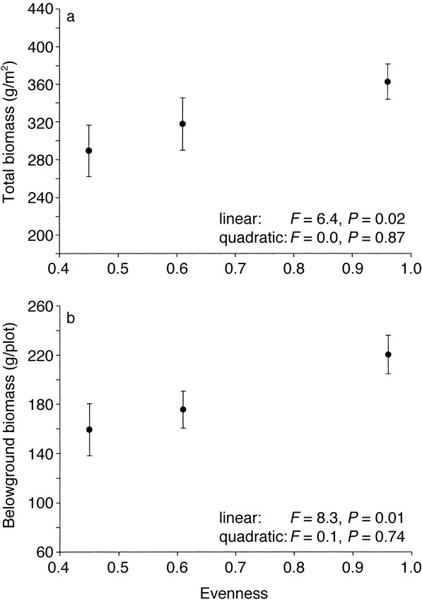{width="80%"}
:::

::: {.column width="50%"}
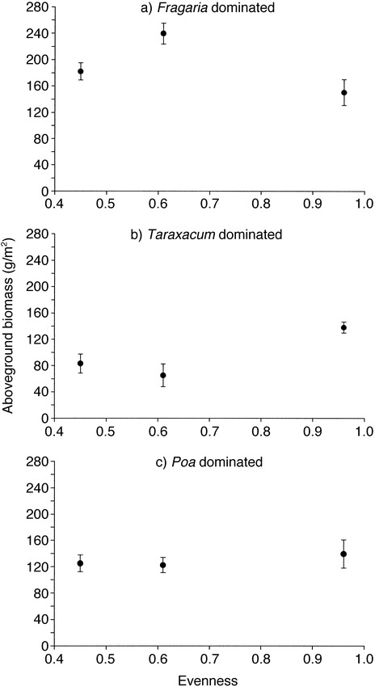{width="70%"}
:::
:::::

## Species richness

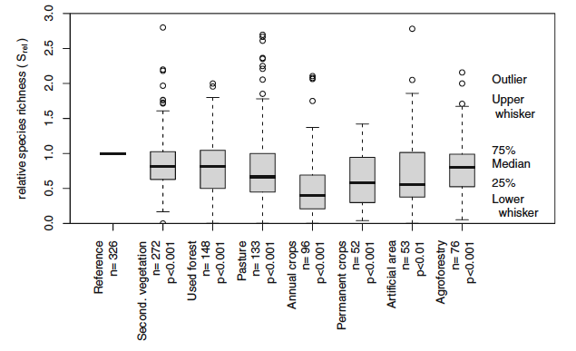{width="75%"}


---

-   The ESA (Ecological Society of America) concluded that maintaining biodiversity is a safeguard against risk resulting from changes in environmental conditions because it extends the productive use of a site's resources over time and provides an effective way to multiple goods and services [@Hooper2005].

. . .

::: callout-important
# Question!

What are ecosystem services?
:::

---


-   **Provisioning services**

    -   Food, Energy, Structural materials
    
-   **Regulating services**

    -   Reduce the severity of environmental events
    
-   **Supporting services**

    -   Provision of physical bodies to be used for essential services (oxygen and soil)
    
-   **Cultural services**

    -   Recreational, intellectual and spiritual activities


# IUCN

### International Union for the Conservation of Nature (est. 1948) <https://www.iucn.org>

- Its vision...

> [...create a just world that values and conserves nature.]{style="color: green;"}

- Its mission...

> [...influence, encourage and assist societies throughout the world to conserve the integrity and diversity of nature...]{style="color: green;"}

- Permanent staff of ca. 1000 paid employees and thousands of volunteer experts and professional dislocated and working in about 50 locations globally. Combines together government and NGOs. It has no explicit authority to make any "law", but its authority has gained enough momentum to have the force of law as international standards for conservation practice [@Stuart2017].

------------------------------------------------------------------------

-   The IUCN has contributed published standards and protocols that are currently in use and followed throughout the world
-   Students and practitioners need to know about, appreciate, access and effectively use such resources to work in conservation at any scale
    -   Guidelines for applying protected area management categories [@Dudley2008]
    -   IUCN Red List Categories and Criteria Version 3.1 Second Edition [@IUCN2012]
    -   A global standard for the identification of Key Biodiversity Areas : version 1.0 [@IUCN2016]
    -   Guidelines for the application of IUCN Red List of Ecosystems Categories and Criteria. Version 1.1 [@IUCN2017]
    
---

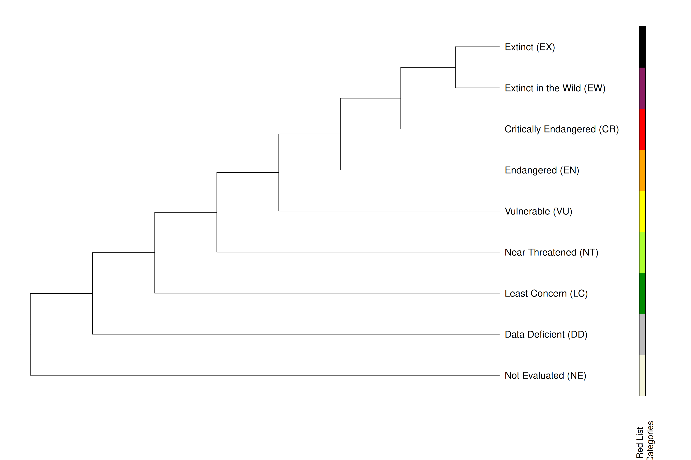{width="80%"}

## Current status of biodiversity

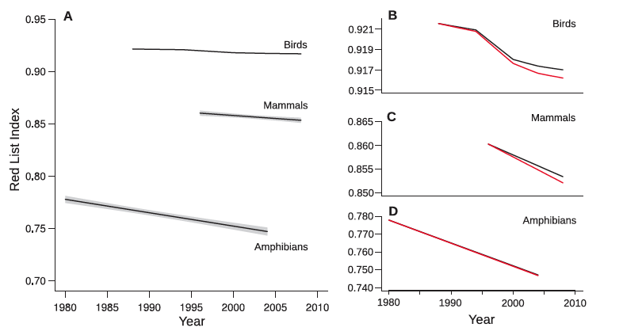

## Causes of rapid decline in amphibians

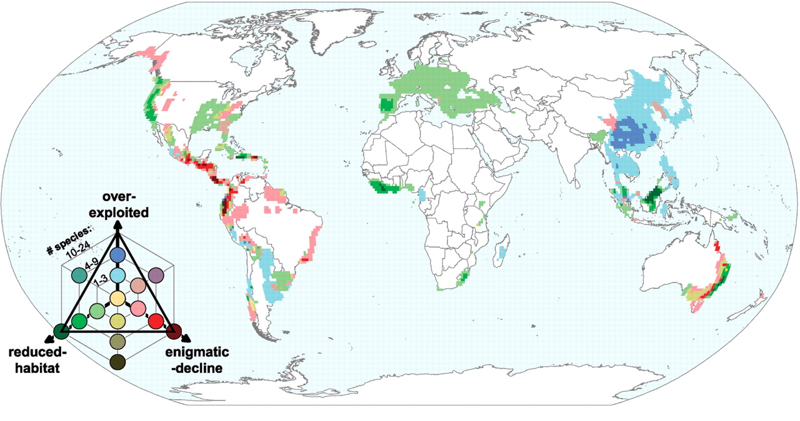

## Main causes of biodiversity loss

1.  Habitat modification [@deBaan2013]
    -   Transformational effects
    -   Occupational effects
    -   Permanent effects
2.  Climate change (we will talk about this in a separate class)

. . .

### Transformational effects

Change in the way the land is used. For example, a prairie changed to become a soybean field. The land is still there, and the productivity in term of biomass may even be higher, but the system structure's is simplified and the chance to have a diverse group of species is lost

---

### Occupational effects

Colonization of areas that were previously human free. The human presence directly and indirectly affect the newly colonized system by removing resources, producing wastes, altering the landscape

. . . 

### Permanent effects

Areas can be disturbed in a more or less permanent way. Lumbering of a forest section in a specific area can be, with time and proper management, reversed and the forest could be reestablished. A prairie covered in asphalt to build a mall and a parking lot is probably lost for good

# Species

::: callout-note
Although as an applied concept we can measure it at multiple levels, the most widely used currency to measure and compare biodiversity across sites is SPECIES!
:::

. . .

| Species concept | Description | Reference |
|:------------------|:---------------------------------|:------------------|
| Typological Species Concept (TySP) | Defines species as distinct and fixed morphological types | Based on Plato's, Aristotele's, and, later, Christian philosophies |

------------------------------------------------------------------------

|   |   | (continued) |
|:------------------|:---------------------------------|:------------------|
| Evolutionary Species Concept (ESC) | A species is a lineage of ancestral descent which maintains its identity from other such lineages and which has its own evolutionary tendencies and historical fate | [@Wiley1978] |
| Biological Species Concept (BSC) | Groups of actually or potentially interbreeding natural populations, which are reproductively isolated from other such groups | [@Mayr1942] |

---

|   |   | (continued) |
|:------------------|:---------------------------------|:------------------|
| Phylogenetic Species Concept (PSC) | A species is the smallest diagnosable cluster of individual organisms within which there is a parental pattern of ancestry and descent | [@Cracraft1983] |
| Differential Fitness Species Concept (DFSC) | Groups of individuals with features that would have negative fitness effects in other groups and cannot regularly be exchanged between groups upon contact | [@Hausdorf2011] |

------------------------------------------------------------------------

-   Important to conservation is the identification of operational units to be preserved (individuals, populations, species, etc. etc. etc.)

-   Conservationists, thus, not only work to preserve organisms, but also their ability to adapt and respond to environmental changes (i.e., the capability of individuals to give rise to new species in the future)

-   From this perspective, the PSC has become widely used by conservationists as it incorporates well defined tools (both scientific and normative) to define species [@Agapow2004]

-   The concept of Evolutionary Significant Units (ESU) aims at preserving both evolutionary potential and organisms. ESUs are based on criteria that are associated to genetic variation between and within populations [@Moritz1994]

---

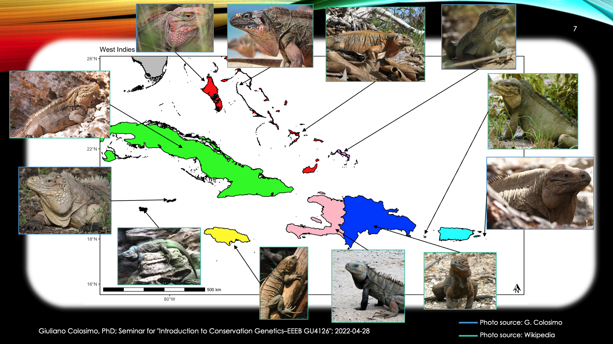{width="85%" fig-align="center"}

---

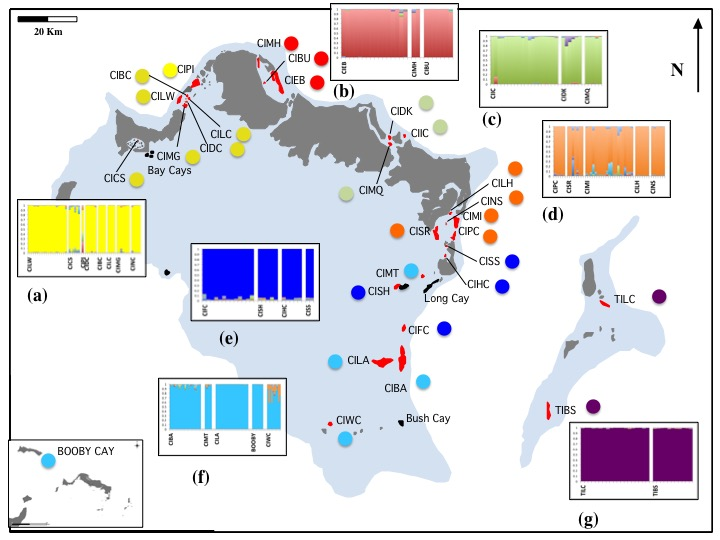{width="75%" fig-align="center"}

---

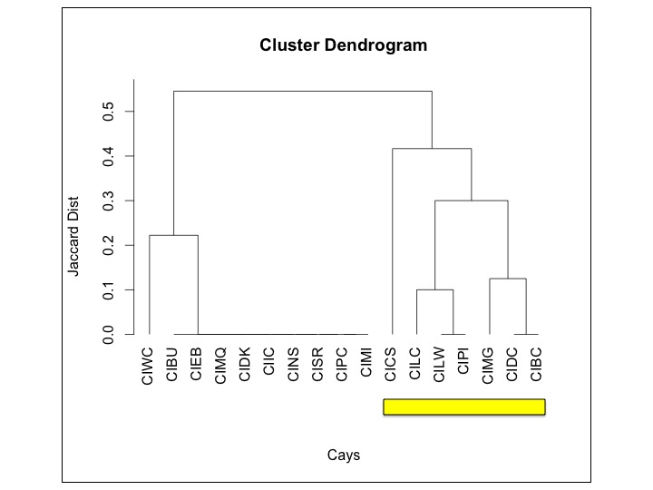{width="80%"}


# Measuring biodiversity

| Index | Formula and Terms |
|:----------------------------------|:-----------------------------------|
| **Alpha diversity**:
The diversity of species within an ecological community. The number of different species (species richness) and their evenness (the species' relative abundance) | $H = - \sum_i^s \ p_i \ ln(p_i), \ (i=1, 2, 3,...,s), \ \ (0 \le H^{'}\le \infty)$ [@VanDyke2020]; $p_i$ = proportion of the total community abundance of the species $i$ |
| **Beta diversity**: Measure of diversity among communities. A measure of the gradient of species composition across a landscape | $S/\alpha-1$ [@Whittaker1975];  $S$ = number of species in the area; $\alpha$ = average number of species per site |

---

| Index | Formula and Terms |
|:----------------------------------|:----------------------------------|
| **Gamma diversity**: Biodiversity of species across larger landscape levels | $dS/dD[(g+l)/2]$ [@Cody1986]; $D$ = distance; $g$ = rate of species gain; $l$ = rate of species loss |

## Calculating biodiversity: Excercise 1

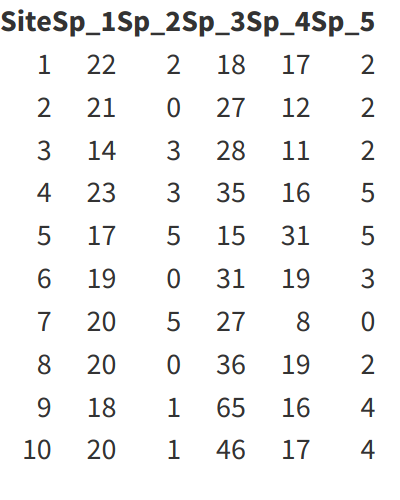{width="35%"}

- What is the most diverse site based on Shannon index? $H = - \sum_i^s \ p_i \ ln(p_i)$

## Calculating biodiversity: Excercise 1 in R

```{r divExcercise, echo=TRUE, eval=TRUE}
library(vegan)
data(BCI)
plantDivExcercise <- BCI[1:10, 
                         c(144, 186, 208, 216, 223)]
species_names <- rep(NA, ncol(plantDivExcercise))
for (i in 1:ncol(plantDivExcercise)){
  species_names[i] <- paste("Sp_", i, sep = "")
}
names(plantDivExcercise) <- species_names
Site <-  1:10
plantDivExcercise <- cbind(Site, plantDivExcercise)
diversity(plantDivExcercise)[diversity(plantDivExcercise)
    [] == max(diversity(plantDivExcercise))]
```


## Calculating biodiversity: Exercise 1 explanation

-   In $H = - \sum_i^s \ p_i \ ln(p_i)$, $p_i$ is the proportion of the total community abundance of the species $i$

-   We can workout the value for site 5:

$$
17+5+15+31+5 = 73
$$

$$
p_{species1} = 17/73 = 0.233
$$

$$
ln(p_{species1}) = ln(0.233) = -1.457
$$

$$
0.233*-1.457 = -0.339
$$

## Calculating biodiversity: Exercise 2

::::: columns
::: {.column width="50%"}
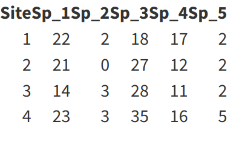{width="85%"}
:::

:::  {.column width="50%"}
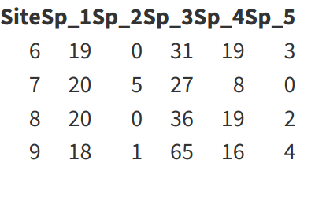{width="85%"}
:::
::::


-   Question: What is the most diverse area based on $\beta$ diversity index as postulated by @Whittaker1975? $S/\alpha-1$

## Calculating biodiversity: Exercise 2 in R

```{r divExcercise2, echo=TRUE, eval=TRUE}
data(BCI)
plantDivExcercise <- BCI[1:10, c(144,186,208,216,223)]
species_names <- rep(NA, ncol(plantDivExcercise))
for (i in 1:ncol(plantDivExcercise)){
  species_names[i] <- paste("Sp_", i, sep = "")
}  
names(plantDivExcercise) <- species_names
Site <-  1:10
plantDivExcercise <- cbind(Site, plantDivExcercise)
ncol(plantDivExcercise[1:4, 2:6])/
  mean(specnumber(plantDivExcercise[1:4, 2:6])) - 1
```

## Calculating biodiversity: Exercise 2 explanation

{width="40%"}

-   The @Whittaker1975 formula: $\beta=(S/\alpha)-1$, where $S$ is the total number of species in the area, and $\alpha$ is the average number of species in the area. $\beta$ diversity gives us an index of species turnover along a geographic gradient.

$$
\beta=\frac{5}{(5+4+5+5)/4}-1=0.052
$$

## Biodiversity distribution

::::: columns
::: {.column width="50%"}
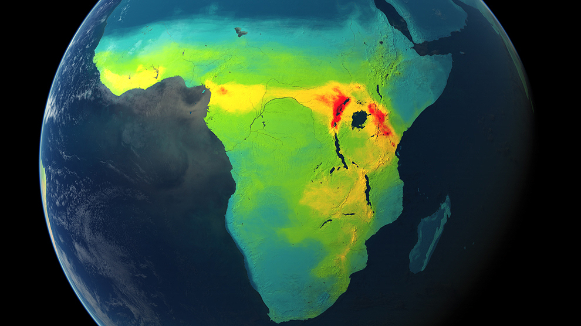{width="75%"}

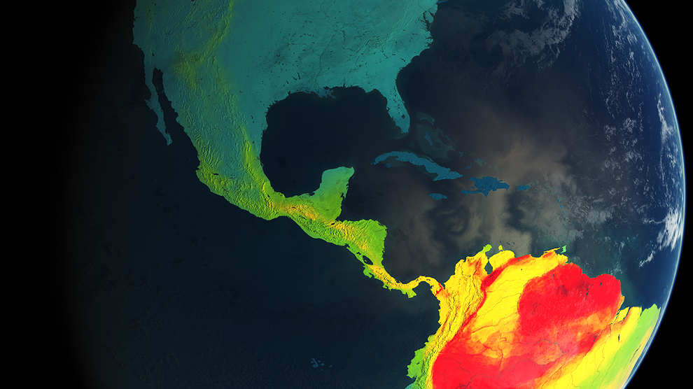{width="75%"}
:::

::: {.column width="50%"}
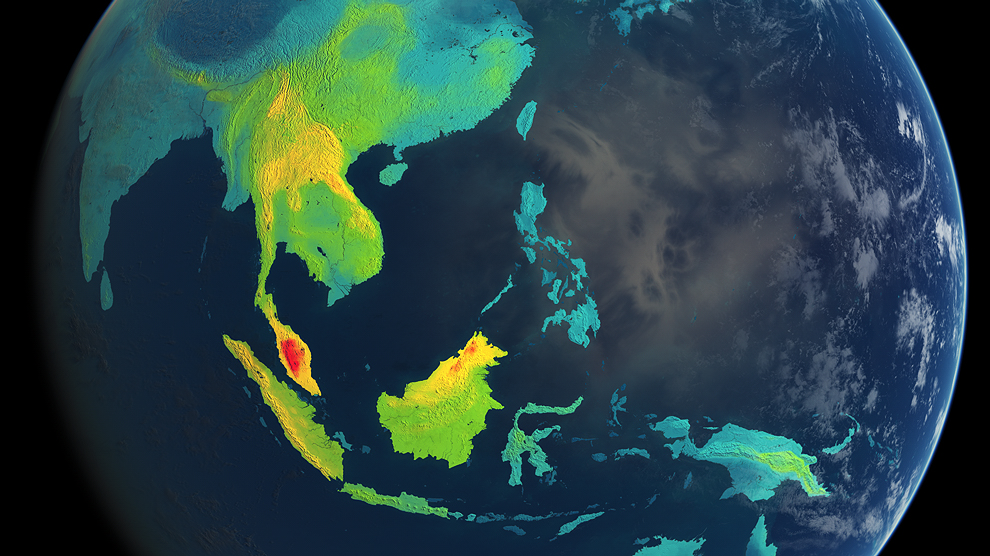{width="75%"}

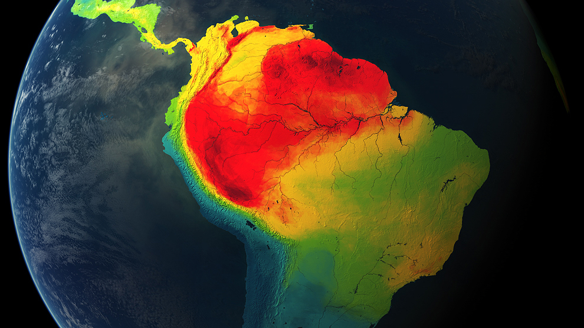{width="75%"}
:::
:::::

Mammal richness. Data downloaded from <https://biodiversitymapping.org>.

------------------------------------------------------------------------

## Global prioritization strategies

{width="82%" fig-align="center"}

------------------------------------------------------------------------

## Integrated conservation strategies

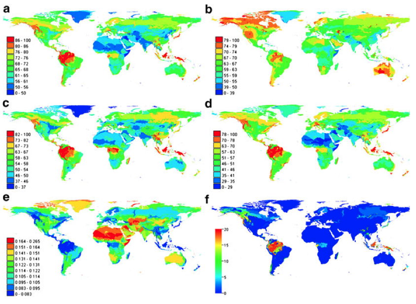{width="80%" fig-align="center"}

------------------------------------------------------------------------

## How to support biodiversity in human modified landscapes?

1.  Prefer diversity in crops (polyculture) and land use (land-use mosaic).
2.  Encourage traditional agricultural practices over large-scale mechanized solutions.
3.  Monitor and maintain keystone structure or species from the environment.
4.  Maintain as much natural vegetation as possible.
5.  Expand protected areas to encompass species of significant value (keystone-species).
6.  Favor use of native species in gardens and cultivation.
7.  Maintain urban green areas.
8.  Discourage urban sprawl.
9.  Encourage appreciation and understanding of conservation goals among land users.

After @Trimble2014

------------------------------------------------------------------------

## Synthesis

-   Biodiversity is a core concept of conservation biology. Its usefulness is only valid if we are able to thoroughly measure it and define it mathematically.

-   Only with a clear understanding and measurement of biodiversity and its value we could use it in conservation studies, conservation laws and conservation policy.

-   Effective future research on biodiversity will not only keep on refining and finding new ways on how to measure it, but also understand the evolutionary and ecological processes that can contribute to its creation and maintainment.

-   The hope is to increasingly see biodiversity as a core concept of future local and international strategies for the conservation of nature.


# References {.allowframebreaks}
