```{r setup, include=FALSE}
knitr::opts_chunk$set(echo = TRUE)
library("readxl")
library("diagram")
library("grid")
library("gridExtra")
library("plotrix")
library("tidyverse")
library("dendextend")
library("vegan")
library("gt")
library("gtExtras")
library("gtsummary")
library("plotly")
library("knitr")
library("kableExtra")
```

## Geological Time Scale

.](./1_geots.png){fig-align="center" width="90%"}

# Anthropocene

## We know we are changing the environment

-   The Holocene (Greek for "entirely recent") had been designated for the post-glacial period of the past ten to twelve thousands years during the Geological Congress in Bologna in 1855

-   The Welsh geologist Thomas Jenkins was probably the first one to publish the idea of an evidence-based human geologic time unit [@Lewis2015]

-   The US author George Perkins published in 1864 the volume "Man and Nature" detailing the global extent of modification of the earth by humans

------------------------------------------------------------------------

-   In 1873 the overwhelming impact of human activities on the environment was even more explicitly stated by the Italian geologist Antonio Stoppani who described the human impact as a "telluric force which in power and universality may compared to the greater forces of earth" [@VanDyke2020]

-   "Any formal recognition of an Anthropocene epoch in the geological time scale hinge on whether humans have changed the Earth ecosystem....to produce a stratigraphic signature in sediment and ice that is distinct of that of the holocene epoch" [@Waters2016]

## The Anthropocene

-   The sharpest of these signals is made by the artificial radionuclides spread worldwide by the thermonuclear bomb tests from the early 1950 [@VanDyke2020]

-   In 2019 the Anthropocene Working Group (AWG) released the result of its vote to designate a new geologic epoch

-   2019 officially marks the manifold and planetary effects that human beings are now creating on the ecology, natural processes and even geological records of planet Earth [@VanDyke2020]

------------------------------------------------------------------------

\vspace{1cm}

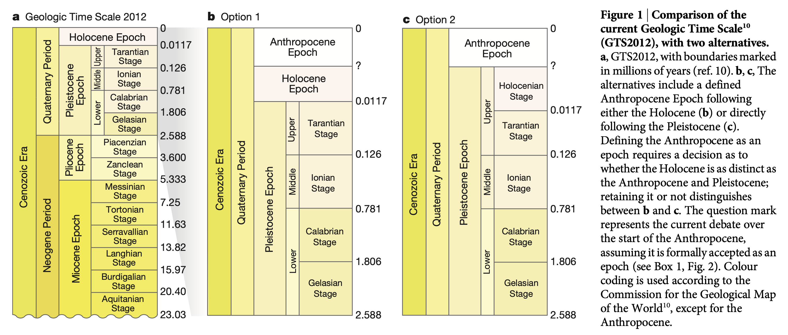{fig-align="center"}

------------------------------------------------------------------------

\vspace{1cm}

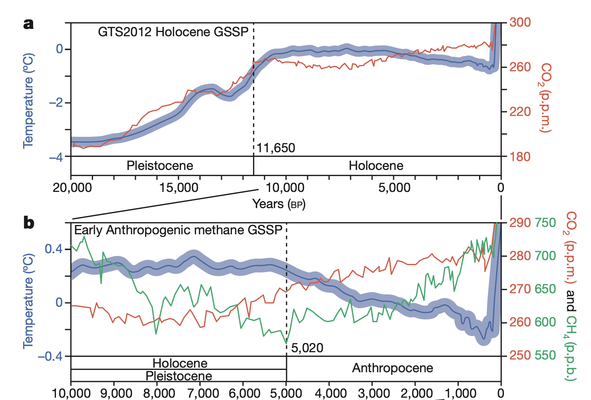{fig-align="center" width="90%"}

------------------------------------------------------------------------

\vspace{1cm}

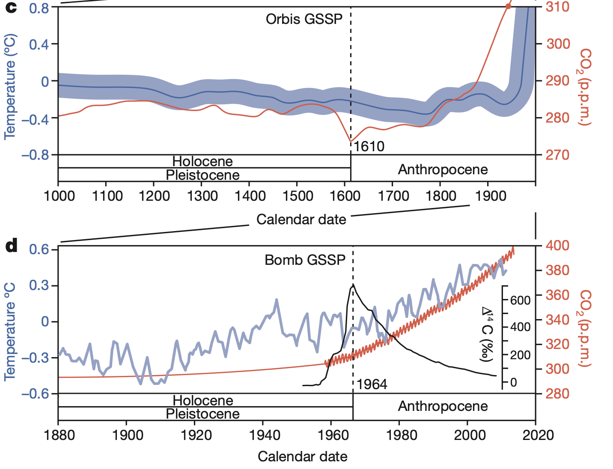{fig-align="center" width="80%"}

## From Biomes...

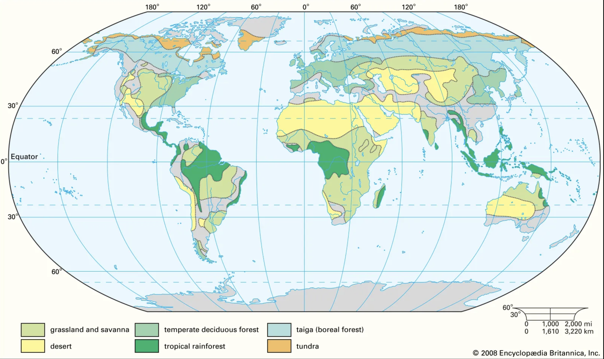{fig-align="center" width="90%"}

## ... to Anthromes

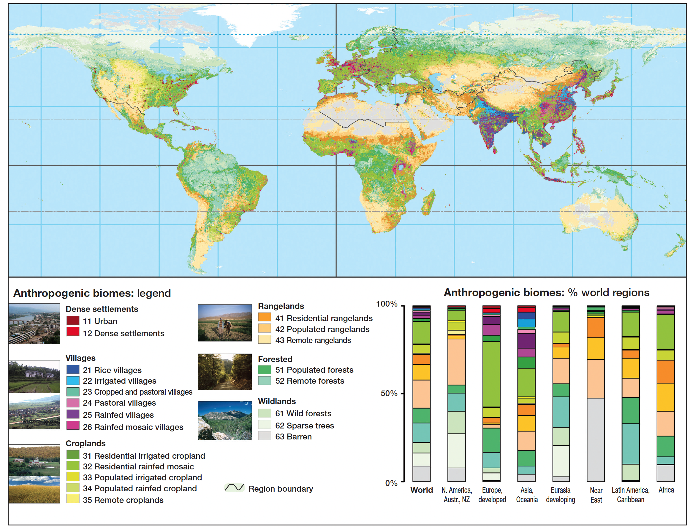{fig-align="center" width="80%"}

# Invasive species

> Make no mistake, we are seeing one of the great historical convulsions in the world's fauna and flora [@Elton2020, Elton's original publication is from 1958]

-   The role of humans as one of the most nefarious agent of disruption of biological communities is well recognized in the anthropocene epoch. One of the means of such disruption is undoubtedly tied to our transport of new species thousands of kilometers away from their native habitat [@VanDyke2020]

-   Invasive species represent the second most commonly listed factor for species endangerment! (Do you remember which is the first one?)

------------------------------------------------------------------------

-   An estimated cost of non-native species in the US alone is over \$120 billion annually [@Crowl2008]

-   International commerce has aided and increased the movement of species worldwide and across taxonomic groups

-   Only a fraction of transported species becomes established, and only $1\%$ become a pest, but addition and effects of all non native species, including pest species are cumulative over time

-   Currently New Zealand harbors more or less the same number of native plants and invasive plant species

------------------------------------------------------------------------

-   Arizona and Montana historically did not share any fish species. They now have about 33 species of fishes in common [@Mooney2001]

-   These changes have occurred because humans transport species for their benefit, and invasive species use human means of transport to their benefit!

-   Once an invasive species has established and naturalized at regional or continental scale there is little hope to eradicate it

------------------------------------------------------------------------

\vspace{0.7cm}

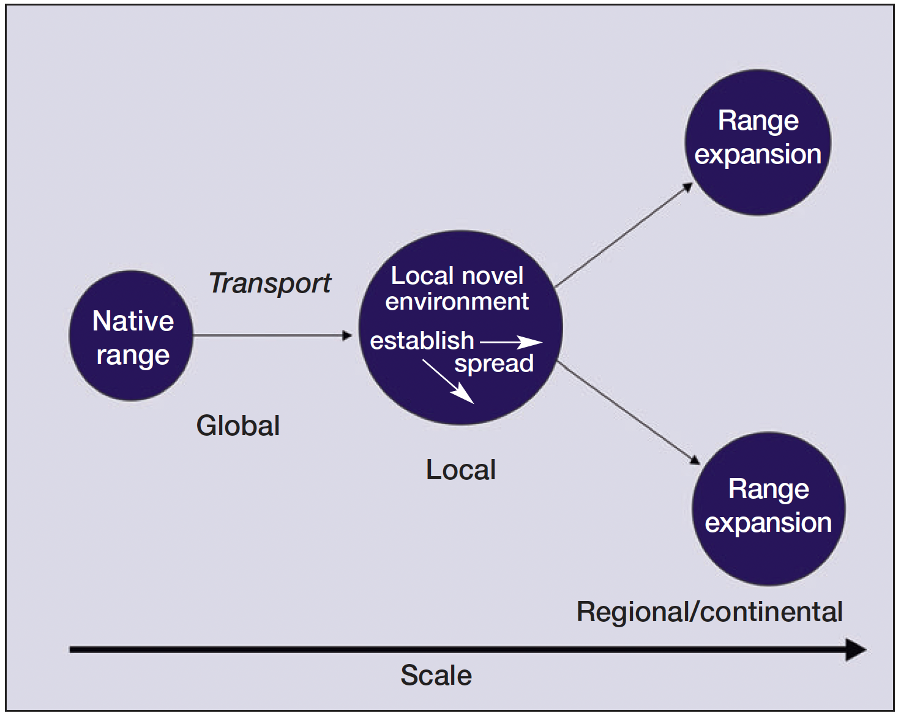{width="75%"}

##  Catastrophic invasions - The zebra mussel

 website.](./class_17_2.jpg){width="80%"}

------------------------------------------------------------------------

-   Zebra mussel can attach to any hard surface and to other living creature. In the later case they can cause the death of the individual they attach to

-   They are exceptionally good filter-feeders and they can alter the ecosystem by filtering huge amounts of phytoplankton, often the most important component of primary production in many aquatic systems

-   The introduction in North America, in the late 80ies, caused a great deal of disruption in many biotic and abiotic components of the environment where they were introduced and spread

------------------------------------------------------------------------

-   Among others, this invaders altered water transparency, nutrient cycling, and benthic habitat structure as well as food web structure, bioaccumulation of contaminants, and the diversity of native freshwater mussels [@Strayer2009; @Crowl2008]

-   Along with the zebra mussel came also its own roundworm parasite (*Bucephalus polymorphus*) which caused the reduction in many cyprind fish species [@Crowl2008; @VanDyke2020]

------------------------------------------------------------------------

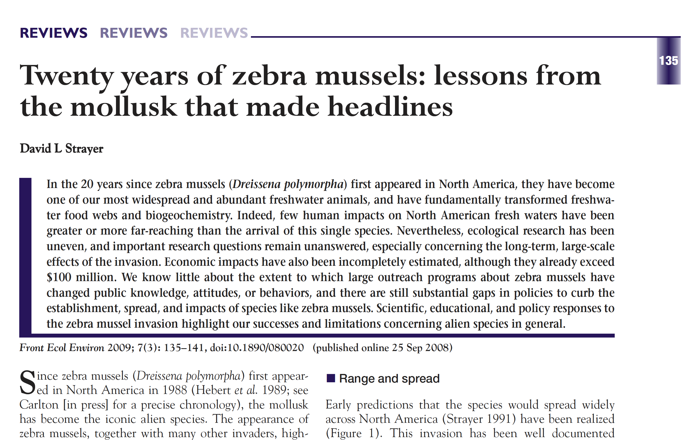{width="85%"}

##  Catastrophic invasions - Green iguanas

-   Green iguanas have invaded [Grand Cayman](https://doe.ky/wp-content/uploads/2021/07/Invasive_-Green-Iguanas-in-the-Cayman-Islands.pdf) island!

](./iguana_cull.png){width="75%"}

##  Catastrophic invasions - The blue crab

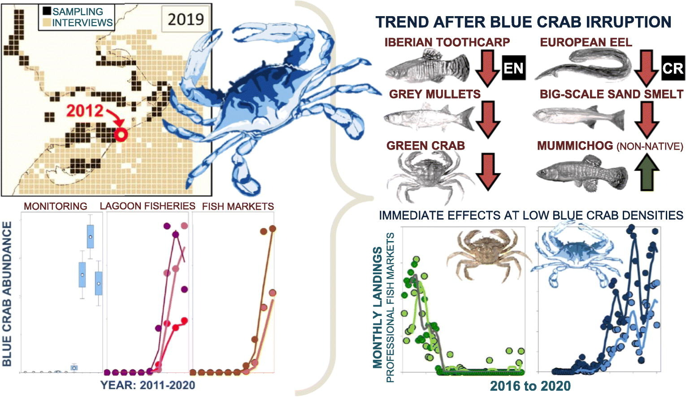{width="100%"}

## The seven steps of a succesfull invasion

1.  Introduction (intentional or accidental)

2.  Colonization (sustained residence on at least one invaded area)

3.  Establishment (positive population growth on at least one of the new sites)

4.  Dispersal

5.  Spatially distributed populations

6.  Invasive spread

7.  Adaptation to new environments

<!--Indeed, this is just a general framework describing what are the main steps, but the specifics of invasions vary on a case by case basis. Despite this, whether benign or disruptive, invasive species end up altering the local environment where they are introduced -->

## Understanding the invasive process!

-   Successful invaders are rare! Invaders must possess traits predisposing them to be transported by humans and to survive in the new environment

1.  They can deliver seeds, breeding individuals, or other type of propagules at a high rate at an opportune moment for invasion and at a high density

2.  They are able to persist for extended periods of time at low density under unfavorable conditions until favorable conditions permit them to grow to very high densities and initiate the spreading phase

3.  They are a good ecological match for the environment and are able to exploit local conditions and abiotic factors that favor the completion of their life cycle as well or even better than the native species [@VanDyke2020]

## The role of humans in moving things around!

-   Effects of invasive species will increase in response with increased levels of global trade and will be exacerbated by the climatic crisis [@Levine2003]

-   Humans have often been deliberate in the intent of introducing species to non-native areas while ignorant of the consequences of such introductions

-   In the nineteenth century the Naturalization Society attempted, and for the most part succeeded, in its intent to introduce common British songbirds to recreate the England country side environement. Such behaviour caused a dramatic dirsuption of the natural environment, with great damage to the local avifauna [@VanDyke2020]

<!--   More introductions are accomplished without any goal at all, as species can easily find themselves traveling unnoticed as stowaway around the globe -->

## A documented case of impact

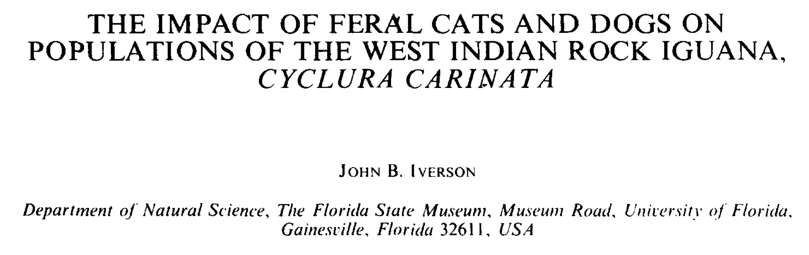

## Species extinction

> The extinction of species, each one a pilgrim of four billion years of evolution, is an irreversible loss. The ending of the lines of so many creatures with whom we have traveled this far is an occasion of profound sorrow and grief. Death can be accepted and to some degree transformed. But the loss of lineages and all their future young is not something to accept. It must be rigorously and intelligently resisted [@Snyder1990].

------------------------------------------------------------------------

-   Current biodiversity can be thought as the outcome of two "competing" and ongoing evolutionary processes: [speciation]{style="color: red;"} and [extinction]{style="color: red;"}.

-   Extinction is a fundamental part of natural processes and can be defined as the [global loss of species]{style="color: blue;"}.

-   Extinction is for good! Or maybe not...[@Lesley2014].

-   The institution most actively contributing to track global decline in species and biodiversity is the IUCN.

-   How exactly species extinction is a natural process and if so, why should we really care if things are currently going extinct?

# The evolution of life on earth

## First life forms

-   The oldest evidence of life on earth may be as old as 4 billion years ago [@Dodd2017].

-   After its appearance life remained pretty much the same and without much differentiation throughout the proterozoic era.

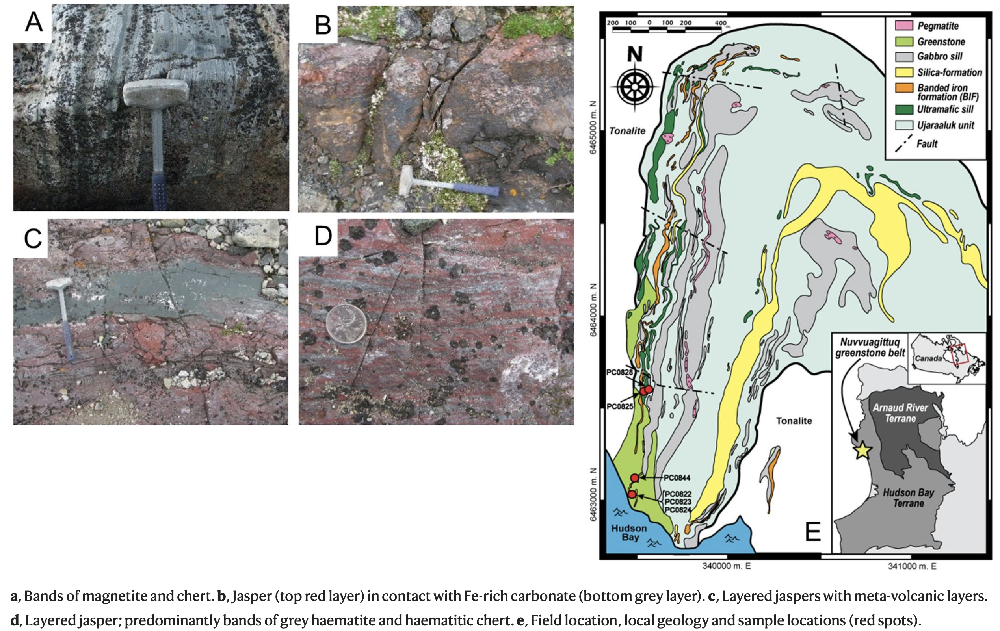{fig-align="center" width="75%"}

## Cambrian explosion

-   Ediacaran diversity, between 635 and 542 MYA.

    -   Mostly unskeletonized.

    -   [*Charniodiscus*](https://www.frontiersin.org/files/Articles/785929/feart-09-785929-HTML-r2/image_m/feart-09-785929-g002.jpg), [*Kimberella*](https://en.wikipedia.org/wiki/Kimberella#/media/File:Kimberella_quadrata.jpg).

-   Explosion of animal diversity in early Cambrian (542-480 MYA).

    -   First dominated by small shelly fossils.

    -   Brachiopoda and Mollusca.

    -   Unique in its degree of diversity and disparity.

------------------------------------------------------------------------

![Anatomy of the Cambrian explosion. After [@Marshall2006]](./3_cambrianExplosion.png){width="80%"}

------------------------------------------------------------------------

## Ordovician diversification

-   GOBE (Great Ordovician Biodiversification Event)

-   Great diversification in the seas (Brachiopods, Gastropods, Bivalves)

-   Landmasses invasion by plants and animals

-   It happened in a relatively small amount of time (ca. 485-460 MYA)

------------------------------------------------------------------------

![Paleogeographic reconstruction of the Ordovician period [@Servais2010].](./4_gobe.jpg){width="60%"}

------------------------------------------------------------------------

\vspace{1cm}

 website.](./4_bis.jpg){width="85%"}

# Extinctions

## How many species are there?

 website.](./numspec.png){width="87%" fig-align=center}

## Fossil records and extinction rates

| Taxon                   | Source           | Average (MY) |
|-------------------------|------------------|--------------|
| All invertebrates       | [@Raup1978]      | 11           |
| Marine invertebrates    | [@Valentine1970] | 5-10         |
| Marine animals          | [@Sepkoski1992]  | 5            |
| All fossil groups       | [@Simpson1952]   | 0.5-5        |
| Mammals                 | [@Martin1993]    | 5            |
| Cenozoic mammals        | [@Raup1978b]     | 1-2          |
| Diatoms                 | [@VanValen1973]  | 8            |
| Dinoflagellates         | [@VanValen1973]  | 13           |
| Planktonic foraminifera | [@VanValen1973]  | 7            |
| Echinoderms             | [@Durham1970]    | 6            |

- Estimates of species lifespan from origin to extinction [@Lawton1995].

---

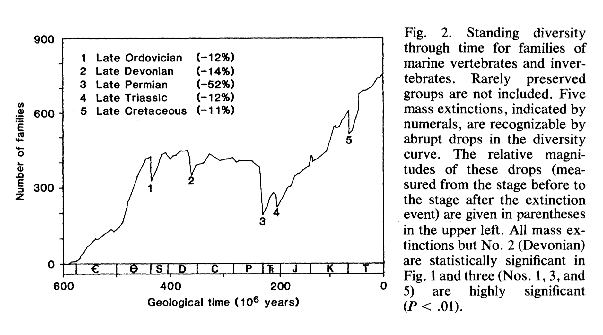

------------------------------------------------------------------------

1.  [Ordovician-Silurian]{style="color: blue;"}. 86% of life lost. Scientists theorize that there were two main phases to this extinction; a glaciation event and a heating event

2.  [Late Devonian]{style="color: blue;"}. 75% life lost. Global cooling. Algae blooming consumed vast amounts of oxygen in the oceans, suffocating many species

3.  [Permian-Triassic]{style="color: blue;"}. 96% of life lost. Volcanic activity in Siberia put out massive amounts of carbon dioxide into the atmosphere. Bacteria began producing methane, another greenhouse gas. Large quantities of both gases warmed the planet and combined with earth's water, making the ocean and rain acidic, creating a highly toxic environment for life

------------------------------------------------------------------------

4.  [Triassic-Jurassic]{style="color: blue;"}. 80% of life lost. Volcanic eruption and/or asteroid

5.  [Cretaceous]{style="color: blue;"}. ca. 65% of life lost. The Cretaceous-Paleogene extinction wiped out the dinosaurs, along with a significant portion of all life on Earth. A widely accepted theory is that an asteroid landed in the Yucatán Peninsula in Mexico and killed the dinosaurs

## A little excercise...

-   We saw that the majority of life on earth exploded and differentiated approximately in the last 600 MY

-   We also estimated that a single species persists on average 5 MY [@Lawton1995]

-   Finally we will assume that the number of total species today is, roughly, 2.16 M

::: callout-important
# Question

Can you estimate what is the percentage of extant biodiversity compared to what is extinct?
:::

------------------------------------------------------------------------

```{r extinctSpecies}
(specTurnover <- 600/5)
(totalSpec <- 2.16 * specTurnover)
(2.16*100)/totalSpec
```

\vspace{0.5cm}

-   This means that more than 99% of all species that have ever lived are extinct today! [See also @Jablonski2004]

## Another little excercise...

::: callout-important
# Question

Based on the data we have, can you roughly estimate what is the proportion of species that went extinct outside of the mass extinction events? (Ordovician-Silurian 86%; Late Devonian 75%; Permian-Triassic 96%; Triassic-Jurassic 80%; Cretaceous 65%)
:::

. . .

```{r outsideOfMassExtinc}
100-(0.86+0.75+0.96+0.80+0.65)
```

. . .

-   This means that 100% - 4% = 96% of all extinctions occurred [outside]{style="color: red;"} the mass extinction events

------------------------------------------------------------------------

-   The results from this little exercise are not so distant from what has been known in the scientific literature [@Raup1991]

-   These results tell us that extinction is a natural process!!!

-   If extinction is part of the natural process of evolution it should be possible to identify a [background-extinction]{style="color: red;"} rate, i.e. the natural extinction rate during periods in between major extinction events

## Background extinction rate.

-   If we can estimate a background-extinction rate it should also be possible to compare it across time to measure our current impact on biodiversity

-   The value we just used (\~5-10 MY) per species is a good approximation of the background extinction rate [@Lawton1995] and falls under the categories of extinction rate intended as species survival rate

------------------------------------------------------------------------

<!--   Another way used to estimate extinction rate is based on the species-area estimate [@Chisholm2018] -->

-   One of the estimate of extinction rate largely used is in million species years (MSY) and is based on fossil records [@Pimm2006]

-   The million species year extinction rate is based on the empirical estimate from known data on current extinction

-   It tells us how many extinctions we should expect in any sample where the sum of all of the years over all of the species under consideration is one million

-   For example, follow the fates of 10,000 bird species for one century and one should observe just one extinction [i.e., 1 E/MSY according to @Pimm2006]

------------------------------------------------------------------------

::: callout-important
# Question!

1230 species of birds have been described since 1900. This cohort has accumulated 98334 species-years, meaning that one species has been known, on average, for 80 years. Since their description, 13 have gone extinct. Can you estimate the extinction rate?
:::

. . .

$$
13:98334=x:10^6
$$

. . .

- This means that the rates of extinctions in recent times (at least since we can document extinctions as they happen) seems to be dramatically increased [@Pimm2014]!

------------------------------------------------------------------------

-   The core idea is to find a background extinction rate that doesn't consider the influence of mass-extinction events and/or anthropic influence.

-   We know from fossil records that species seem to persist \~1 MY. @Pimm1995 take the fossil evidence and turn it into a background extinction rate (i.e, a ratio between two quantities, the number of species extinct over time-species). In particular, 1 extinction (E) per $10^6$ species-years (MSY).

---

:::::: columns
::: {.column width="33%"}
$$
\frac{x}{10000}=\frac{1}{10^6};
$$

$$
x = \frac{1}{10^6}*10000; 
$$

$$
x = 0.01
$$
:::

::: {.column width="33%"}
$$
\frac{13}{98334}=\frac{x}{10^6}; 
$$

$$
 x = \frac{13}{98334}*10^6;
$$

$$
x = 132.202
$$
:::

::: {.column width="33%"}
$$
\frac{191}{100000}=\frac{x}{10^6};
$$

$$
x = \frac{191}{10^5}*10^6;
$$

$$
x=1910
$$
:::
::::::

------------------------------------------------------------------------

## The sixth extinction!

The overarching driver of species extinction is human population growth and per-capita consumption!

-   1690 Dodo bird (*Raphus cucullatus*), extinct from predation by introduced pigs and cats.

-   1768 Stellar's sea cow (*Hydrodamalis gigas*), extinct from hunting for fur and oil.

-   1870 Labrador duck (*Camptorhynchus labradorius*), extinct from human competition for mussels and other shellfish.

-   1900 Rocky mountain locust (*Melanoplus spretus*), extinct from habitat conversion to farmland.

-   1936 Tasmanian wolf (*Thylacinus cynocephalus*), extinct from hunting, habitat loss, and competition with dogs.

------------------------------------------------------------------------

-   1952 Deepwater cisco fish (*Coregonus johannae*), extinct from competition and predation by introduced fishes.

-   1962 Hawaii chaff flower (*Achyranthes atollensis*), extinct from habitat conversion to military installations.

-   1989 Golden toad (*Incilius periglenes*), extinct from climate change or other impacts.

-   2004 St. Helena olive tree (*Nesiota elliptica*), extinct from logging and plantations.

(List available from the [Smithsonian](https://naturalhistory.si.edu/education/teaching-resources/paleontology/extinction-over-time) website.)

------------------------------------------------------------------------

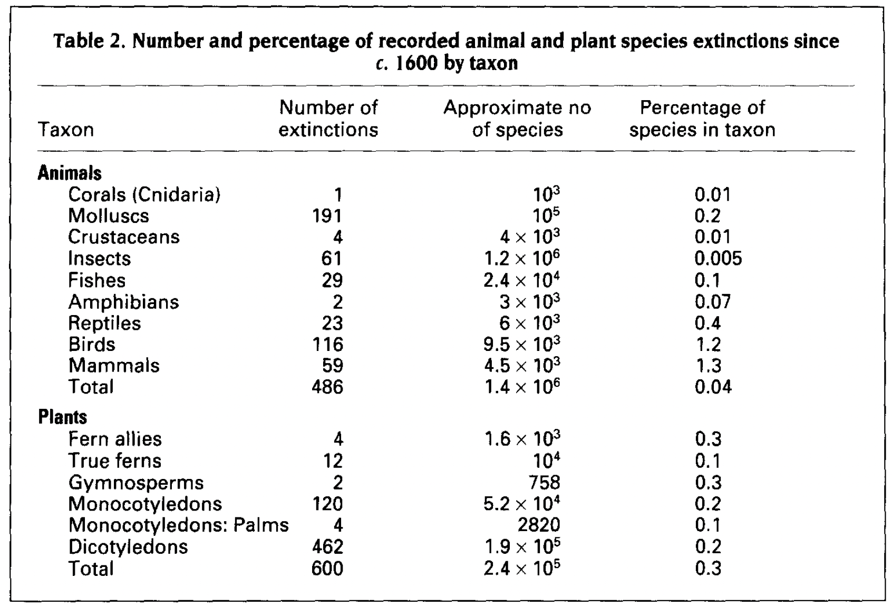{width="80%"}

# References {.allowframebreaks}
