```{r setup, include=FALSE}
knitr::opts_chunk$set(echo = TRUE)
x <- c("calendR", "dplyr",
       "ggthemes", "diagram", "readxl", "plotly",
       "lubridate", "phylogram",
       "scales", "ggtree", "tidytree",
       "tidyverse", "stringr", "DT",
       "XML", "xml2", "kableExtra", "gt", "gtExtras")
lapply(x, require, character.only = T)
rm(x)
```

## What is a population?

- The traditional definition of a population is:

  - \textcolor{red}{All individuals of the same species coexisting at the same time and in the same geographic area} [@VanDyke2020]

-   This definition is strictly biological, but it could be more complex when we refer to individuals that are harvested, threatened or are perceived controversially by the public opinion

-   In the above cases, a population may be defined using political and social arguments rather than biological ones

-   For example, Michigan and Wisconsin manage their Wolf (*Canis lupus*) population independently even though they are neighboring states and even though wolf individuals, obviously, move across the boundaries as they please

------------------------------------------------------------------------

-   Even if they "feel" artificial, political and social perspectives should always be considered when defining populations, as politicians are the ones that ultimately support or deny conservation policies


## Population demography

-   Populations mutate over time due to individuals \textcolor{blue}{reproducing} or \textcolor{red}{dying}, \textcolor{orange}{migrating} or \textcolor{olive}{dispersing}

-   Population demography is the study of populations by understanding how probable each one of the above mentioned events is, and what factors influence these probabilities

. . .

- \textcolor{gray}{Extinction} is the event that conservation biologists are trying to avoid

- Very few populations suddenly disappear when they are alrge and healthy: extinction is generally preceded by decline!

------------------------------------------------------------------------


- \textbf{Cohort}: a group of individuals born at the same time

- \textbf{Survivorship}: the probability of an individual surviving up to a certain age

- \textbf{Recruitment}: the net additions/subtractions of reproductively viable individuals, added to the population after the adjustment for early or neonatal mortality

- \textbf{Fecundity}: the number of young or eggs produced per female (animal) or seeds per individual (plants) per unit time

- \textbf{Dispersal}: the permanent movement of an individual from its area of birth to another area. Usually measured in term of \emph{rate}, \emph{distance} and \emph{direction}


<!-- La capacità di dispersione di un organismo è stata per lungo tempo trascurata perché difficile da misurare direttamente. Tecniche moderno di monitoraggio diretto come la telemetria e la possibilità dei monitoraggi satellitari, stanno via via sostituendo le tecniche indirette come ad esempio l'utilizzo delle metriche basate sulle distancze genetiche tra popolazioni -->

---

- If we had perfect knowledge about each individual in the population it would be relatively simple to make precise predictions about the behavior of the population through time

- Unfortunately, in most cases our knowledge about population status is far from perfect. We therefore construct models to understand and approximate the complexity of a population and predict how it will behave

- The models and their assumptions are NOT laws that invariably describe how populations work. They have to be informed with direct information gathered from real populations


## Population models: exponential

-   The simplest model of population dynamic can be written as the sum of births (\textbf{B}) and migrants entering the populations (\textbf{I}) minus mortality (\textbf{D}) and individuals leaving or exiting the population (\textbf{E})

$$
\label{popmod}
\tag{4.1}
N_{(t+1)} = N_{(t)} + (B_t + I_t) - (D_t + E_t)
$$

. . .

-   If a population is increasing exponentially (\emph{i.e.}, increasing with and increasing rate over time) its growth will be defined by $N$ and a rate of increase $r$ which is rate of birth minus rate of death ($r = b-d$)

-   Without considering migration (neither in nor out of the population) $B$ becomes a function of birth rate ($b$), the number of deaths ($D$) is a function of $d$ the per capita death rate

------------------------------------------------------------------------

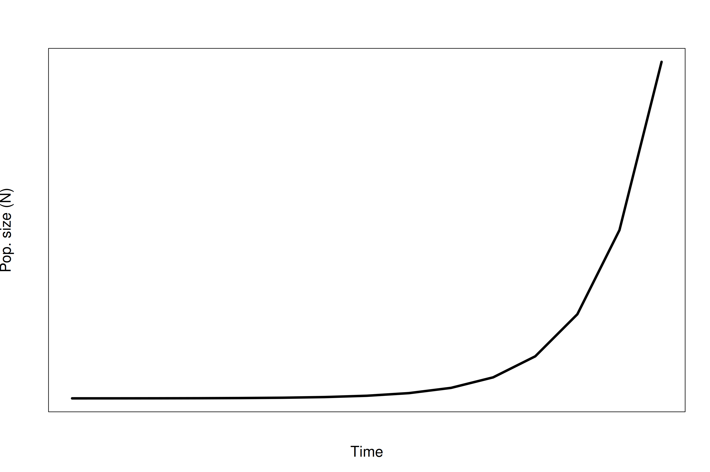{width="70%" fig-align="center"}

-   Change in numbers over change in time is expressed as:

$$
\label{expgrth}
\tag{4.2}
\frac{dN}{dt} = rN 
$$

## Population models: logistic

-   The exponential growth curve is a good starting point, although unrealistic for most species. \textcolor{red}{Exponential growth has no ecology!} [@Boyce1992]

-   A more realistic model should account for species' ecology and the fact that species exist in their environment

-   The limits imposed by the environment are usually identified using $K$, \emph{i.e.} the carrying capacity

$$
\label{expgrthcc}
\tag{4.3}
\frac{dN}{dt} = rN (\frac{K-N}{K})
$$

-   With small values of $N$ relative to $K$, $(\frac{K-N}{K}) \approx 1$ and the population grows almost exponentially

------------------------------------------------------------------------

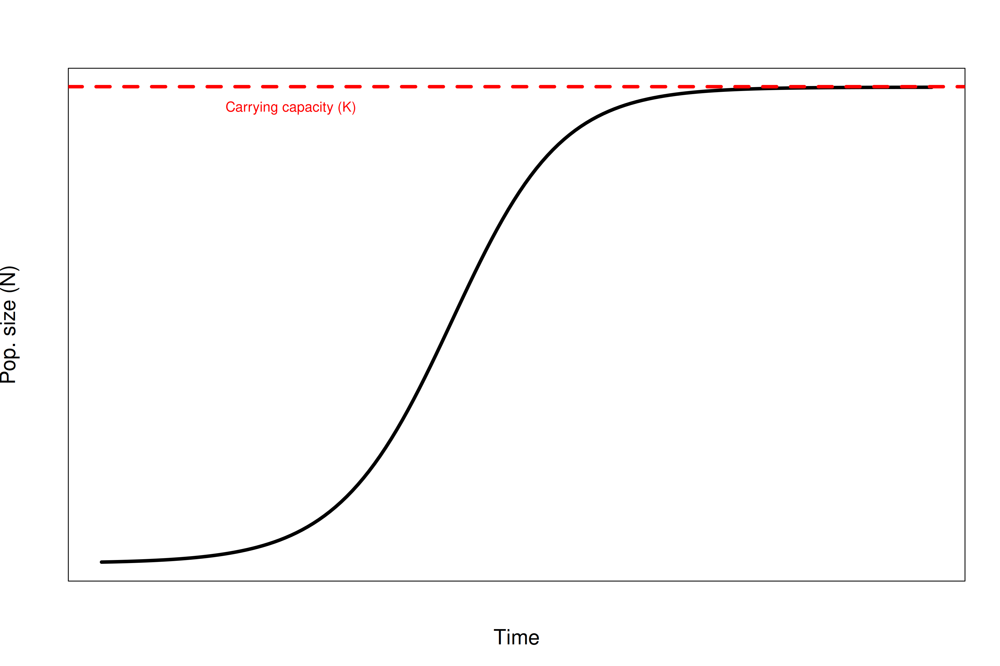{width="70%" fig-align="center"}

-   This model assumes all individuals are demographic equivalent, an unlikely assumption in many systems, especially with long lived individuals!

---

- In logistic model, changes in the size of the population ($N$) directly affect population growth, an expression of \textbf{density dependence}

- Density dependence operates through a negative feedback between the growth rate and the population size at one or more steps

- Density dependence results in regulation of the population fluctuations around a mean population size, which is the carrying capacity

------------------------------------------------------------------------

## Population perturbations: density independent

-   Many factors influencing population size are described as [stochastic factors]{style="color: red;"}

-   A population whose growth is only a function of stochastic variation can be described as density independent. @Shaffer1981 recognizes 4 main sources of such stochasticity:

    -   genetic stochasticity;

    -   demographic stochasticity;

    -   environmental stochasticity

    -   natural catastrophes!

-   The effects of the these sources of variation are not predetermined, but subject to uncertainties that are more or less probable according to population characteristics

## Population perturbations: natural catastrophes!

- Some have argued that natural catastrophes are a special case of environmental stochasticity because they are only extreme forms of normal environment variation (prolonged drought, flash floods, extreme rain)

- The point is that catastrophes lie outside of the normal probability distribution of random events associated with environmental variation

- They also are qualitatively and quantitatively different in their effects

- A forest fire is not just a very hot day! [@Lacy1993]

- The most viable protection against risks associated with catastrophes is spatial segregation of different population subunits [@VanDyke2020]


## Avoiding extinction through spatial segregation

- What are the relative risks of keeping a small population intact on a single site versus subdividing the population in to separate units?

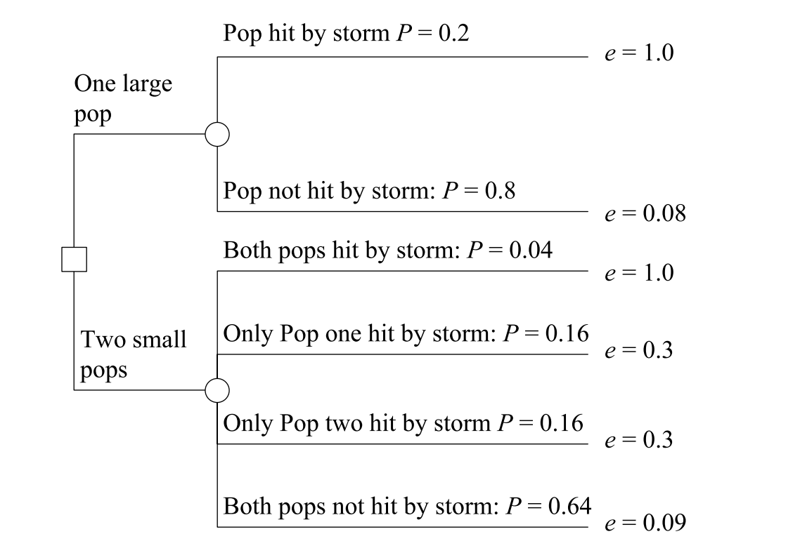{width="65%" fig-align="center"}

---

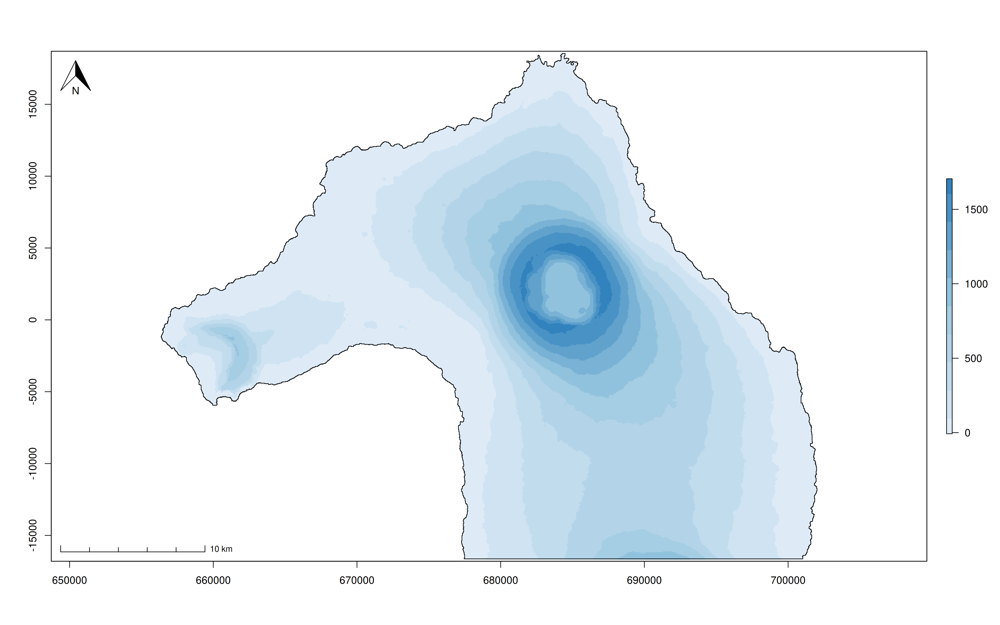{width="83%" fig-align="center"}

## Population perturbations: density dependent

-   Density dependent factors can regulate the size of a population in a much more precise way than the independent ones

-   To better understand these factors it is useful to debunk the assumptions of the logistic growth curves

    -   Time lag in density dependence: the addition of new individuals in the population may not have an immediate effect in shaping the growth curve

    -   Traditional logistic curves assume constant values of K: it is more accurate to define K not as a constant value that a population cannot exceed, but as a population size reflecting equilibrium between a population and its resources created by their interaction

    -   Individuals in a population are not contributing equally to the population growth: age and sex structure play a pivotal role

------------------------------------------------------------------------

## How do we estimate the size of a population?

-   It is often impractical and/or impossible to count every single individual in a population

. . .

-   Capture-Mark-Recapture experiments allow to estimate a population's size

    -   Some individuals are captured and marked

    -   The marked individuals are released in their environment

    -   A second sampling trip is conducted and another portion of the individuals are collected

    -   The number of marked individuals collected in the second expedition is expected to be proportional to the number of marked individuals in the entire population

## Tagging systems

-   A tagging system is a system allowing us to tag and label things to provide those things a unique identifier

-   People have been tagging animals (wild and captive) for hundreds of years and have developed different ways to tag pretty much every single living things

-   An animal tag can be as simple as a piece of metal or plastic with a number carved on it or with a standardized meaning

------------------------------------------------------------------------

## Visual tagging systems

::: {layout="[[-1], [1], [-1]]"}
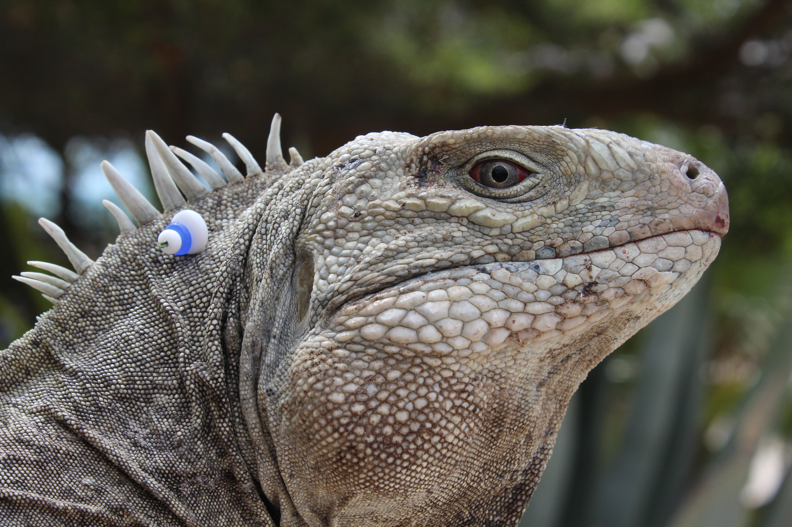{width="70%" fig-align="center"}
:::

## Passive integrated transponders

::::: columns
::: {.column width="50%"}
-   Tags based on radio-frequency identification (RFID) \vspace{0.5cm}
-   Emit a signal with an alpha-numeric code unique to the animal \vspace{0.5cm}
-   Widely used for wildlife fauna \vspace{0.5cm}
-   They generally do not carry any other information but the ID
:::

::: {.column width="50%"}
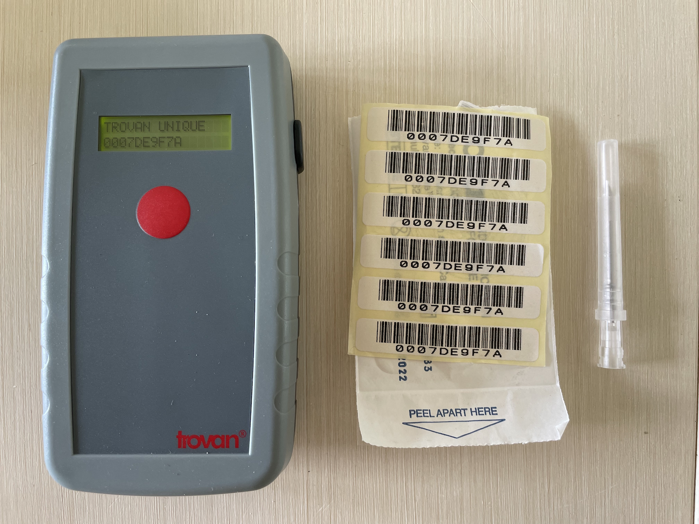{fig-align="center"}
:::
:::::

## Patterns tagging


### Toes and nail clipping

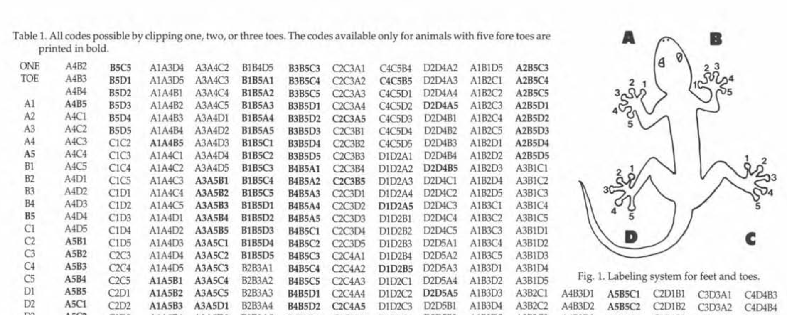

---

### Features tag

](./class_4_4.png){fig-align="center" width="80%"}


## Photo tagging

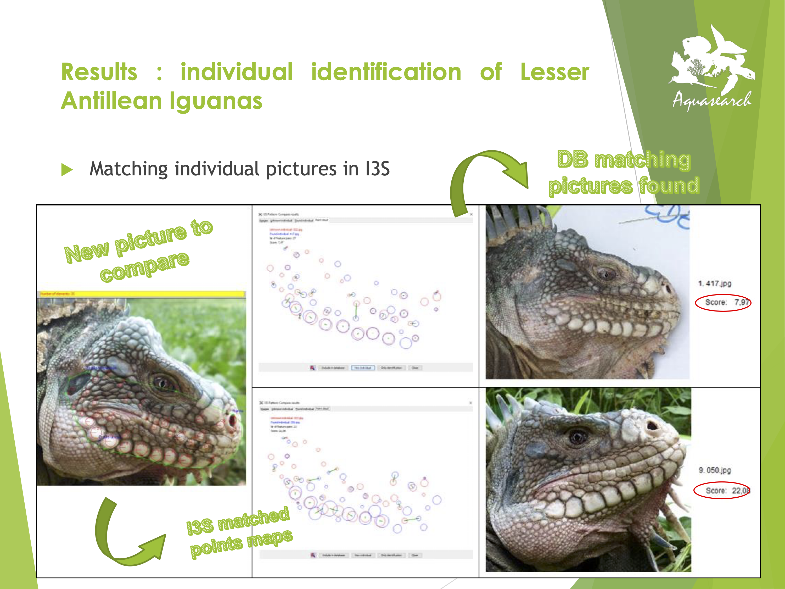{width="70%" fig-align="center"}

## Satellite tags

<!--   Identify an individual and provide useful information about that animal and its environment [@Loreti2019; @Loreti2020; @Colosimo2022b]-->

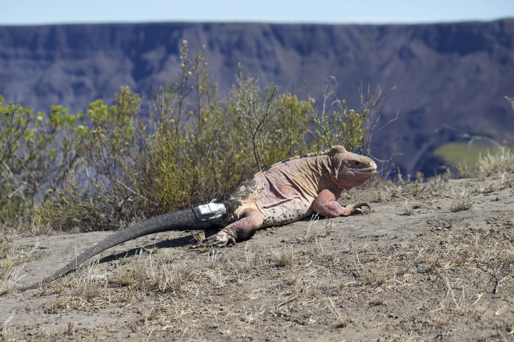{fig-align="center" width="80%"}

## Estimates of census population size

-   A conservationist is working on a critical endangered species and needs to estimate how many individuals are left. He/she goes to the field and captures 15 individuals. These individuals are tagged and released on site. One week later the researcher comes back and catches 20 individuals, 10 of which are tagged

-   Lets define some variables as:

    -   $N$ = Number of animals in the population

    -   $n$ = Number of animals marked on the first visit

    -   $K$ = Number of animals captured on the second visit

    -   $k$ = Number of animals captured in the second visit that were marked (i.e., recaptured individuals)

## Lincoln-Petersen estimator of N [@Seber1982]

-   Useful with only two sampling events \vspace{0.5cm}
-   Assumes that $N$ is constant over the time of the experiment (i.e., there are no deaths or births) \vspace{0.5cm}
-   Assumes a closed population (i.e., there are no migrants) \vspace{0.5cm}
-   Catchability is the same among individuals, even the tagged ones \vspace{0.5cm}
-   Tags are not lost between sampling events \vspace{0.5cm}
-   Individuals have the time to randomly redistribute over their habitat

------------------------------------------------------------------------

-   $N$ = Number of animals in the population \vspace{0.5cm}
-   $n$ = Number of animals marked on the first visit \vspace{0.5cm}
-   $K$ = Number of animals captured on the second visit \vspace{0.5cm}
-   $k$ = Number of animals captured in the second visit that were marked (i.e., recaptured individuals)

$$
\label{lp}
\tag{4.4}
N=\frac{K*n}{k}
$$

## Schnable estimator of $N$

-   Extension of the LP estimator \vspace{0.8cm}
-   Same assumptions of LP \vspace{0.8cm}
-   Allows to incorporate $s$ sampling events in the calculation \vspace{0.8cm}
-   It depends simply on observing how the proportion of marked animals in catches increases as more animals have been marked [@Sutherland1996]

------------------------------------------------------------------------

-   $N$ = Number of animals in the population \vspace{0.5cm}
-   $n_i$ = Number of animals captured on $i^{th}$ visit \vspace{0.5cm}
-   $m_i$ = Number of animals marked on $i^{th}$ visit \vspace{0.5cm}
-   $k_i$ = Number of animals captured on $i^{th}$ visit that were marked (i.e., recaptured individuals) \vspace{0.5cm}
-   $s$ = Number of visits

$$
\label{schnable}
\tag{4.5}
N=\frac{\sum_{i=1}^s  n_i*m_i}{\sum_{i=1}^s k_i}
$$

## Jolly-Seber

-   Jolly-Seber [@Jolly1965; @Seber1982] is the method of election to estimate N starting from multiple sampling occasions

-   The following set of four numbers are needed in order to begin the calculation

    -   $n_i$ = total number of animals caught in the $i^{th}$ sample

    -   $R_i$ = number of animals that are released after the $i^{th}$ sample

    -   $m_i$ = number of animals in the $i^{th}$ sample that carry marks from previous captures

    -   $m_{ij}$ = number of animals in the $i^{th}$ sample that were most recently caught in the $j^{th}$ sample

------------------------------------------------------------------------

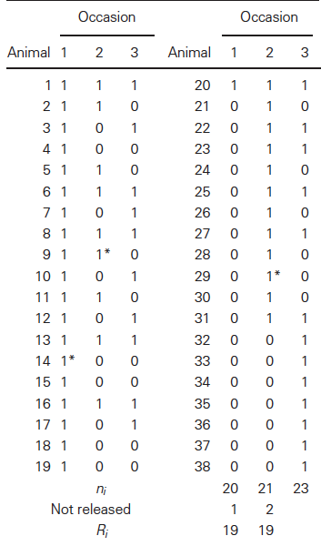{width="38%"}

------------------------------------------------------------------------

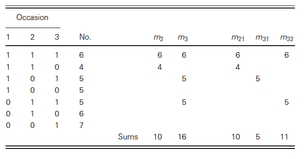

------------------------------------------------------------------------

-   $z_i$ = the number of animals caught both before and after the $i^{th}$ sample but not in the $i^{th}$ sample itself

-   $r_i$ = the number of animals that were released from the $i^{th}$ sample and were subsequently recaptured [@Sutherland1996]

-   $M_i$ = number of marked animals in the population when the $i^{th}$ sample is taken (but not including animals newly marked in the $i^{th}$ sample)

$$
    \label{mi}
    \tag{4.6}
    m_1 + (R_i + 1)z_i /(r_i + 1)
$$

------------------------------------------------------------------------

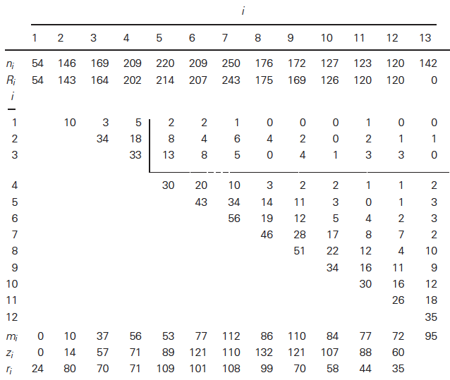{width="75%"}

------------------------------------------------------------------------

-   $N_i$ = population size at the time of the $i^{th}$ sample

$$
    \label{ni}
    \tag{4.7}
    M_i (n_i + 1)/(m_i + 1)
    $$

-   $\phi_i$ = proportion of the population surviving (and remaining in the study area) from the $i^{th}$ sampling occasion to the $(i + 1)^{th}$

$$
\label{fi}
\tag{4.8}
M_{i+1}/(M_i − m_i + R_1)
$$

-   $B_i$ = number of animals that enter the population between the $i^{th}$ and $(i + 1)^{th}$ samples and survive until the $(i + 1)^{th}$ sampling occasion

$$
    \label{bi}
    \tag{4.9}
    N_{i+1} − \phi_i (N_i − n_i + R_i)
$$

------------------------------------------------------------------------

-   $M_2 = 10 + (143 + 1)14/(80 + 1) = 34.89$ \vspace{0.5cm}
-   $N_2 = 34.89(146 + 1)/(10 + 1) = 466.1$ \vspace{0.5cm}
-   $\phi_2 = 169.46/(34.89 − 10 + 143) = 1.009$ \vspace{0.5cm}
-   $B_2 = 758.1 − 1.009(466.2 − 146 + 143) = 290.7$ \vspace{0.5cm}
-   Note that one cannot calculate $M$ for the last sample, $N$ for the first or last, $\phi$ for the last two and $B$ for the first or last two. $M_1$ is always zero

## Distance sampling

- This method is based on performing transects during which the user collects the distances of the surveyed individuals from a line or point

- The goal is to estimate the density of individuals within a region

](./Distance_sampling_method_line_transects_diagram.png){width="30%" fig-align="center"}

---

\vspace{.7cm}

- Distance sampling assumes perfect detectability on the walking transect line

](./distSamplSim.png){width="70%" fig-align="center"}

# References {.allowframebreaks}
