```{r setup, include=FALSE}
knitr::opts_chunk$set(echo = TRUE)
x <- c("calendR", "dplyr",
       "ggthemes", "diagram", "readxl", "plotly",
       "lubridate", "phylogram",
       "scales", "ggtree", "tidytree",
       "tidyverse", "stringr", "DT",
       "XML", "xml2", "kableExtra", "gt", "gtExtras")
lapply(x, require, character.only = T)
rm(x)
```

## Population genetics

-   Genetics (and genomic) have an important role in conservation biology and towards the protection of biodiversity

-   Darwin was the first to consider the importance of genetics and evolution in the persistence of natural populations. He postulated that because of the reduced population size of deer in British natural reserves they may experience loss of vigor [@Darwin1896]

-   The modern concern for genetics in conservation began in the 1970s when Frankel began to raise the alarm about the loss of primitive crop varieties and their replacement by genetically uniform cultivars [@Frankel1970; @Frankel1974]

------------------------------------------------------------------------

-   Most articles dealing with conservation and genetics fit into one of the five general categories [@Allendorf2022]:

    1.  Management and reintroduction of captive populations, and the restoration of biological communities

    2.  Description and identification of individuals, genetic population structure, kin relationships, and taxonomic relationships

    3.  Detection and prediction of the effects of habitat loss, fragmentation, isolation, and genetic rescue

    4.  Detection and prediction of the effects of hybridization and introgression

    5.  Understanding the relationships between fitness of individuals or local adaptation of populations and environmental factors

------------------------------------------------------------------------

-   As in other sciences, conservation genetics has benefited from the use of model organisms for experiments as well as modelistic and numerical approaches

-   How much gene flow is required to prevent the inbreeding effects of small population size?
  
    - We can use species with short generation time and easy to control (*Drosophila*, peas, *Arabidopsis thaliana*) to make empirical experiments and answer the above question

---
    
-   Describing individuals from a molecular genetic standpoint can also help to better understand the basic biology of species and populations [@Allendorf2022]

    -   Total population size can be estimated from the genotypes in populations that are difficult to sample with the classic methodologies [@Luikart2010]
    
-   Genetic analysis can help detecting cryptic effects of climate change on the distribution of species [@Allendorf2022]

    -   @Gurgel2020 documented the reduction in genetic diversity after a heatwave despite the sea weed population had recovered

------------------------------------------------------------------------

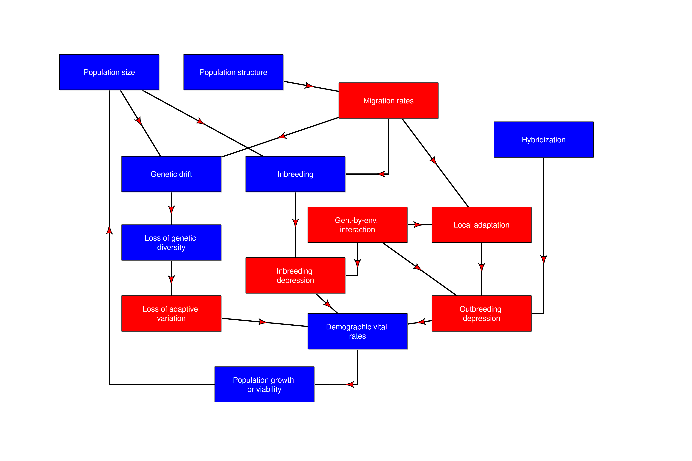{width="90%" filg-align="center"}

## What should we conserve?

-   In 1990 IUCN identified genetic diversity as one of the three most important element of conservation biology (Genetic diversity, Species diversity, Ecosystem diversity)

-   \textbf{Phylogenetic diversity}: A monotypic genus receives higher priority [@USWF1983]. The Tuatara case from New Zealand is paradigmatic [@Daugherty1990; @Gemmell2020]

-   @VaneWright1991 developed a method to assign a conservation value to distinct phylogenetic lineages. This value is inversely proportional to the number of branching points to other extant lineages

---

- \textbf{Species or ecosystems}: Conservation requires a balanced approach based on habitat protection that also takes into account the natural history and viability of individual species. This is particularly challenging for wide-ranging species [@Allendorf2022]

- \textbf{Populations or species}: Genetically distinct populations should probably receive more attention than species from a conservation perspective

-   The functional units of an ecosystem are populations

---

-   Experiments conducted in the field of community genetics hint towards a correlation between individual alleles within species and community composition and diversity [@Crutsinger2016]

-   Genetic variation of a Tasmanian blue gum tree affects the distribution of insects, birds, and marsupials [@Whitham2008]

-   Conservation genetics ultimately looks for and tries to maintain the \textcolor{red}{allelic diversity} within a population and prevent the fixation of alleles

## Fundamental vocabulary

| Term | Definition |
|-------------------|-----------------------------------------------------|
| Locus | The position on the chromosome where a specific gene is found, and/or the genetic segment, even a single nucleotide base, of interest.|
| Allele | Variant of a specific locus on homologous chromosomes (containing the same type of genetic information). |
| Genotype | Combination of alleles at one or more loci (genes) in an individual. For example, the genotype of a diploid individual characterized for the bi-allelic gene A might be A1A1, A1A2, or A2A2. |

------------------------------------------------------------------------

\vspace{.5cm}

|   | (continues) |
|--------------------|----------------------------------------------------|
| Phenotype | The obvious and measurable manifestation of a specific genotype. |
| Genome | The set of nucleotide sequences, coding and not, generally organized into chromosomes, which characterize a species or an individual. |
| Homozygote | Individual with two identical copies of a specific allele registered at the locus (gene) of interest. |
| Heterozygote | Individual with two different alleles characterized at the locus (gene) of interest. |
| Allele frequency | The frequency of a specific allele in a population. The term gene frequency is often used to indicate the same concept. |

------------------------------------------------------------------------

\vspace{.5cm}

|   | (continues) |
|--------------------|----------------------------------------------------|
| Polymorphic | The presence in a species or population of 2 or more alleles at a certain gene. For example, gene A in a population might have 4 alleles: A1, A2, A3, and A4. A locus is considered polymorphic if the frequency of its most frequent allele is less than 0.99 or 0.95. |
| Monomorphic | A population or species is monomorphic for a gene when all individuals have the same allele. In other words, the frequency of that allele in the population is 1. |
| Average heterozygosity | Average number of heterozygous loci in an individual or population. |


------------------------------------------------------------------------

|   | (continues) |
|--------------------|----------------------------------------------------|
| Co-dominance | Situation where all genotypes can be identified by their phenotypes. In the case of gene A with two codominant alleles, the A1A1, A1A2, and A2A2 genotypes all produce different and distinguishable phenotypes. |
| Allelic diversity | Mean number of alleles per locus. |
| Genetic distance | A measure of distance obtained by comparing 2 or more nucleotide sequences or by comparing the allele and genotype frequencies of two or more individuals or populations. |

------------------------------------------------------------------------

## Molecular techniques

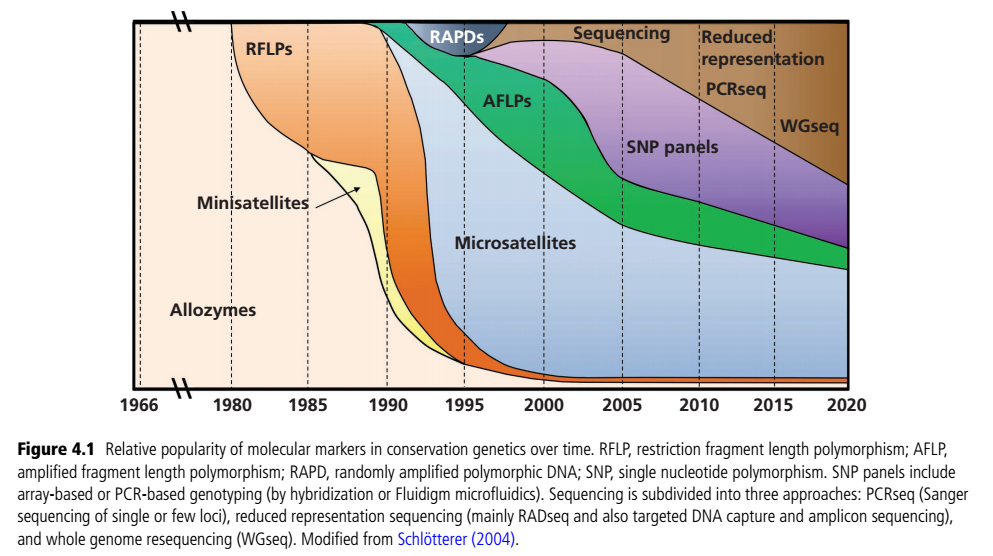

## Fundamental measures of genetic diversity

-   Polymorphism

$$
P = number\ of\ polymorphic\ loci/total\ number\ of\ loci
$$

-   Allele frequency (for diploid individuals)

$$
p = \frac{2n_{Hom} + n_{Het}}{2n}
$$ 

<!-- where $p$ is the frequency of the allele (usually the dominant one) and $n$ is the number of individuals that are homozygotes ($n_{Hom}$) and heterozygotes ($n_{Het}$) for that allele, respectively -->

-   Average heterozygosity $H = \sum H_i/N$ where $H_i$ is the average heterozygosity at locus $i$, and $N$ is the total number of loci

---

-   Describing the genetic variation using mathematical tool is a good and necessary exercise, but it is not enough!

-   We need to develop models that could tell us about how various evolutionary factors (natural selection, mutations, population size, geographic fragmentation, drift) affect the persistence of populations and species

 - Models are essential for understanding the genetics of natural populations in a variety of ways: *i)* models make us define the parameters that need to be considered; *ii)* models allow us to test hypotheses; *iii)* models allow us to generalize results; iv) models allow us to predict how a system will operate in the future [@Allendorf2022, p.95].

------------------------------------------------------------------------

## The simpler model: Hardy-Weinberg principle

<!--   In 1908, Godfrey Harold Hardy (a British mathematician) and Wilhelm Weinberg (a German physician), independently developed a math model describing the dynamics of a diploid, sexually reproducing population -->

::::: columns
::: {.column width="50%"}
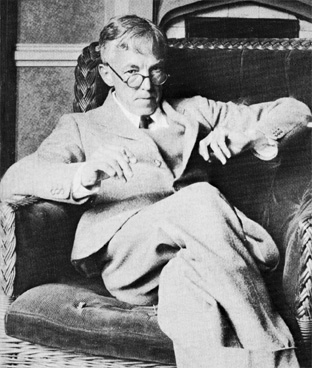{width="80%" fig-align="center"}
:::

::: {.column width="50%"}
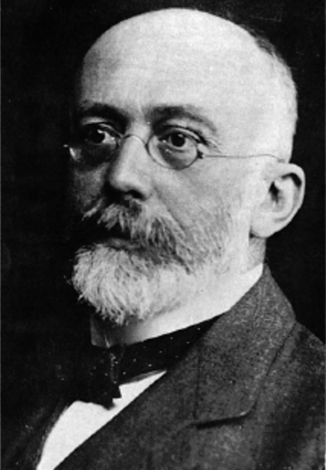{width="70%" fig-align="center"}
:::
:::::

<!--   Hardy-Weinberg model suggests that a population reaches an equilibrium where allele frequencies are constant and there is a specific relation between genotypic and allelic frequencies -->

## Assumptions of the model

| Assumption | Significance |
|--------------------|----------------------------------------------------|
| Random mating | Individuals show no significant preference or dislike for other individuals with respect to specific traits or loci. |
| No mutation | Mutation is one of the few forces creating variability. We assume that the information is transmitted from generation to generation without the influence of mutation. |
| Infinite population size | No population in nature is actually infinite (although populations of some species may as well be)! This assumption is fundamental to construct a null model and compare the effect of small population size. |

------------------------------------------------------------------------

\vspace{.5cm}

|   | (continues) |
|--------------------|----------------------------------------------------|
| No natural selection | We will assume that all alleles and genotypes have the same fitness and that there is no differential reproduction or survival. This assumption is very unlikely to be true in nature, especially because selection may be reduced for the loci under analysis, but still present at all other loci in an individual. |
| No immigration | We will first consider a situation where only one population of a certain species is present. This means that we will not consider gene flow and exchange of genetic material from and to other populations. |

---

::: callout-important
# Question

What is the main consequence of the assumptions we have just described?
:::

---

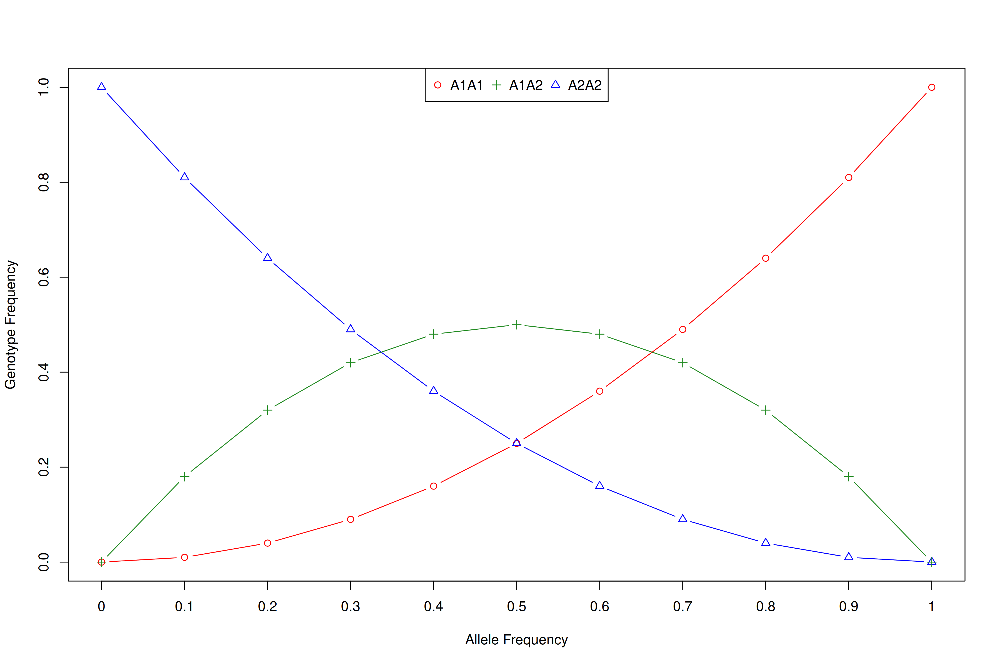{width="90%" fig-align="center"}


## Analyzing the Hardy-Weinberg model

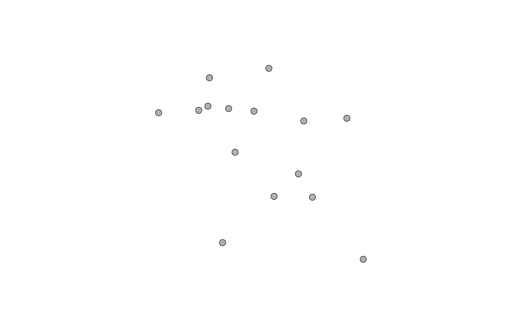{fig-align="center" width="85%"}

------------------------------------------------------------------------

\vspace{.5cm}

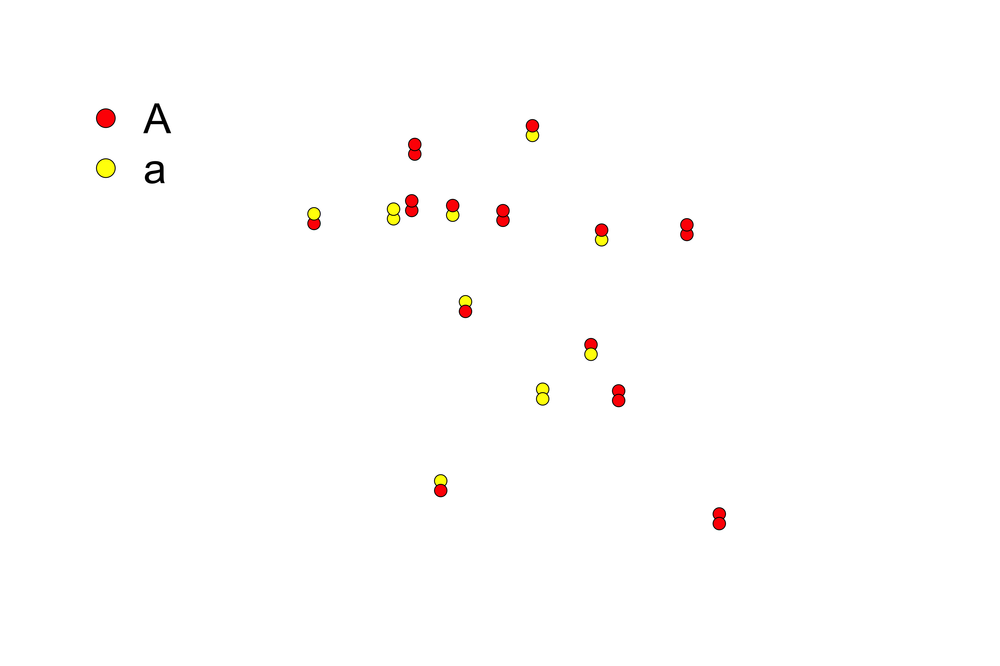{fig-align="center" width="85%"}

------------------------------------------------------------------------

| $n_{AA}$ | $n_{Aa}$ | $n_{aa}$ | $n$ |
|----------|----------|----------|-----|
| 6        | 7        | 2        | 15  |


$$
p = f(A) = \frac{2n_{AA} + n_{Aa}}{2n} = \frac{12 + 7}{30} \approx 0.633
$$ 

$$
q = f(a) = \frac{2n_{aa} + n_{Aa}}{2n}= \frac{4 + 7}{30} \approx 0.367
$$

$$
p + q = 1
$$

## Expansion with alleles > 2 

-   Because of our assumption of random mating the assortment of alleles in the zygotes can be estimated from the allele frequencies using a binomial expansion:

$$
(p+q)^2=p^2+2pq+q^2
$$

-   If we want to add another allele ($A_1, A_2, A_3$)...

$$
(p+q+r)^2=p^2+2pq+q^2+2pr+2qr+r^2
$$

------------------------------------------------------------------------

\vspace{.6cm}

-   Random mating and same fitness mean the frequencies of male and female gametes correspond to the allele frequencies and zygotes are formed randomly choosing gametes from the gene pool

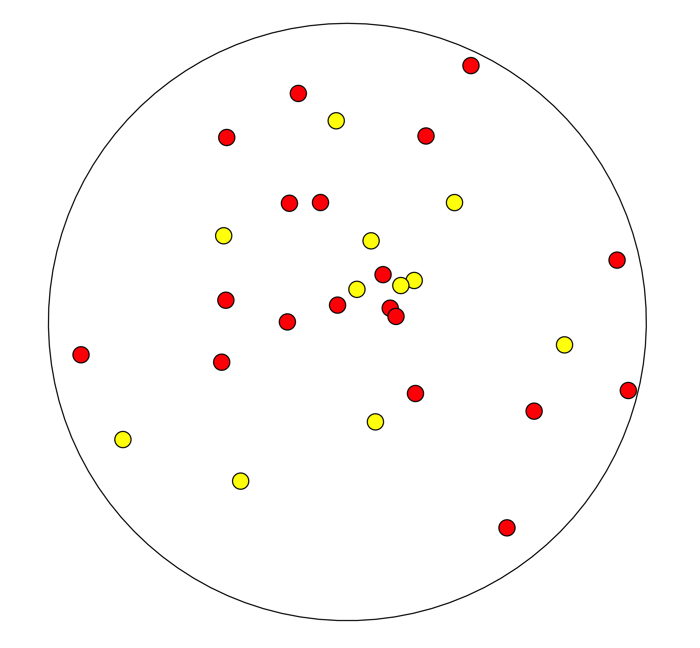{fig-align="center" width="50%"}

## Basic probability theory

-   The probability of two independent events, such as the union of two gametes at random in a zygote, is calculated as the product of the probability of the single events

```{r dice1}
#| output-location: column-fragment
(dice <- c(1,2,3,4,5,6))
```

<br/>

```{r dice2}
#| output-location: column-fragment
sample(dice, size = 1)
```

<br/>

```{r dice3}
#| output-location: column-fragment
sample(dice, size = 1)
```

---

```{r dice4}
#| output-location: column-fragment
sim_dice <- sample(dice, size = 100000, replace = T)
table(sim_dice)/100000
```

-   The probability of casting a dice and obtaining one of the six numbers is $\frac{1}{6} \approx 0.17$

-   The probability of casting the dice twice and obtaining the same number is $\frac{1}{6} * \frac{1}{6} = \frac{1}{36} \approx 0.028$

---

\vspace{.3cm}

-   We want to recreate a sample of 15 individuals starting from the gamete pool of our original population with $n = 15$ and $p \approx 0.633$ and $q \approx 0.367$

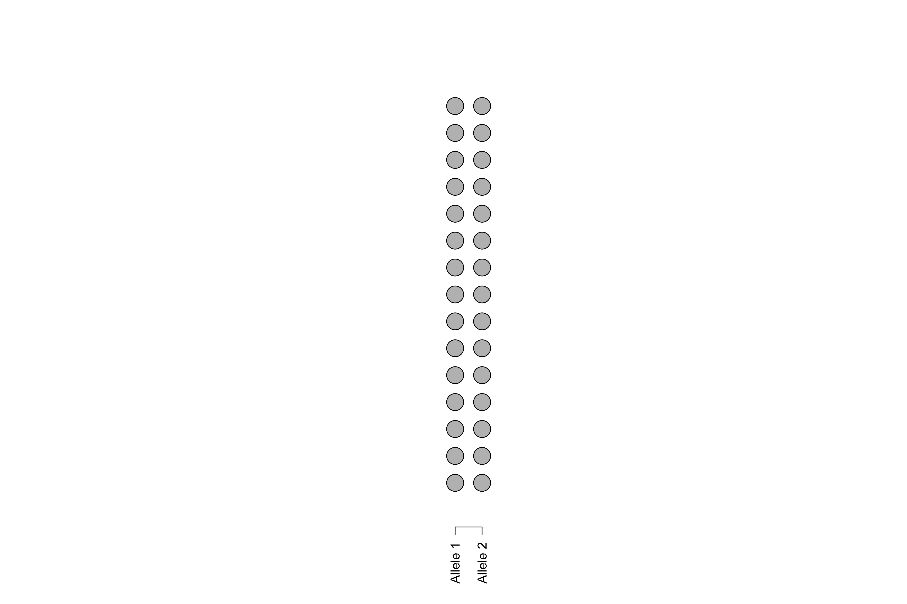{fig-align="center" width="50%"}

```{r echo=TRUE, eval=FALSE}
p <- 0.633 
q <- 0.367  
sample(c("A", "a"), size = 1, prob = c(p, q))
```

---

-   Every time we sample an allele, we add a color. Remember A = \textcolor{red}{red} and a = \textcolor{yellow}{yellow}. An animation of the process is available [here](https://drive.proton.me/urls/7G3G9Y3VQ4#vdhcdyprcfvd)

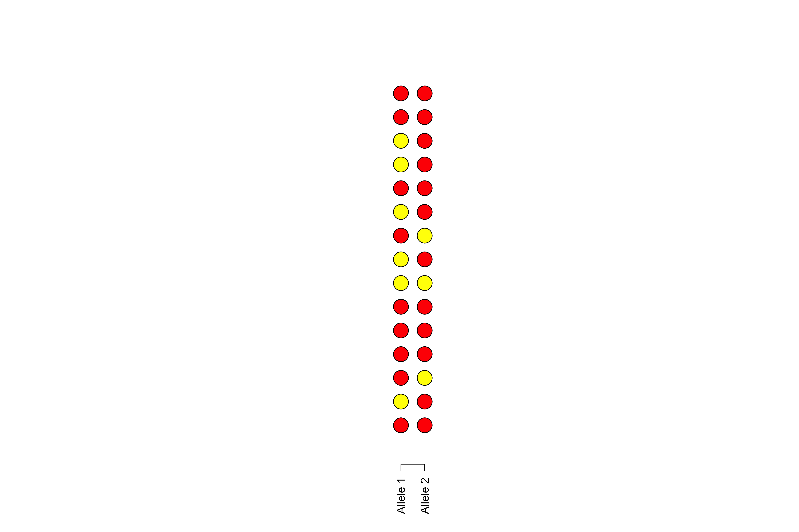{fig-align="center" width="75%"}


---

{fig-align="center" width="75%"}

| $n_{AA}$ | $n_{Aa}$ | $n_{aa}$ | $n$ |
|----------|----------|----------|-----|
| 7        | 7        | 1        | 15  |

---

-   The genotype and allele frequencies of the new generation are different from the previous one. We repeat the experiment one more time

\vspace{.2cm}

```{r echo=TRUE, eval=TRUE}
p <- 0.633 
q <- 0.367  
newSample <- sample(c("A", "a"), size = 30,
                    prob = c(p, q),
                    replace = T)
table(newSample)
```

---

-   Once again, the genotype and allele frequencies of the new generation are different from the previous one, and it will likely be different most of the time we do this again

\vspace{.2cm}

```{r echo=TRUE, eval=TRUE}
p <- 0.633 
q <- 0.367  
newSample <- sample(c("A", "a"), size = 30,
                    prob = c(p, q),
                    replace = T)
table(newSample)
```

------------------------------------------------------------------------

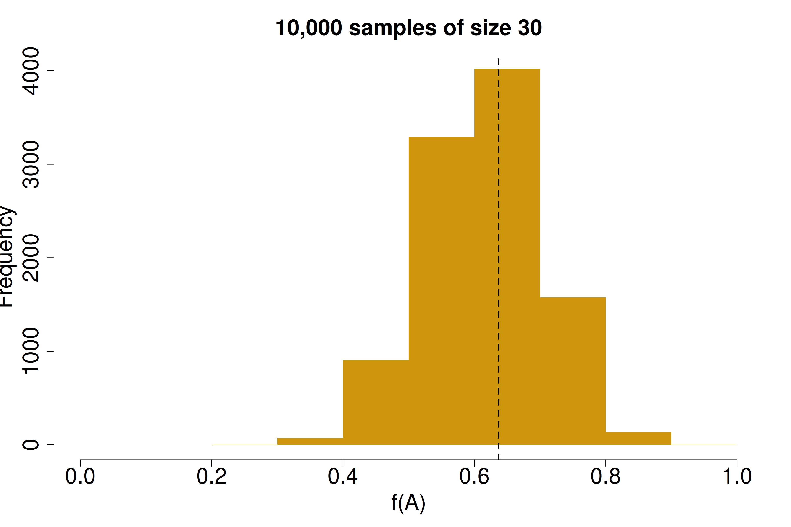{fig-align="center" width="75%"}

------------------------------------------------------------------------

\vspace{.5cm}

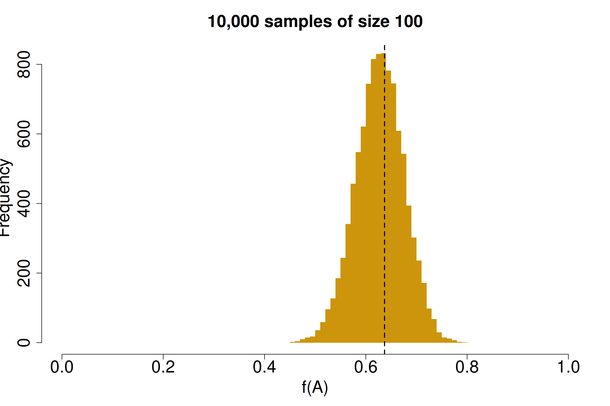{fig-align="center" width="90%"}

------------------------------------------------------------------------

\vspace{.7cm}

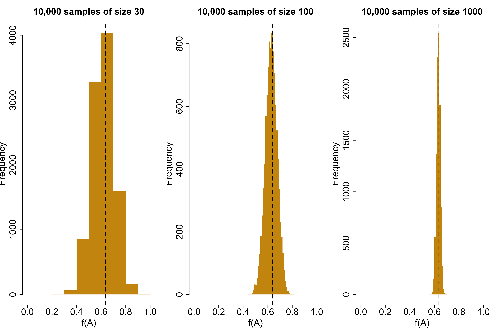{fig-align="center" width="90%"}

------------------------------------------------------------------------

## Summary of the Hardy-Weinberg model

-   The larger the sample dimension, the lower is the variation in allele frequencies with respect to the original value

-   If all the assumptions of the HW model are met, we should expect no variation at all in allele frequency, generation after generation

-   In natural population it is very hard to meet all the assumptions of the HW

-   The HW model is a very effective and simple way to "see" the effects of various evolutionary forces operating at the population level

-  With this in mind we can start investigate the relative role of the various evolutionary forces

## Genetic Drift

-   Genetic drift is the random change in allele frequencies from generation to generation because of sampling error. That is, the finite number of genes transmitted to progeny will be an imperfect sample of the allele frequencies in the previous generation [@Allendorf2022, p. 114]

-   Genetic drift is the primary cause bringing about allele frequency changes throughout the genome over time [@Chen2018; @Allendorf2022]

-   With many samples ($n >> 1$) the probability that their alleles all are $A_1$ or $A_2$ becomes $(\frac{1}{2})^{2n}$, and it will be less likely to loose one of the two alleles

------------------------------------------------------------------------

-   The probability that a population has $k$ copies of allele $A_1$ and $2n-k$ copies of $A_2$ allele is $\binom{2n}{k}p^kq^{2n-k}$ where $\binom{2n}{k}$ is the binomial function $\frac{2n!}{k!(2n-k)!}$

-   The variance around the mean allele frequency is the binomial sampling variance: $\sigma^2_p =\frac{p_0q_0}{2n}$

-   Variances are higher in smaller than larger populations

-   In small population the process of sampling happens every single generation, and its effect on allele frequency is cumulative

---

-   Genetic drift will eventually cause all except one allele to go to fixation.

-   The probability that a gamete does not contain allele $A_1$ (with frequency $p$ in the parental population) is $1-p$

$$
P(fixation \ A_2)=(1-p)^{2n}
$$

::: callout-important
# Problem

Diploid population with $n = 4$ with allele $A_1$ with a frequency $p = 0.25$ and allele $A_2$ with a frequency $q = 0.75$. What is the probability of losing allele $A_1$ in one generation of sampling to recreate a population of the same size?
:::

---

::: callout-tip
# Solution

$(1-0.25)^8=$ `r (1-0.25)^8`
:::


---

\vspace{.7cm}

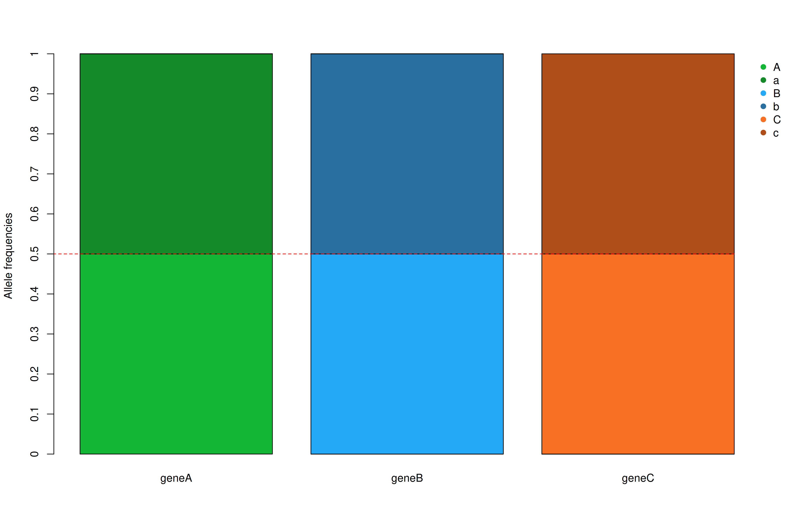{width="90%" fig-align="center"}

---

\vspace{.7cm}

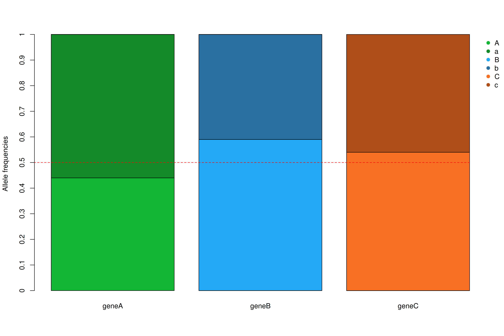{width="90%" fig-align="center"}

---

\vspace{.3cm}

![Allele frequencies variation after 200 generations while maintaining N = 100 [@Russo2021]](./geneticDrift3.png){width="80%" fig-align="center"}


---

\vspace{.3cm}

![Simulating the average time of allele fixation in our example [@Russo2021]](./fixationSimulation.png){width="80%" fig-align="center"}


## References {.allowframebreaks}