```{r setup, include=FALSE}
knitr::opts_chunk$set(echo = TRUE)
x <- c("DT", "tidyverse", "RColorBrewer", "learnPopGen")
lapply(x, require, character.only = T)
rm(x)
```

## Population size

-   There can be no doubt that genetic variation is related to population size, as @Soule1973 proposed. Small population size reduces the evolutionary potential of wildlife species [@Frankham1996]

-   The importance of maintaining a large population size is pretty intuitive, but may not be enough!

-   Many populations of insects and small mammals naturally fluctuate in their "census" population size, but it is when they are at their minimum that the genetic processes affect them the most

-   Often the census population counts juveniles and senescent individuals that do not really contribute to the reproductive output of next generations

------------------------------------------------------------------------

-   Within adult and reproductive individuals there may be significant variance in the number of offspring sired by males and females

-   Different reproductive strategies (monogamy VS. polygamy) may as well influence the genetic output generation after generation

-   Therefore it is necessary to distinguish between census population and those individuals within the census population that actually contribute offspring to the next generation

-   We can standardize this concept of idealized population by describing it in term of **effective population size** ($N_e$), and it can be defined as the actual number of breeding individuals needed in order to see the same variation of a critical parameter (such as genetic diversity) measured in the real population

------------------------------------------------------------------------

-   The effective size of a population determines the rate of change in composition of a population caused by genetic drift [@Charlesworth2009a, p. 195]

-   We hereby introduce another model that is extremely useful in population and conservation genetics: the Wright-Fisher population model [@Wright1931]

## W-F model's assumptions

-   All individuals in the population are considered adults and capable of breeding

-   Individuals are hermafroditic (self fertilization is possible)

-   The number of breeding individuals is constant in all generations and they breed randomly

-   New individuals are formed each generation by random sampling, with replacement, of the gametes from the parents

-   The parents die after mating so each generation is only composed by new individuals (discrete generations)

-   There is no selection at any life stage and mutation is ignored

<!--   When $N >> 1$ each individual contributes a number of offspring that is approximated by a Poisson distribution -->

## W-F model used in wild populations

-   An important measure in conservation is the ratio $\frac{N_e}{N}$

-   There are multiple evidence that in most natural population this ratio is usually much less than 1

-   The primary factors in natural populations that are influencing this ratio are:

    -   fluctuating population size over multiple generations

    -   high variance in family size

    -   unequal ratios between sexes

-   Demographic and genetic approaches to estimate $N_e$

## Genetic drift

<!-- The tendency for allele frequencies to change from one generation to the next in a finite population even if there is no selection (and if we consider no mutation, migration etc. etc. etc.) -->

<!-- Genetic diversity (heterozygosity) will be lost from the population over time -->

-   Genetic drift will eventually lead to loss of all alleles in the population except one

-   The probability that any allele will eventually become fixed in the population is equal to its current frequency

-   The probability that a population has $k$ copies of allele $A_1$ and $2n-k$ copies of $A_2$ allele is $\binom{2n}{k}p^kq^{2n-k}$ where $\binom{2n}{k}$ is the binomial function $\frac{2n!}{k!(2n-k)!}$

-   The variance around the mean allele frequency is the binomial sampling variance: $\sigma^2_p =\frac{p_0q_0}{2n}$

## Size matters

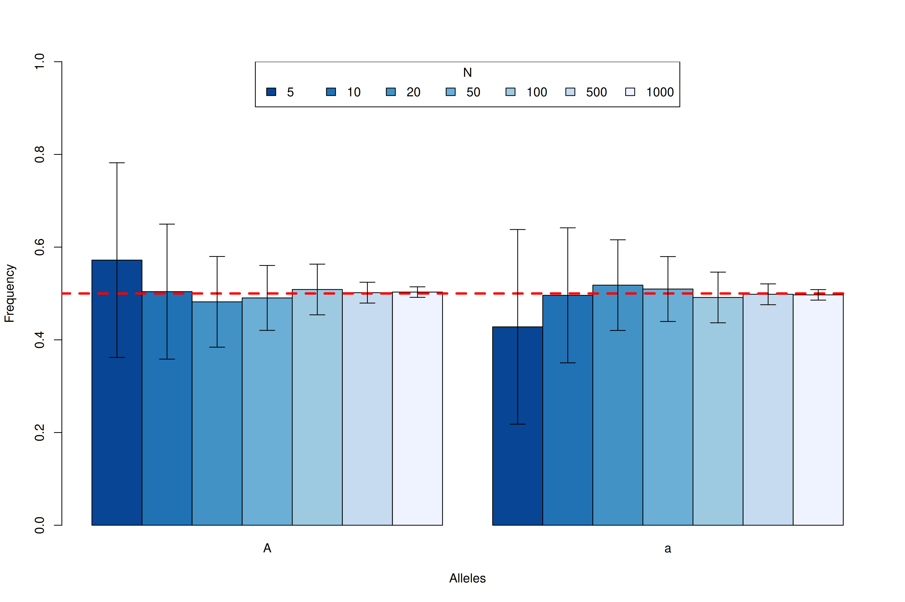{width="80%" fig-align="center"}

## Genetic drift and heterozygosity

-   Genetic drift will, in the absence of new mutations, slowly purge our population of neutral genetic diversity, as alleles slowly drift to high or low frequencies and are lost or fixed over time

-   Imagine a randomly mating population of a constant size N diploid individuals, and that we are examining a locus segregating for two alleles that are neutral with respect to each other

-   This population is randomly mating with respect to the alleles at this locus

------------------------------------------------------------------------

-   In generation t our current level of heterozygosity is $H_t$ , i.e. the probability that two randomly sampled alleles in generation t are non-identical is $H_t$

-   In the next generation $t + 1$ we are looking at the alleles in the offspring of generation $t$.

-   If we randomly sample two alleles in generation $t + 1$ which had different parental alleles in generation $t$, that is just like drawing two random alleles from generation $t$

-   So the probability that these two alleles in generation $t + 1$, that have different parental alleles in generation $t$, are non-identical is $H_t$

------------------------------------------------------------------------

-   Conversely, if the two alleles in our pair had the same parental allele in the proceeding generation (i.e. the alleles are identical by descent one generation back) then these two alleles must be identical (as we are not allowing for any mutation)

-   In a diploid population of size N individuals there are $2N$ alleles. The probability that our two alleles have the same parental allele in the proceeding generation is $1/(2N)$ and the probability that they have different parental alleles is is $1 − 1/(2N)$. So by the above argument, the expected heterozygosity in generation $t + 1$ is

$$
\label{HexpHet1}
\tag{6.1}
H_{t+1}=H_t(1-\frac{1}{2N})
$$

------------------------------------------------------------------------

-   if the heterozygosity in generation $0$ is $H_0$ , our expected heterozygosity in generation $t$ is

$$
\label{HexpHet2}
\tag{6.2}
H_{t}=H_0(1-\frac{1}{2N})^t
$$

-   The expected heterozygosity within our population is decaying geometrically with each passing generation. If we assume that $1/(2N ) ≪ 1$ then we can approximate this geometric decay by an exponential decay, such that

$$
\label{HexpHet3}
\tag{6.3}
H_{t}=H_0e^{t/(2N)}
$$

------------------------------------------------------------------------

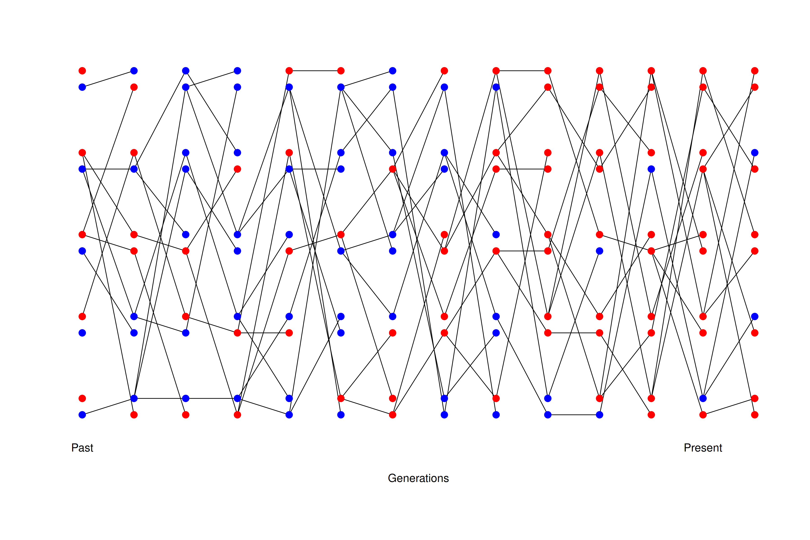{width="80%" fig-align="center"}

------------------------------------------------------------------------

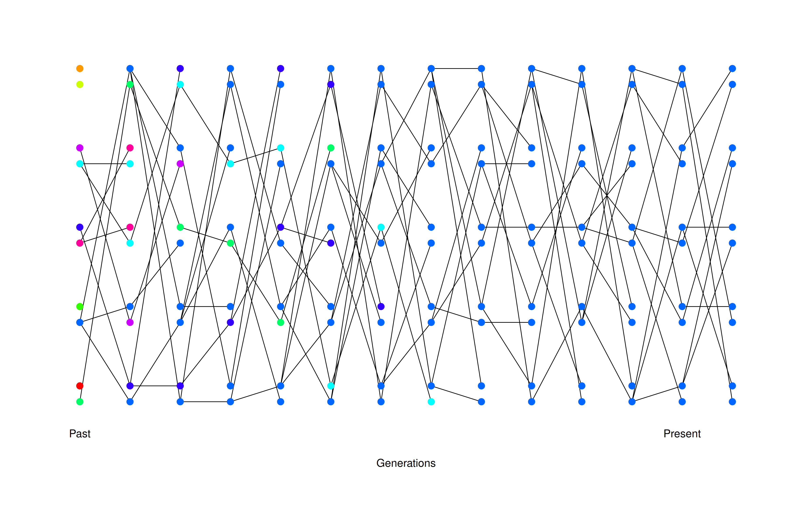{width="80%" fig-align="center"}

------------------------------------------------------------------------

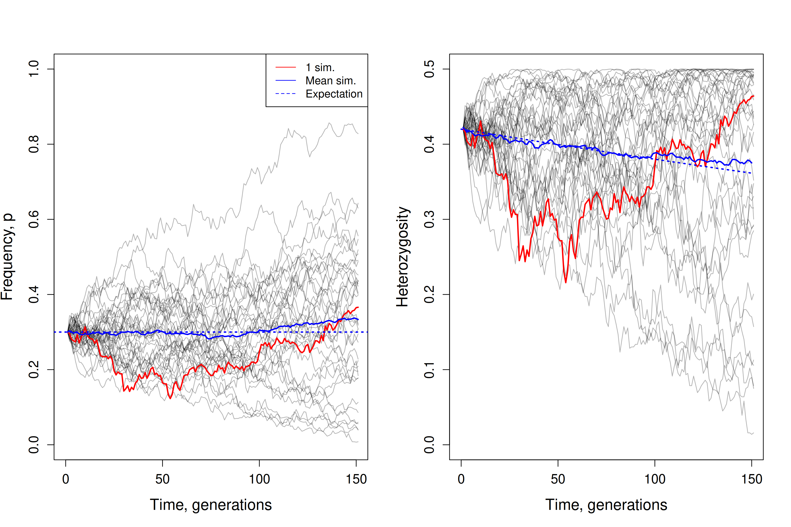{width="80%" fig-align="center"}

## Exercise

::: callout-important
# Problem

You are in charge of maintaining a population of foxes in Villa Doria Pamphili (Rome). Using a large set of microsatellites you estimate that the mean level of heterozygosity in this population is 0.005. You set yourself a goal of maintaining a level of heterozygosity of at least 0.0049 for the next two hundred years. Assuming that the fox has a generation time of 3 years, and that only genetic drift affects these loci, what is the smallest fully outbreeding population that you would need to maintain to meet this goal?
:::

------------------------------------------------------------------------

-   To determine the smallest fully outbreeding population size (N) needed to maintain heterozygosity over time under genetic drift, we use the formula for the decline in heterozygosity due to drift using equation \ref{HexpHet2}: $H_{t}=H_0(1-\frac{1}{2N})^t$

    -   $H_0 = 0.005$ is the initial heterozygosity

    -   $H_t = 0.0049$ is the target heterozigosity

    -   $t$ = number of generations over 200 years ($t = 200/3 \approx 66.67$)

    -   $N$ = is the population size we want to solve for

------------------------------------------------------------------------

-   Substitute the terms to the equations

$$
0.0049 = 0.005*(1-\frac{1}{2N})^{66.67}
$$

-   Divide both sides by 0.005

$$
0.98 = (1-\frac{1}{2N})^{66.67}
$$

-   Take the natural logarithm of both sides

$$
\ln(0.98)=66.67 * \ln(1-\frac{1}{2N})
$$

------------------------------------------------------------------------

-   Solve for the logarithm term

$$
\ln(1-\frac{1}{2N}) = \frac{-0.020203}{66.67}
$$

$$
\ln(1-\frac{1}{2N}) = -0.000303
$$

$$
1-\frac{1}{2N}=e^{-0.000303}
$$

$$
1-\frac{1}{2N}=0.999697
$$

------------------------------------------------------------------------

$$
\frac{1}{2N}=1-0.999697
$$

$$
2N=\frac{1}{0.000303}
$$

$$
N\approx{1650}
$$

## Heterozygosity decline in natural population

-   The black-footed ferret population has declined dramatically through the twentieth century due to destruction of their habitat and sylvatic plague

](./Mustela_nigripes_2.jpg){width="60%" fig-align="center"}

------------------------------------------------------------------------

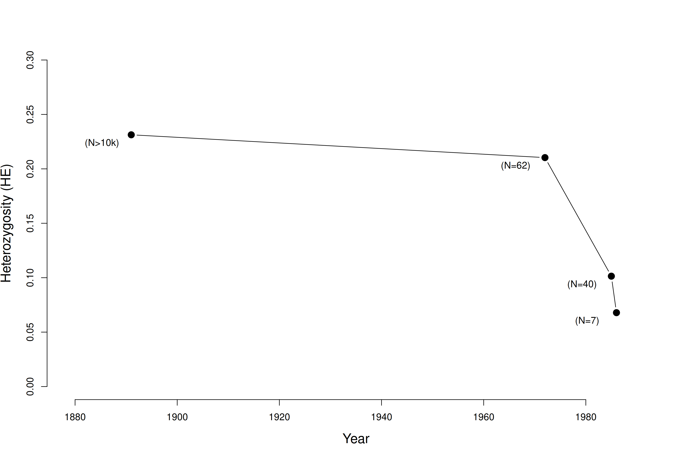{width="80%" fig-align="center"}

## The balance between drift and mutations

-   Luckily, mutations exists, otherwise, based on what we have seen so far, all genetic variation will be lost after a while, even assuming no selection!

-   We need to consider the amount of neutral polymorphism that can be maintained in a population as a balance between genetic drift removing variation and mutation introducing new neutral variation

-   The per base pair mutation rate ($\mu$) in humans is around $1.5 * 10^{-8}$ per generation. That means, on average, we have to monitor a site for \~ 66.6 million transmissions from parent to child to see a mutation

------------------------------------------------------------------------

::: callout-important
# Problem

Your autosomal genome is \~ 3 billion base pairs long ($3 * 10^9$). You have two copies, the one you received from your mum and one from your dad. What is the average (i.e. the expected) number of mutations that occurred in the transmission from your mum and your dad to you?
:::

. . .

-   The expected number of mutations from one parent is: $3*10^9*1.5*10^{-8}=45$

-   Therefore, the total expected number of mutations from both parents is $\approx 90$

------------------------------------------------------------------------

::: callout-important
# Problem

The current human population size is \~ 7 billion individuals. How many times, at the level of the entire human population, is a single base-pair mutated in the transmission from one generation to the next?
:::

. . .

-   The total number of mutations across the entire population per generation is: $90 * 7 * 10^9 = 6.3 * 10^{11}$

-   This means that, on average, a single base-pair is mutated $\approx 6.3 * 10^{11}$ times across the entire human population per generation

------------------------------------------------------------------------

-   The probability that our pair of randomly sampled alleles have coalesced in the preceding generation is $\frac{1}{2N}$, and the probability that our pair of alleles fail to coalesce is $1 − \frac{1}{2N}$

-   The probability that a mutation changes the identity of the transmitted allele is $\mu$ per generation

-   So the probability of no mutation occurring is $1-\mu$

-   We’ll assume that when a mutation occurs it creates some new allelic type which is not present in the population. This assumption (commonly called the infinitely-many-alleles model) makes the math slightly cleaner, and also is not too bad an assumption biologically

------------------------------------------------------------------------

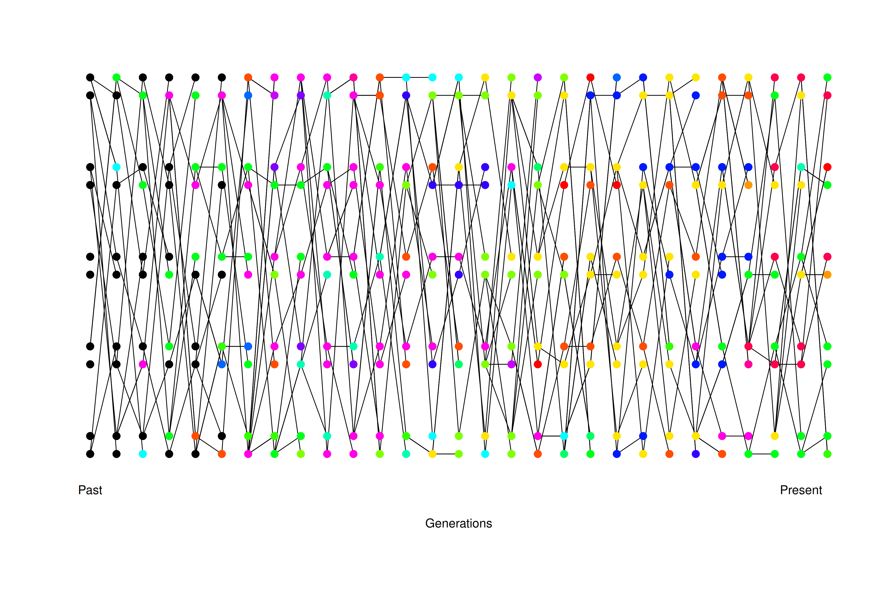{width="85%" fig-align="center"}

## The coalescent theory

-   So far we’ve been trying to predict what will happen in a population given a particular population size

-   We can use this molecular approach to also look at the past

-   Looking backwards in time from one generation to the previous generation, we are going to say that two alleles which have the same parental allele (i.e. find their common ancestor) in the preceding generation have coalesced, and refer to this event as a coalescent event

-   To coalesce means "unite" or "fuse"

------------------------------------------------------------------------

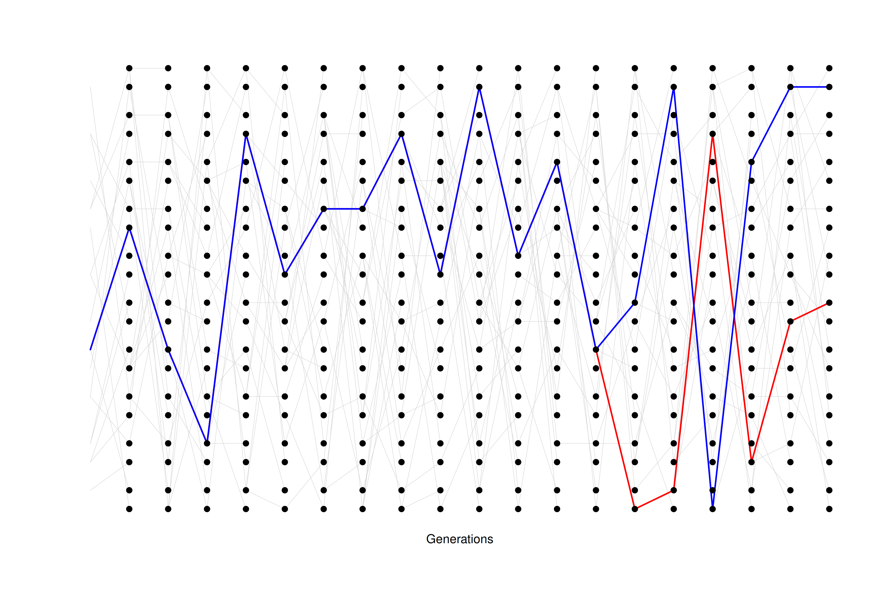{width="80%" fig-align="center"}

------------------------------------------------------------------------

-   The probability that a pair of alleles have failed to coalesce in t generations and then coalesce in the t + 1 generation back is

$$
\label{coal1}
\tag{6.4}
\mathbb{P}(T_2 = t+1)=\frac{1}{2N}(1-\frac{1}{2N})^t
$$

-   For example, the probability that a pair of sequences coalesce three generations back is the probability that they fail to coalesce in generation 1 and 2, which is $(1 − 1/2N) * (1 − 1/2N)$, multiplied by the probability that they find a common ancestor, i.e. coalesce, in the third generation, which happens with probability $1/2N$

------------------------------------------------------------------------

-   The waiting time for a pair of lineages to coalesce is like the number of tails thrown while waiting for a head on a coin with the probability of a head is 1/2N, i.e. if the population is large we might be waiting for a long time for our pair to coalesce

-   The expected (i.e. the mean over many replicates) coalescent time of a pair of alleles is then

$$
\label{coal2}
\tag{6.5}
\mathbb{E}(T_2)=2N
$$

-   Conditional on a pair of alleles coalescing t generations ago, there are 2t generations in which a mutation could occur

------------------------------------------------------------------------

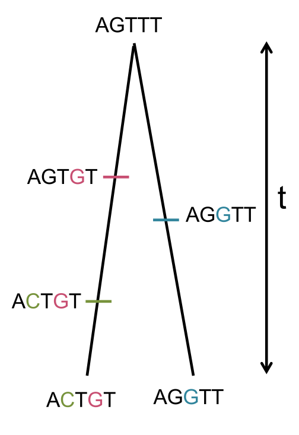{width="40%" fig-align="center"}

------------------------------------------------------------------------

-   If the per generation mutation rate is $\mu$, then the expected number of mutations between a pair of alleles coalescing t generations ago is $2t\mu$ (the alleles have gone through a total of 2t meioses since they last shared a common ancestor)

-   So we can write the expected number of mutations $S_2$ separating two alleles drawn at random from the population as

$$
\label{theta}
\tag{6.6}
S_2=4\mu N = \theta
$$

------------------------------------------------------------------------

## Estimating $N_e$: Unequal sex ratio

-   What is the size of the ideal population that will lose heterozygosity at the same rate of the real population that has unequal sex ratio?

-   When selfing is not permitted, gametes in the progeny cannot come from the same individual, therefore the effective population size in a population with separate sexes is equal to the probability that the gametes in the progeny comes from the same grandparent.

-   The probability that the two uniting gametes in an individual will come from the same male (or female) grandparent is $\frac{1}{4}$.

------------------------------------------------------------------------

-   One-half of the time uniting gametes will come from a grandmother and a grandfather, and 1/4 of the time both gametes will come from the same grandparent [@Allendorf2022].

-   Therefore, the combined probability that both gametes come from the same grandparent is $\frac{1}{4}*\frac{1}{N_m}= \frac{1}{4N_m}$ for grandfathers and $\frac{1}{4}*\frac{1}{N_f}= \frac{1}{4N_f}$ for grandmothers

-   Putting everything together, we can conclude that the combined probability of inheriting both gametes from the same grandparent is

$$
\label{uneqsex}
\tag{6.7}
\frac{1}{N_e}=\frac{1}{4N_f}+\frac{1}{4N_m}  
$$

------------------------------------------------------------------------

-   We can solve this equation and get to $N_e$:

$$
\label{uneqsex_bis}
\tag{6.8}
N_e=\frac{4N_{f}N_{m}}{N_{f}+N_{m}}
$$

-   In many natural populations of species that are harvested for food one of the two sexes is generally more abundantly hunted, and this can produce a highly skewed sex ratio [@Lamb2010].

------------------------------------------------------------------------

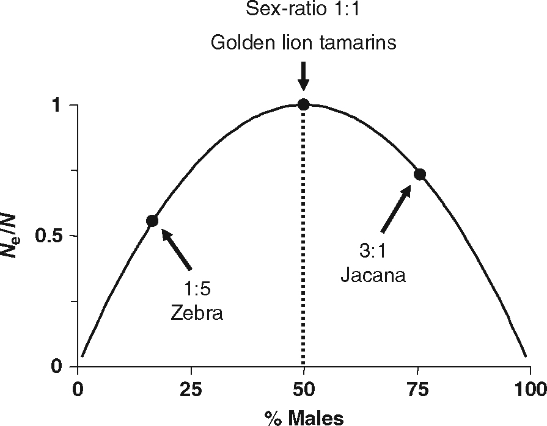{width="250"}

## Estimating $N_e$: Unequal offspring production

-   In real populations parents very rarely have the same probability of producing offspring

-   This variation results in a greater proportion of the progeny being produced by a smaller group of individuals compared to the number of adults potentially able to reproduce [@Allendorf2022]

-   We can model the non-random progeny contribution using @Wright1939

-   Lets imagine a population of $N$ individuals each contributing a varying number $k$ of gametes to the next generation of the same size ($N$). The mean number of gametes contributed by individual is $\bar{k}=2$. We can calculate the variance associated to this number using

------------------------------------------------------------------------

$$
\label{varOffsp}
\tag{6.9}
V_k = \frac{\sum_{i=1}^N (k_i-2)^2}{N}
$$

-   The proportion of cases in which two random gametes will come from the same parent is then

$$
\label{varOffsp2}
\tag{6.10}
\frac{\sum_{i=1}^N k_i(k_i-1)}{2N(2N-1)}=\frac{2+V_k}{4N-2}
$$

------------------------------------------------------------------------

-   By now we know that the effective population size can be intended as the reciprocal of the probability that two gametes come from the same parent, and we can rewrite this equation accordingly

$$
\label{varOffsp3}
\tag{6.11}
N_e=\frac{4N-2}{2+V_k}
$$

-   Random variation of $k$ will produce a distribution that approximates the Poisson's (i.e., with mean equal to the variance)

------------------------------------------------------------------------

-   Thus, $V_k = \bar{k} = 2$ and $N_e = N$ for the idealized population

-   As $V_k$ increases, the effective population size decreases

-   An interesting result is that the effective population size will be larger than the actual population size if $V_k < 2$

-   In captive breeding where we can control reproduction, we may nearly double the effective population size by making sure that all individuals contribute equal number of progeny [@Allendorf2022]

------------------------------------------------------------------------

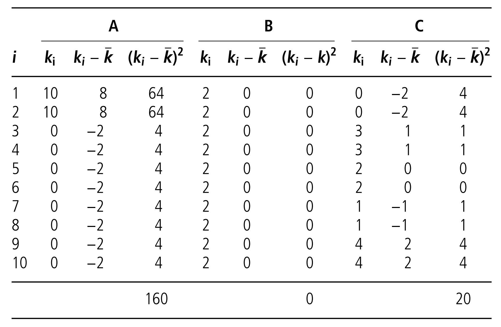{width="80%" fig-align="center"}

------------------------------------------------------------------------

-   Estimation of effective population size for populations in previous table with high, low, and intermediate variability in family size. $N_e$ is estimated using equation \ref{varOffsp3}

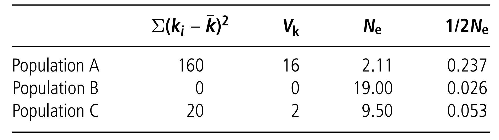

## Estimating $N_e$: Fluctuating population size

-   The rate of loss of heterozygosity ($\frac{1}{2N}$) is the reciprocal of the population size ($\frac{1}{N}$)

-   Many generations with reduced population size will influence greatly the loss of heterozygosity and influcence $N_e$

-   Consider a population that fluctuates in the following way: $N_1 = 100$, $N_2 = 2$, and $N_3 = 100$

-   We can use the armonic mean to calculate the loss of heterozygosity and the effective population size in this situation

------------------------------------------------------------------------

$$
\label{fluctPop}
\tag{6.12}
N_e=\frac{t}{\sum_{i=1}^t{(\frac{1}{N_i})}}
$$

$$
N_e=\frac{3}{(\frac{1}{100}+\frac{1}{2}+\frac{1}{100})}=5.77
$$

## References {.allowframebreaks}
