```{r setup, include=FALSE}
knitr::opts_chunk$set(echo = TRUE)
x <- c("DT", "tidyverse", "RColorBrewer", "learnPopGen")
lapply(x, require, character.only = T)
rm(x)
```

## Introduction

-   Individuals rarely mate completely at random!

-   Even within species, there’s often geographically-restricted mating among individuals

-   Individuals tend to mate with individuals from the same, or closely related sets of populations

-   This form of non-random mating is called population structure and can have profound effects on the distribution of genetic variation within and among natural populations

-   In most species individuals are scattered in local conglomerates that are called *demes* (*i.e.*, local populations or subpopulations)

------------------------------------------------------------------------

-   Summarizing population structure is often a key initial stage in population genetic and genomic analyses

-   We can define inbreeding as having parents that are more closely related to each other than two individuals drawn at random from some reference population

-   The question that naturally arises is: Which reference population should we use? While I might not look inbred in comparison to allele frequencies in Italy, where I am from, my parents certainly are not two individuals drawn at random from the world-wide population

------------------------------------------------------------------------

\vspace{.5cm}

::::: columns
::: {.column width="50%"}
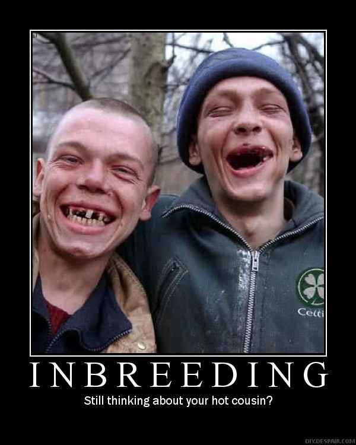{width="70%" fig-align="center"}
:::

::: {.column width="50%"}
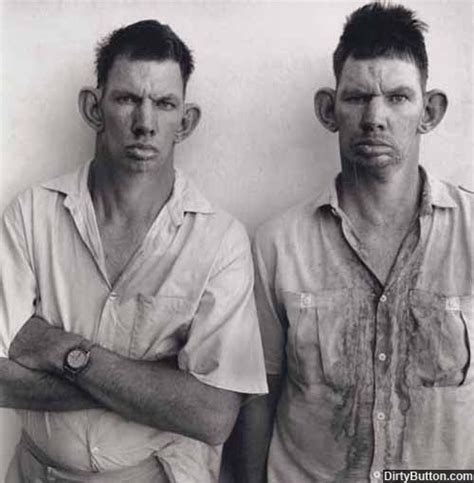{width="85%" fig-align="center"}
:::
:::::

-   There cannot be a class on inbreeding without these pictures!!

------------------------------------------------------------------------

\vspace{.5cm}

-   In its most simple definition inbreeding is the mating between related individuals. An individual is considered inbred if its parents share a common ancestor

-   In large population inbreeding can happen because of the non-random assortment of gametes

-   In many tree species spatially closer trees are more likely to be related than trees further apart

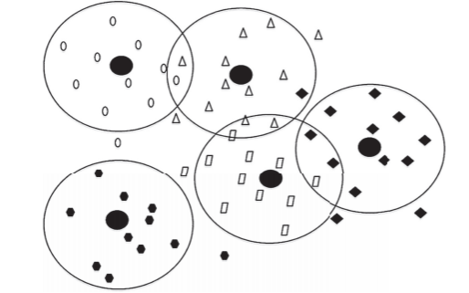{width="38%" fig-align="center"}

------------------------------------------------------------------------

\vspace{.5cm}

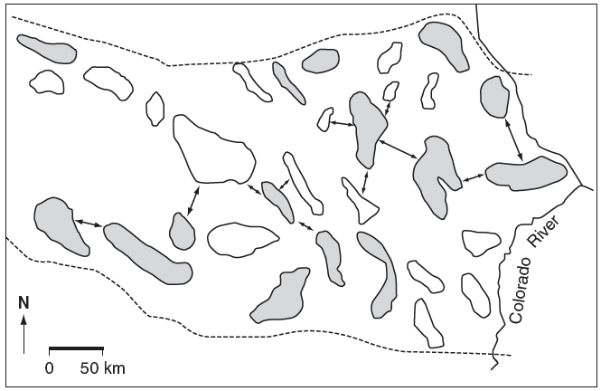{width="85%" fig-align="center"}

------------------------------------------------------------------------

\vspace{.5cm}

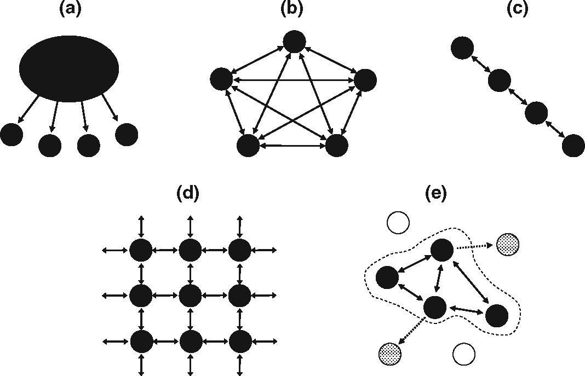{width="85%" fig-align="center"}

------------------------------------------------------------------------

-   A metapopulation is defined as a set of discrete populations (demes) of the same species, in the same general geographical area, potentially able to exchange individuals through migration, dispersal, or human-mediated movement [@Akakaya2007; @Hanski1997]

-   This subdivision (or structure) of populations can be natural and/or human driven

-   Regardless of the cause, the existence of population structure in many species forces us to think at the genetic variation within a species at two primary levels:

    1.  Genetic variation within local demes

    2.  Genetic variation bewteen local demes

<!--   Not all species are scattered! -->

------------------------------------------------------------------------

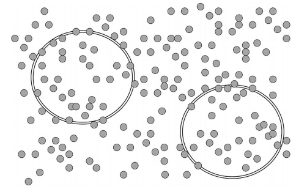

------------------------------------------------------------------------

](./class_13_4.png){width="85%" fig-align="center"}

------------------------------------------------------------------------

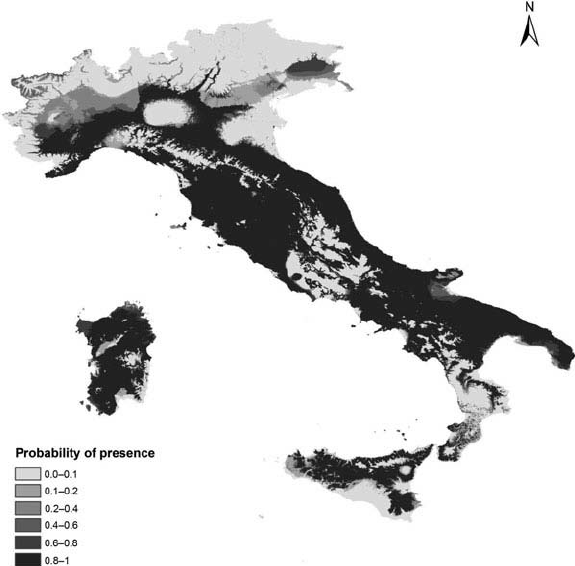{width="60%" fig-align="center"}

------------------------------------------------------------------------

![Individuals that are very distant from each other may present significant differences at the genetic level: isolation by distance. Modified from @Forbes1999 with unpublished data from M.K. Schwartz [@Allendorf2022].](./class_13_5.png){width="70%" fig-align="center"}

------------------------------------------------------------------------

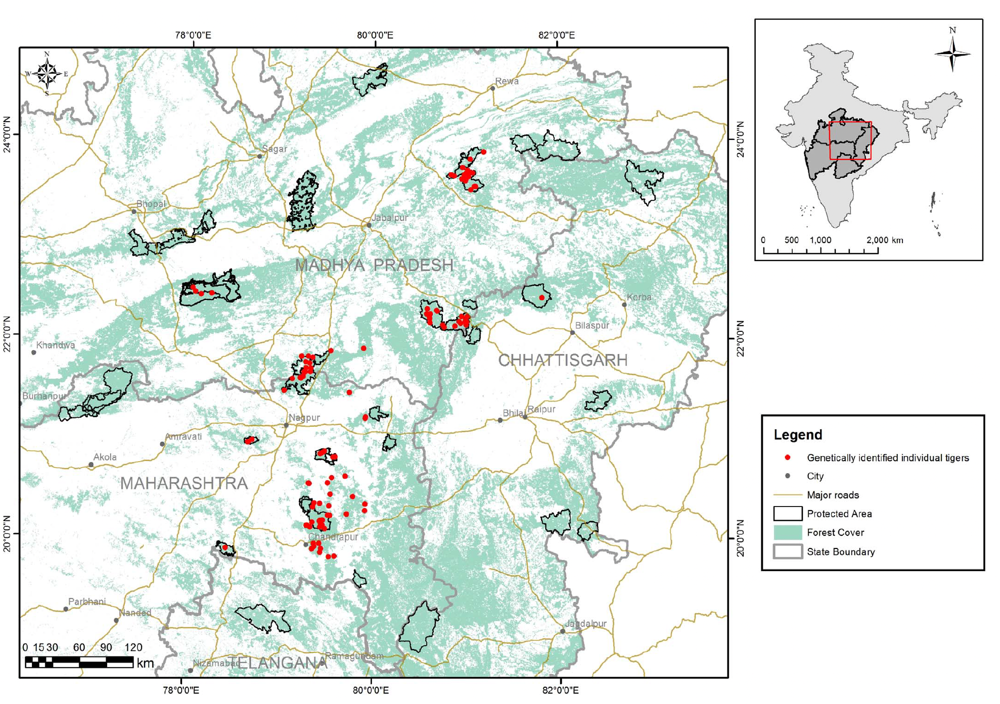{width="70%" fig-align="center"}

------------------------------------------------------------------------

-   @Frankham2011 describe the risks of outbreeding depression when translocating individuals from genetically distinct populations to supplement imperiled ones

\vspace{.3cm}

::::: columns
::: {.column width="50%"}
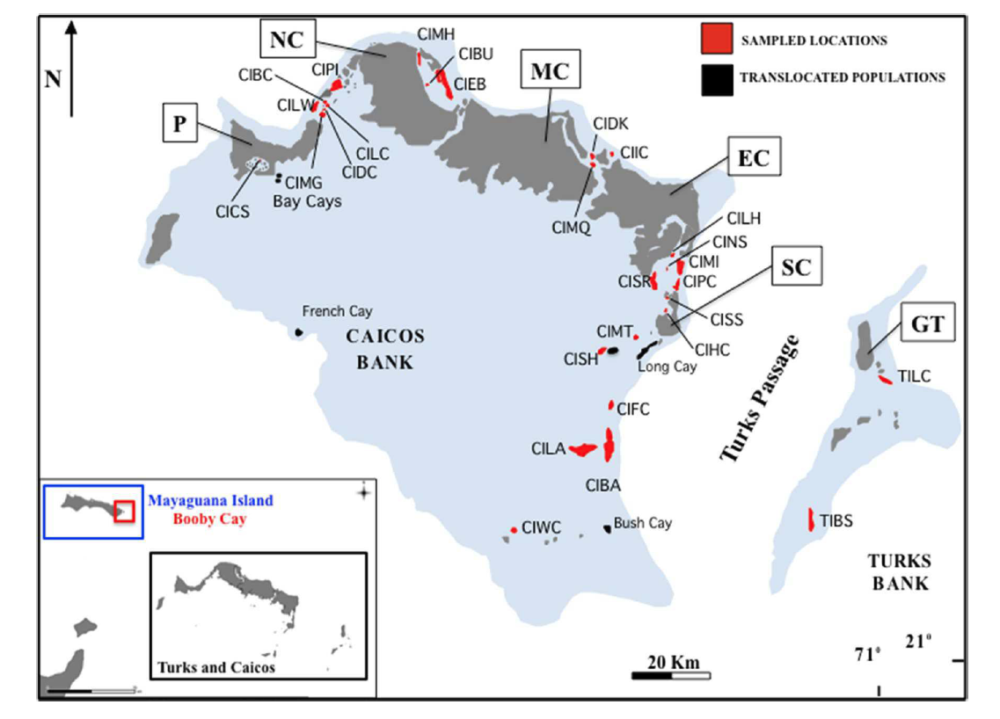{width="90%"}
:::

::: {.column width="50%"}
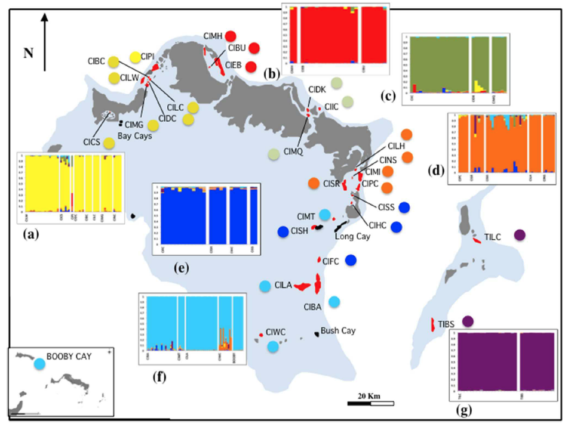{width="85%"}
:::
:::::

------------------------------------------------------------------------

\vspace{.6cm}

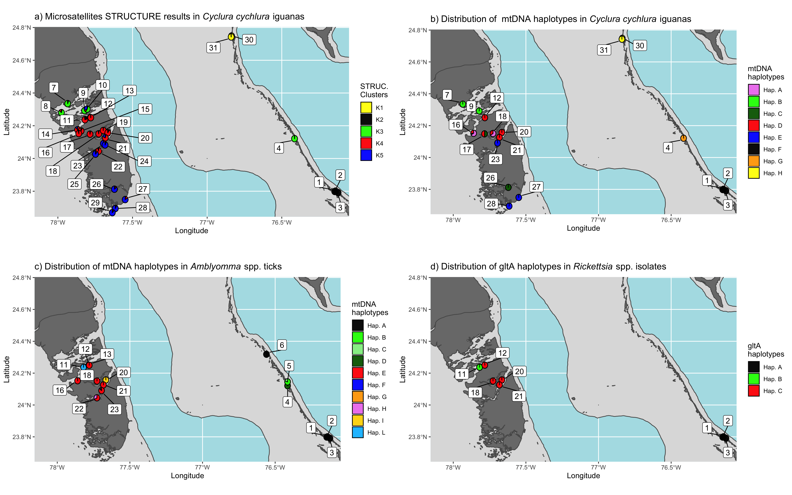{width="95%" fig-align="center"}

------------------------------------------------------------------------

-   Developing priorities for the conservation of a species often requires an understanding of adaptive genetic differentiation among populations [@Allendorf2022]

-   To understand how genetic variation is distributed at different loci within subdivided populations it is necessary to look at different interacting forces like gene flow, genetic drift and natural selection

-   $F$ statistics [@Wright1931; @Wright1951; @Malecot1948] are undoubtedly the most used indexes to describe genetic differentiation in and between demes

-   $F$ statistics are, in short, inbreeding coefficients measuring different types of inbreeding at different levels

## $F$ statistics

-   We recognize three primary coefficients: $F_{IS}$, $F_{IT}$, and $F_{ST}$

-   $F_{IS}$ measures Hardy--Weinberg departures within local demes

-   $F_{ST}$ measures divergence in allele frequencies among demes

-   $F_{IT}$ measures Hardy--Weinberg departures in the metapopulation due to $F_{IS}$ (nonrandom mating within local demes) and $F_{ST}$ (allele frequency divergence among demes)

-   The original $F$ statistics developed by wright focused on loci with only two alleles

-   @Nei1977 extended these measures to multiple alleles and used a different notation to name what he called *analysis of gene diversity*: $G_{IS}$, $G_{IT}$, and $G_{ST}$. Often the two groups of indexes are used interchangeably

## $F_{IS}$

-   This is a measure of departure from HW proportions within local demes.

$$
\label{fis}
\tag{7.1}
F_{IS} = 1-\frac{H_O}{H_S}
$$

-   $H_O$ is the observed heterozygosity averaged over all demes while $H_S$ is the expected heterozygosity averaged over all demes. $F_{IS}$ values can range from $-1 \leq 0 \leq 1$, with positive values indicating an excess of homozygotes and negative values indicating an excess of heterozygotes [@Allendorf2022].

## $F_{ST}$

-   Often called *fixation index*, it is a measure of genetic divergence among demes.

$$
\label{fst}
\tag{7.2}
F_{ST} = 1-\frac{H_S}{H_T}
$$

-   $H_T$ as the expected HW heterozygosity if the metapopulation were panmictic, and $H_S$ is the HW proportion of heterozygotes in each separate deme and then averaged over all demes. This measure varies from $0$ (demes all have equal allele frequencies) to $1$ (demes are all fixed for different alleles).

## $F_{IT}$

-   Measures the departure from HW proportions due to departures from HW proportions within local demes and divergence among demes [@Allendorf2022].

$$
\label{fit}
\tag{7.3}
F_{IT} = 1-\frac{H_O}{H_T}
$$

-   $H_O$ is the observed heterozygosity averaged over all demes while $H_T$ is the expected HW heterozygosity if the metapopulation were panmictic.

------------------------------------------------------------------------

-   The fixation indexes described in the previous slides are related by the following expression:

$$
\label{findexrelation}
\tag{7.4}
F_{IT}= F_{IS}+F_{ST}-(F_{IS}*F_{ST})
$$

## Population structure and habitat fragmentation

-   Habitat fragmentation is a combination of two processes: reduction in total area, and the creation of separate islands

-   Human induced fragmentation and habitat loss is recognized as the main cause of biodiversity loss [@deBaan2013]

-   Habitat fragmentation causes an overall reduction in population size

-   Habitat fragmentation also causes an overall reduction in gene flow among the patches it creates

------------------------------------------------------------------------

\vspace{.3cm}

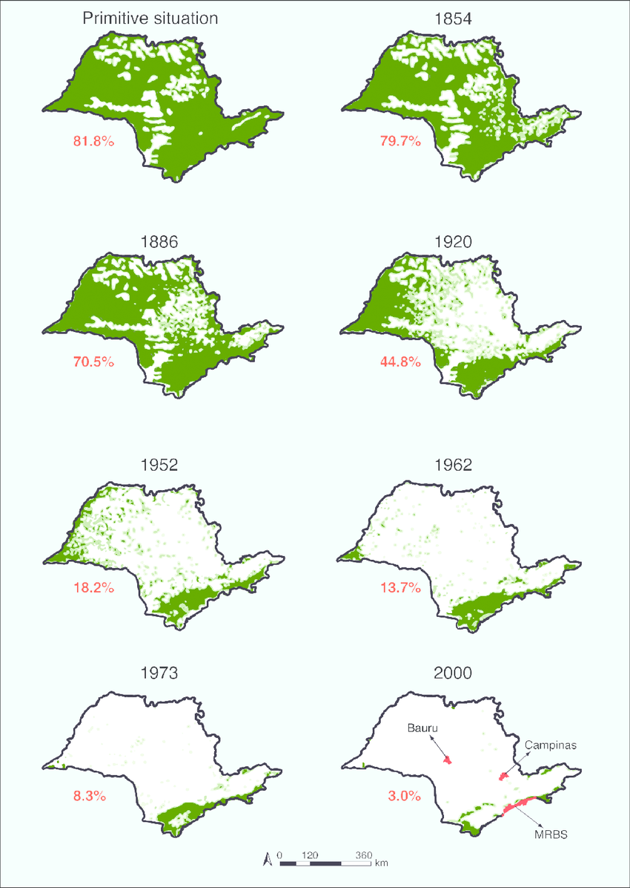{width="45%" fig-align="center"}

------------------------------------------------------------------------

\vspace{.3cm}

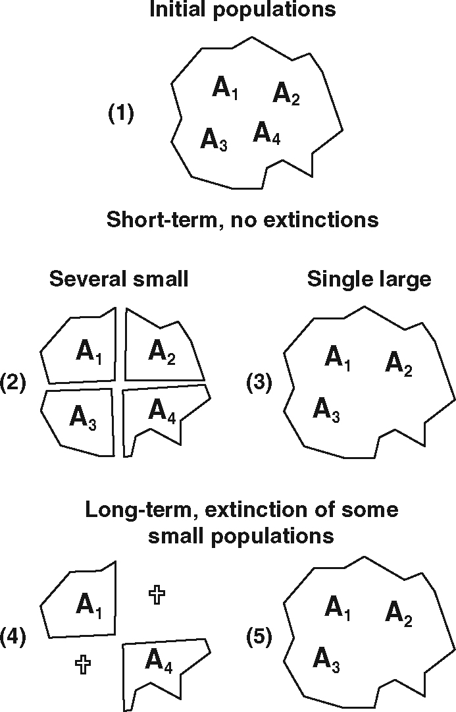{width="40%" fig-align="center"}

------------------------------------------------------------------------

-   Fragmentation happens in two steps:

    1.  Initial genetic subdivision of the population

    2.  Cumulative diversification through genetic drift, selection, inbreeding etc. etc. etc

-   After an initial fragmentation, different fragments will have different initial allele frequencies. This diversification can be described by the binomial sampling variance ($\sigma_p^2 = \frac{pq}{2N}$) and the smaller the fragment, the higher the variance

-   The degree of differentiation among fragments can be described by partitioning the overall inbreeding into components within and among populations ($F$ statistics).

-   We will look at some examples on estimating $F$ statistics from genotype data.

## Gene flow

-   What is gene flow?

    -   Movement of alleles between population due to migration.

-   The effects of fragmentation on gene flow depend on:

    -   Number of population fragments

    -   Distribution of population sizes in the fragments

    -   Distance between fragments

    -   Dispersal ability of the species

    -   Migration rates among fragments

    -   Environment of the matrix among fragments

    -   Times since fragmentation and extinction and recolonization rates across fragments

## The black footed rock wallaby

::::: columns
::: {.column width="50%"}
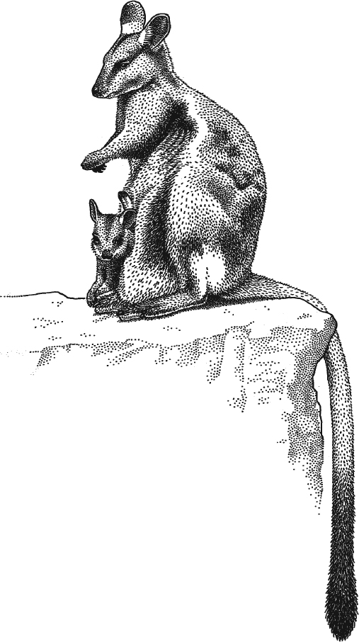{width="20%" fig-align="center"}
:::

::: {.column width="50%"}
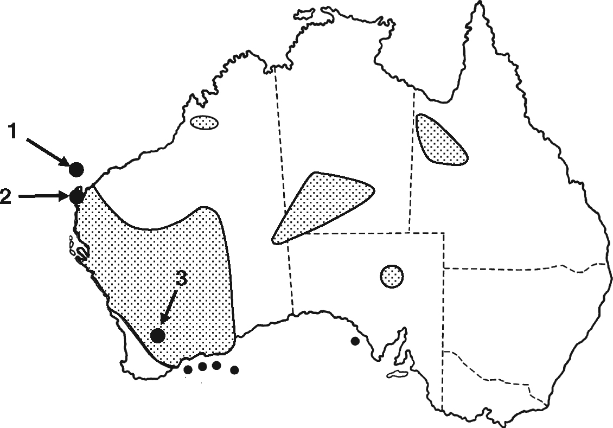{width="50%" fig-align="center"}
:::
:::::

| Location | Prop. of polymorphic loci | Mean \# of alleles | Average heterozygosity |
|------------------|-------------------|------------------|------------------|
| Barrow Island (1) | 0.1 | 1.2 | 0.05 |
| Exmouth (2) | 1.0 | 3.4 | 0.62 |
| Wheatbelt (3) | 1.0 | 4.4 | 0.56 |

-   Data from @Eldridge1999, images after @Frankham2010.

## Example - 1

-   Populations with same allele frequencies. One with random mating the other one with inbreeding.

| Population | $A_1A_1$ | $A_1A_2$ | $A_2A_2$ | Allele Freq | F   | He  |
|------------|----------|----------|----------|-------------|-----|-----|
| 1          | 0.25     | 0.5      | 0.25     | $p=0.5$     | 0   | 0.5 |
|            |          |          |          | $q=0.5$     |     |     |
| 2          | 0.4      | 0.2      | 0.4      | $p=0.5$     | 0.6 | 0.5 |
|            |          |          |          | $q=0.5$     |     |     |

-   $H_O$ observed heterozygosity averaged over all demes.
-   $H_S$ expected heterozygosity averaged over all demes.
-   $H_T$ expected heterozygosity of the metapopulation.
-   $F_{IS} = 1-\frac{H_O}{H_S}$; $F_{IT} = 1-\frac{H_O}{H_T}$; $F_{ST} = 1-\frac{H_S}{H_T}$.

## Example - 2

-   Random mating populations with different allele frequencies

| Population | $A_1A_1$ | $A_1A_2$ | $A_2A_2$ | Allele Freq | F   | He   |
|------------|----------|----------|----------|-------------|-----|------|
| 1          | 0.25     | 0.5      | 0.25     | $p=0.5$     | 0   | 0.5  |
|            |          |          |          | $q=0.5$     |     |      |
| 2          | 0.04     | 0.32     | 0.64     | $p=0.2$     | 0   | 0.32 |
|            |          |          |          | $q=0.8$     |     |      |

-   $H_O$ observed heterozygosity averaged over all demes
-   $H_S$ expected heterozygosity averaged over all demes
-   $H_T$ expected heterozygosity of the metapopulation
-   $F_{IS} = 1-\frac{H_O}{H_S}$; $F_{IT} = 1-\frac{H_O}{H_T}$; $F_{ST} = 1-\frac{H_S}{H_T}$

## Example - 3

-   Populations with different allele frequencies, one random mating and one with inbreeding

| Population | $A_1A_1$ | $A_1A_2$ | $A_2A_2$ | Allele Freq | F   | He   |
|------------|----------|----------|----------|-------------|-----|------|
| 1          | 0.25     | 0.5      | 0.25     | $p=0.5$     | 0   | 0.5  |
|            |          |          |          | $q=0.5$     |     |      |
| 2          | 0.14     | 0.13     | 0.74     | $p=0.2$     | 0.6 | 0.32 |
|            |          |          |          | $q=0.8$     |     |      |

-   $H_O$ observed heterozygosity averaged over all demes
-   $H_S$ expected heterozygosity averaged over all demes
-   $H_T$ expected heterozygosity of the metapopulation
-   $F_{IS} = 1-\frac{H_O}{H_S}$; $F_{IT} = 1-\frac{H_O}{H_T}$; $F_{ST} = 1-\frac{H_S}{H_T}$

## Patterns of $F_{ST}$

![$F_{ST}$ increases over generations in fragmented populations at a rate inversely dependent on population size. Values that are $\ge 0.15$ indicate significant differentiation between fragments [@Frankham2010].](./class_13_15.jpg){fig-align="center"}

## Migration and gene flow

-   Migration reduces the impact of fragmentation in a way that is dependent on the rate of gene flow

-   When is gene flow sufficiently high to prevent the genetic impact of fragmentation?

::::: columns
::: {.column width="50%"}
-   A single migrant per generation is considered sufficient to prevent differentiation between demes
-   The migration rate $m$ is the proportion of genes in a population derived from migrants per generation
-   $Nm$ is the number of migrants per generation [@Frankham2010]
:::

::: {.column width="50%"}
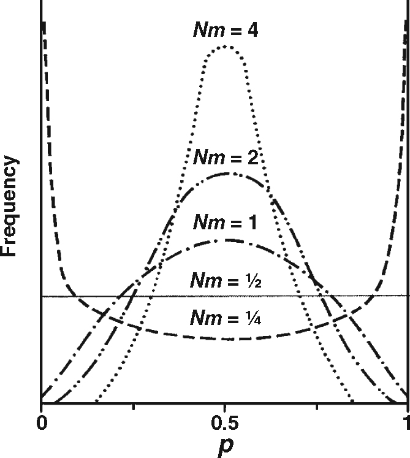{width="75%" fig-align="center"}
:::
:::::

## References {.allowframebreaks}
