```{r setup, include=FALSE}
knitr::opts_chunk$set(echo = TRUE)
x <- c("DT", "tidyverse", "RColorBrewer", "learnPopGen")
lapply(x, require, character.only = T)
rm(x)
```

## Inbreeding

-   Inbreeding is defined as the mating between related individuals

-   When two related individuals produce an offspring, that individual can receive two alleles that are identical by descent, i.e. they can be homozygous by descent (sometimes termed autozygous)

{width="85%" fig-align="center"}

------------------------------------------------------------------------

-   Can inbreeding happen when individuals are mating at random?

. . .

-   Imagine the case of small populations. In the case of a population with 10 breeders, after a few generations the most distantly related individuals will be cousins, and even if the population mates at random, individuals will be highly inbred

-   This has been called inbreeding effect of small populations [@Crow1970]

-   So, we can consider an individual inbred if its parents share a common ancestor and its genes (one, two, or big chunks of the genome) are Identical by Descent (IBD)

------------------------------------------------------------------------

-   What we know from studying evolution and from the examples on the colaescence theory is that eventually all parents of an individual share a common ancestor

-   We must, therefore, define inbreeding relative to some “base” population in which we assume all individuals are unrelated to one another [@Allendorf2022]

-   The concept of inbreeding is relatively easy to understand, but can also be confusing as the same term is associated with different phenomena (gentic drift, non random mating within populations, increase in genome wide homozygosity)

------------------------------------------------------------------------

-   All these concepts are measured by the same quantity, inbreeding coefficients [@Templeton1994], and all these concepts can, to certain degree, be used interchangeably as they all refer to a situation in which relatives mate with each other [@Keller2002a]

-   As inbred individuals receive two copies of the same allele from its parents, they will present higher homozygosity and lower heterozygosity throughout the entire genome

-   We can, then, define the inbreeding coefficient ($F$) as that proportion of the genome in an individual that is IBD (sometime an alternative word is used, i.e., autozygous)

-   The alternative to IBD is IBS (Identical by State), which means that an individual possesses two alleles that are descendant from different ancestral alleles in the base population

------------------------------------------------------------------------

\vspace{.5cm}

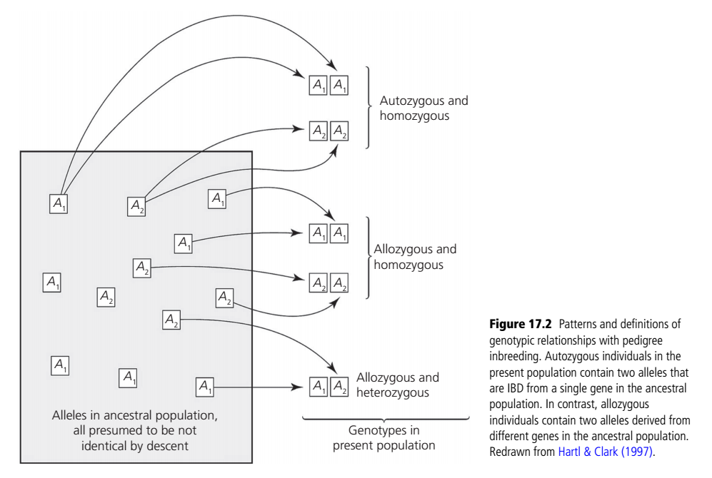{width="85%" fig-align="center"}

## The pedigree inbreeding coefficient

-   The pedigree inbreeding coefficient ($F_{P}$) refers to the expected increase in homozigosity of the inbred individual relative to the population founders or founder

-   The value ranges from 0 (indicating no inbreeding) to 1 (indicating completely inbred)

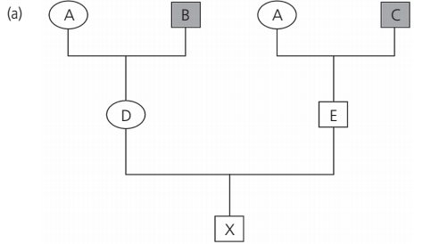{width="45%" fig-align="center"}

------------------------------------------------------------------------

\vspace{.5cm}

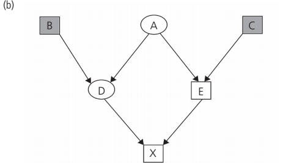{width="90%" fig-align="center"}

------------------------------------------------------------------------

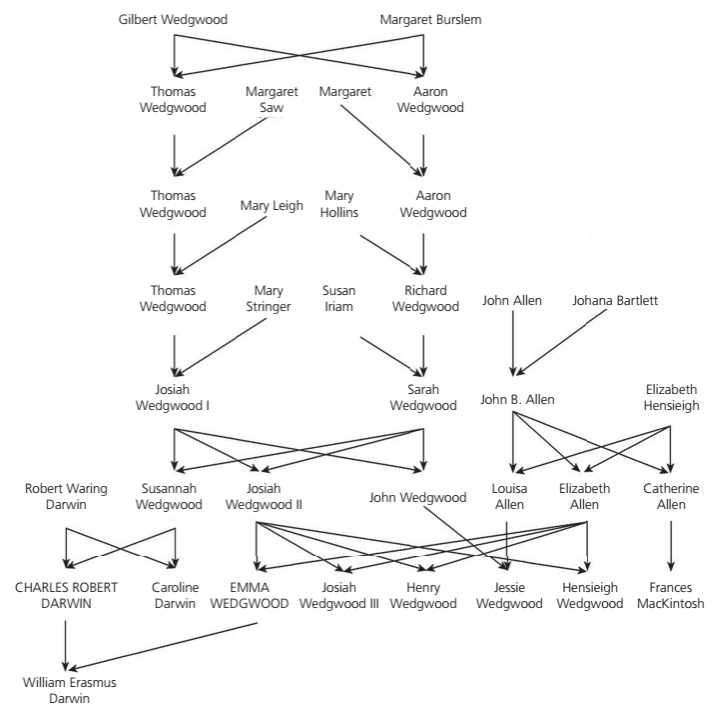{width="70%" fig-align="center"}

## How to estimate pedigree?

1.  Draw the pedigree as shown in previous figure where each individual appears only one

2.  Identify the ancestors of the male and female that generated X. If the father and the mother share no ancestors $F_{P} = 0$

3.  Trace all of the paths that lead from one of X’s parents, through the common ancestor, and then back again to the other parent of X (in our example there is only one path: from D to A and from A to E. The notation to indicate such path is DAE)

4.  Determine $N$, the number of individuals in the path, excluding our target individual X. In our case $N = 3$

------------------------------------------------------------------------

5.  With a single path we can use

$$
\label{fp1}
\tag{9.1}
F_{P} = (\frac{1}{2})^N (1 + F_{P(CA)})
$$

with $F_{P(CA)}$ is the pedigree inbreeding coefficient of the common ancestor

6.  If there is more than just one path, $F_{P}$ becomes the sum of all $F_{P}$ values obtained from each single paths

$$
\label{fp2}
\tag{9.2}
F_{P} = \sum[(\frac{1}{2})^N (1 + F_{P(CA)})]
$$

------------------------------------------------------------------------

-   So, in our previous example, taken from Allendorf et al. (2022), we can use equation 7.1 and the estimated inbreeding coefficient is

$$
F_{P(X)} = (\frac{1}{2})^3 (1 + 0) = 0.125
$$

-   We can read this result in two complementary ways:

    1.  Individual X is expected to have $12.5%$ of his genes IBD

    2.  X is expected to have its heterozygosity reduced by $12.5%$ compared to the ancestral population

------------------------------------------------------------------------

\vspace{.5cm}

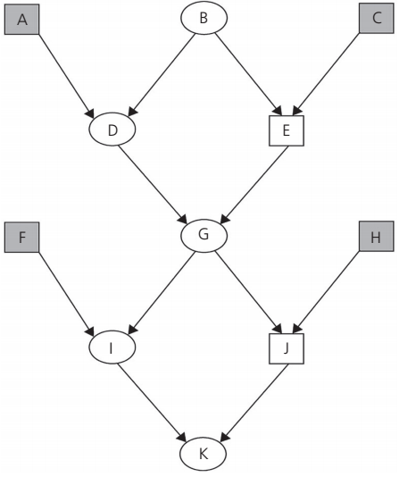{width="50%" fig-align="center"}

------------------------------------------------------------------------

-   There is one loop that contains a common ancestor of both parents of K (IGJ). Therefore, using equation $F_{P(K)} = (\frac{1}{2})^3 (1 + F_{P(G)})$

-   Individual G is also inbred; there is one loop with three individuals through a common ancestor for individual G (DBE). Therefore, $F_{P(K)} = (\frac{1}{2})^3 (1 + F_{P(B)})$. Individual B is not inbred ($F_{P(K)} = 0$) since she is a founder in this pedigree

-   Solving the equations: $F_{P(G)} = 0.125$, and $F_{P(K)} = (\frac{1}{2})^3 (1.125)$

------------------------------------------------------------------------

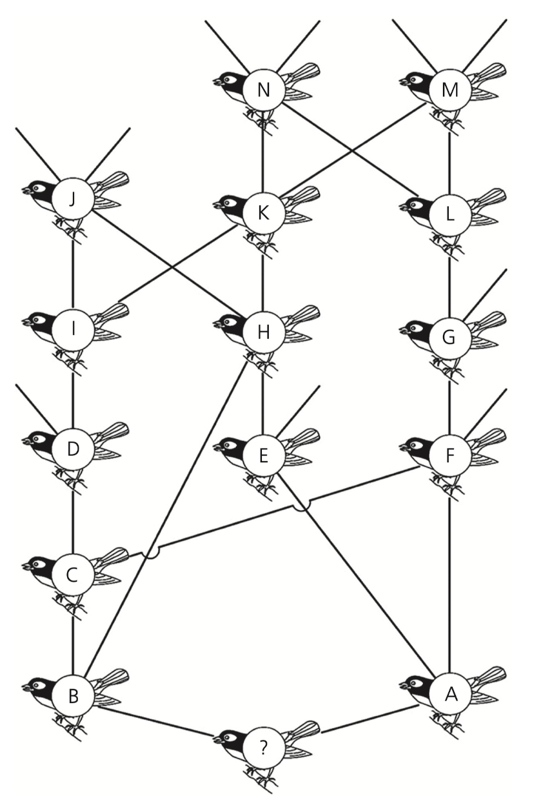{width="40%" fig-align="center"}

------------------------------------------------------------------------

\vspace{.5cm}

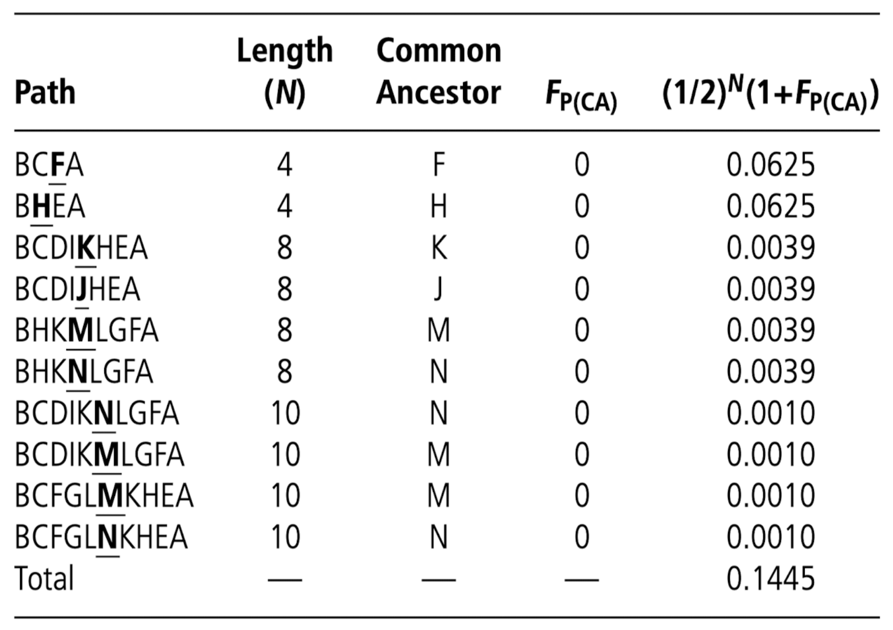{width="70%" fig-align="center"}

------------------------------------------------------------------------

-   Two major short comings while using $F_P$:

    1.  It does not account for the inbreeding level of individuals that are not included in the reference pedigree

    2.  This metric is sub-optimal to obtain an accurate estimate of the proportion of the genome that is IBD, because there is a much variation in the proportion of genes that are IBD imputable to chance alone

-   In general, it is often very complicated to obtain accurate pedigrees for natural populations, and while this approach is still massively used in all species for which we can maintain appropriate pedigree databases, coefficient of inbreeding in wild animals is often obtained through the analysis of molecular markers

------------------------------------------------------------------------

-   Molecular marker-based measures of $F$ range from simple estimates of individual heterozygosity to more advanced methods that use mapped loci to estimate $F$ via identification of IBD chromosome segments as stretches of homozygous genotypes at mapped single nucleotide polymorphisms [@Allendorf2022, pg. 381]

------------------------------------------------------------------------

## Inbreeding coefficient using unmapped loci

-   Estimates of $F$ based on individual heterozygosity rely on the concept that individuals whose parents are more closely related will have lower heterozygosity on average across the genome due to the presence of IBD chromosome segments

::::: columns
::: {.column width="50%"}
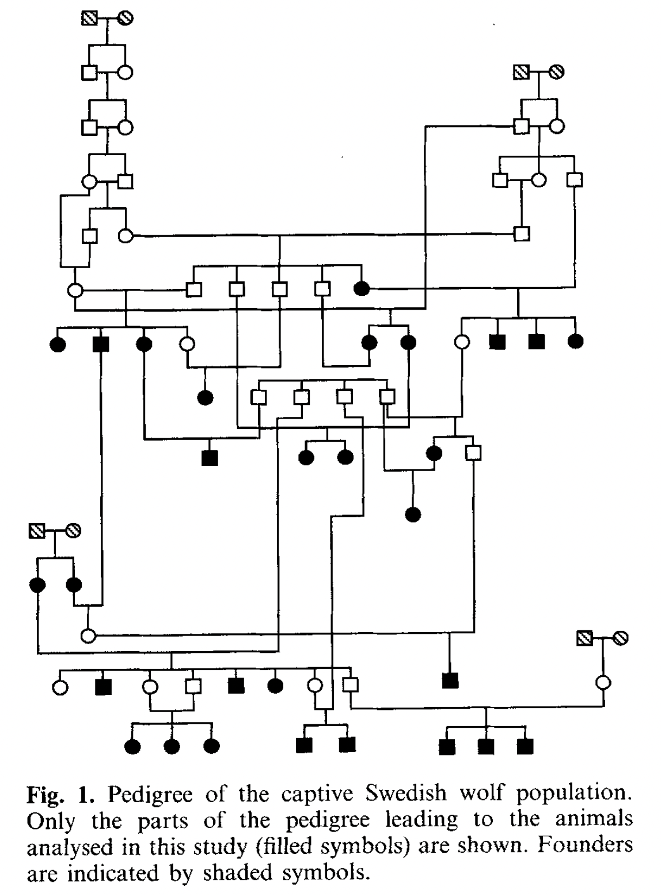{width="50%"}
:::

::: {.column width="50%"}
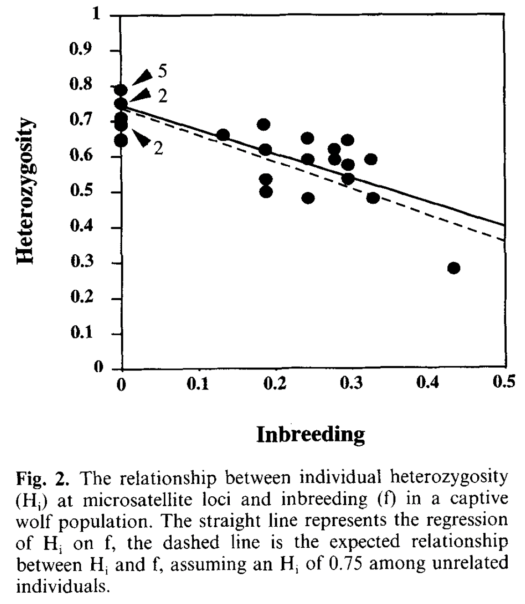{width="60%"}
:::
:::::

## Heterozygosity inbreeding

-   The availability of thousands of genetic markers or more now makes it possible to use this approach in many taxa

-   $F_H$ measures the excess in the observed number of homozygous genotypes within an individual relative to the mean number of homozygous genotypes expected under random mating

$$
\label{fh}
\tag{9.3}
F_H = \frac{O(Hom)-E(Hom)}{L-E(Hom)}
$$

------------------------------------------------------------------------

-   Where $O(Hom)$ and $E(Hom)$ are the observed and expected Hardy–Weinberg (HW) numbers of homozygous loci in an individual and $L$ is the number of loci examined

-   The average $O(Hom)$ is expected to equal $E(Hom)$ in random mating populations. $F_H$ can thus be negative when the parents are less related than expected with random mating

## Inbreeding coefficient using mapped loci

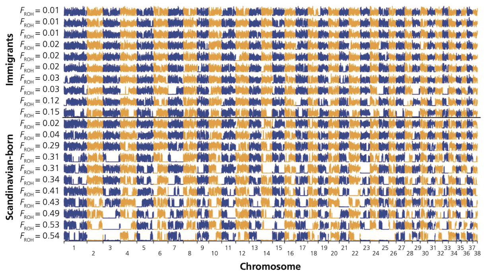{width="80%" fig-align="center"}

## Inbreeding depression

-   Inbred individuals generally have reduced fitness in comparison to non-inbred individuals from the same population because of their increased homozygosity

-   Inbreeding depression is the reduction in fitness (or phenotype value) of progeny from matings between related individuals relative to the fitness of progeny between unrelated individuals

-   Inbreeding depression in natural populations contributes to the extinction of populations under some circumstances [@Allendorf2022]

-   The importance of inbreeding depression has been debated since the time of Darwin. Even today, the importance of inbreeding depression is sometimes questioned by some conservationists and policy-makers

## A common garden example

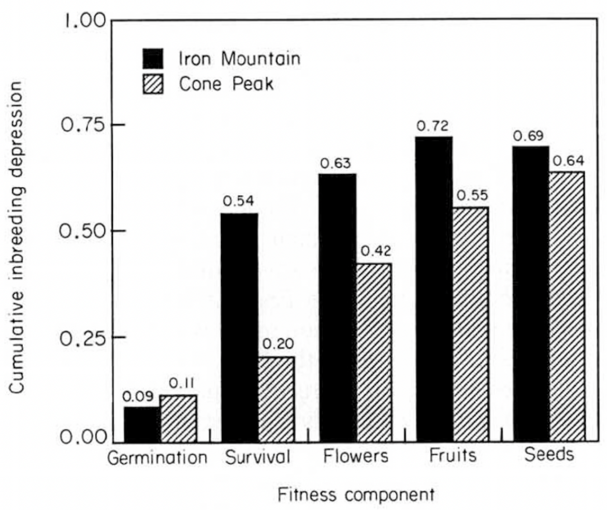{width="70%" fig-align="center"}

## An example from a zoo population

](./callimico.png){width="80%" fig-align="center"}

------------------------------------------------------------------------

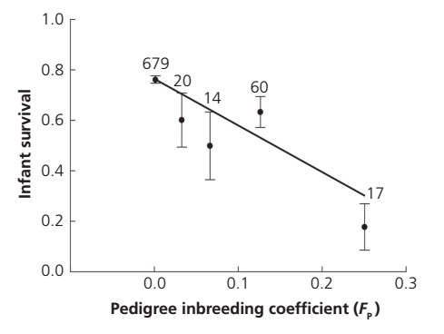{width="70%" fig-align="center"}

------------------------------------------------------------------------

::::: columns
::: {.column width="50%"}
](./class_10_9.jpg){width="60%" fig-align="center"}
:::

::: {.column width="50%"}
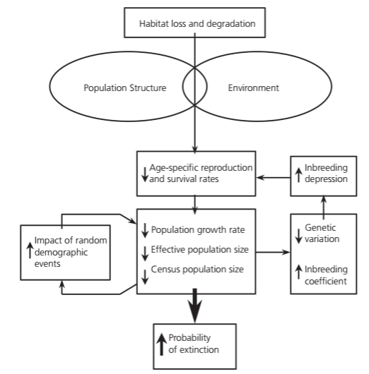{width="60%" fig-align="center"}
:::
:::::

------------------------------------------------------------------------

-   Inbreeding depression can result from either increased homozygosity or reduced heterozygosity

-   Aren't increased homozygosity or reduced heterozygosity two sides of the same coin?

-   Yes, but the mechanism related to a fitness reduction is distinct! Increased homozygosity leads to expression of a greater number of deleterious recessive alleles in inbred individuals, thereby lowering their fitness. Reduced heterozygosity reduces fitness of inbred individuals at loci where the heterozygotes have a selective advantage over homozygotes (heterozygous advantage or overdominance)

-   Most evidence show support for the primary problem of inbreeding depression is increased homozygosity [@Allendorf2022]

## Different mechanisms of fitness reduction

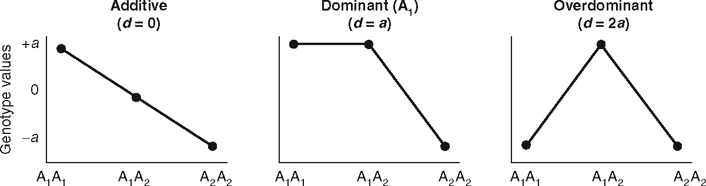

-   It is crucial to know the mechanisms causing inbreeding depression because it affects the ability of a population to "adapt" to inbreeding

-   A population could adapt to inbreeding if inbreeding depression is caused by deleterious recessive alleles that potentially could be removed (purged by selection)

------------------------------------------------------------------------

-   However, inbreeding depression caused by heterozygous advantage cannot be purged because overdominant loci will always suffer reduced fitness as homozygosity increases due to increased inbreeding [@Allendorf2022]

-   Deleterious recessive alleles are present in the genome of all species because they are continually introduced by mutation, and natural selection is inefficient at removing them because most copies are "hidden" phenotypically in heterozygotes that do not have reduced fitness [@Allendorf2022]

-   We, therefore, expect all species to show some inbreeding depression due to the increase in homozygosity of recessive deleterious alleles

------------------------------------------------------------------------

-   The effects of inbreeding depression on survival are often measured by the mean number of lethal equivalents (LEs) per diploid genome

-   A lethal equivalent is a set of deleterious alleles that would cause death if homozygous

-   One lethal equivalent may be a single allele that is lethal when homozygous, two alleles each with a probability of 0.5 of causing death when homozygous, or 10 alleles each with a probability of 0.10 of causing death when homozygous

------------------------------------------------------------------------

-   The number of LEs present in a species or population is generally estimated by regressing survival on the inbreeding coefficient

-   The effects of inbreeding on the probability of survival, S, can be expressed as a function of $F_P$ following @Morton1956

$$
\label{le}
\tag{9.4}
S = e^{-(A+BF_P)}
$$

where $e^{-A}$ is survival in an outbred population, and B is the inbreeding load.

------------------------------------------------------------------------

{width="60%" fig-align="center"}

------------------------------------------------------------------------

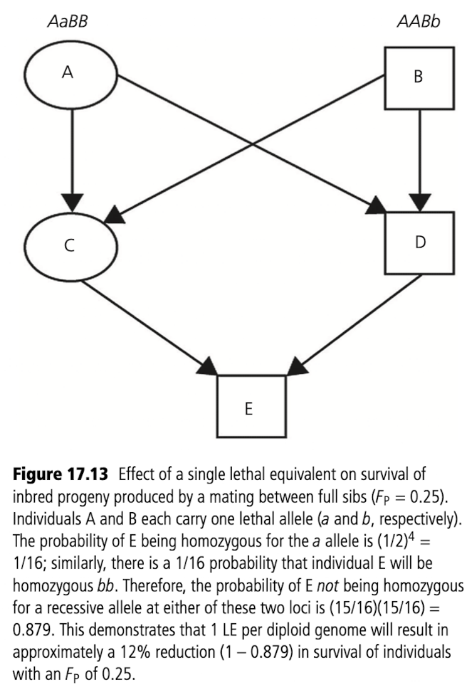{width="45%" fig-align="center"}

## The concept of genetic load

-   Genetic load is the relative difference in fitness between the theoretically fittest genotype within a population and the average genotype in that population.

-   The term load was first used by @Muller1950 in his consideration of the possible effects of increased mutation rates because of nuclear weapons

    1.  Mutation load: The decrease in fitness caused by the accumulation of deleterious mutations
    2.  Segregation load: The decrease in fitness caused by heterozygous advantage
    3.  Drift load: The decrease in fitness caused by the increase in frequency of deleterious alleles resulting from genetic drift
    4.  Migration load: The reduction in fitness caused by the migration into a population of individuals that are less adapted to the local environment than native individuals

## References {.allowframebreaks}
