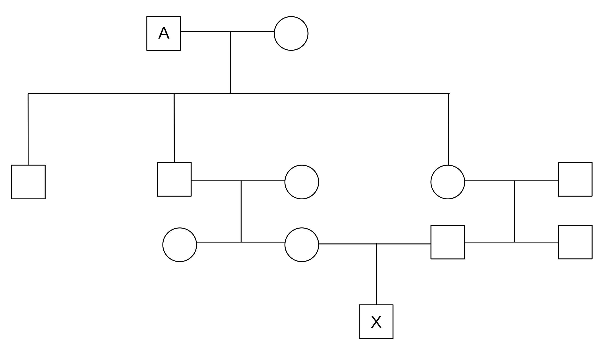

```{r setup, include=FALSE}
knitr::opts_chunk$set(echo = TRUE)
x <- c("dplyr", "kableExtra", "lubridate",
       "raster", "reshape2", "readxl", "rgdal",
       "sf", "sp", "terra", "tidyverse")
lapply(x, require, character.only = T)
rm(x)
```

Name:

Cognome:

Il compito è composto da 18 quesiti. Ogni risposta esatta vale 2 punti. Risposte parzialmente corrette varranno progressivamente meno fino a 0 in caso di risposta completamente errata. Per ottenere la lode è necessario totalizzare 36 punti. La/il candidata/o ha a disposizione 2 ore per completare tutti gli esercizi. Tutti i fogli di calcolo e di brutta dovranno essere firmati e consegnati insieme al foglio del compito.

### 1. Calcolare quale dei seguenti siti presenta maggiore diversità $\alpha$

```{r alphaExc, echo=FALSE, eval=TRUE, warning=FALSE, message=FALSE}
library(vegan)
data(BCI)
plantDivExcercise <- BCI[c(1,2,13,17), 
                         c(144, 186, 208, 216, 223, 195)]
species_names <- rep(NA, ncol(plantDivExcercise))
for (i in 1:ncol(plantDivExcercise)){
  species_names[i] <- paste("Sp_", i, sep = "")
}
names(plantDivExcercise) <- species_names
Site <-  1:4
plantDivExcercise <- cbind(Site, plantDivExcercise)
#print(plantDivExcercise, row.names = F)
knitr::kable(plantDivExcercise, 
             row.names = FALSE,
             format = "latex",
             longtable = T,
             linesep = "",
             booktabs = TRUE) %>% 
  kableExtra::kable_styling(latex_options = c("striped", "hold_position", "scale_down"))

#diversity(plantDivExcercise)[diversity(plantDivExcercise)
#                             [] == max(diversity(plantDivExcercise))]
```


<!-- The correct answer to the question is site 1 -->

### 2. In base alle approssimazioni fatte in classe, quale delle seguenti affermazioni è corretta?

a. La maggior parte delle estinzioni è avvenuta durante gli eventi di estinzioni di massa (sia quelli passati che quello che stiamo vivendo oggi)
b. La maggior parte delle specie mai esistite è oggi estinta
c. Il tasso di estinzione di background e il tasso di estinzione attuale sono praticamente identici
d. Il processo di estinzione è un fenomeno guidato solo dalle attività antropiche e dovrebbe essere evitato a tutti i costi

<!-- The correct answer to the question is b -->

### 3. Il valore della statistica $F_{ST}$ varia tra

a. 0 e 1
b. 0 e 10
c. -1 e 0
d. -1 e 1

<!-- The correct answer to the question is a -->

### 4. Che cosa è la biologia della conservazione?

\vspace{3cm}

### 5. Un gruppo di ricercatori vuole stimare la popolazione di un roditore notturno. Durante la prima visita di campionamento vengono catturati e marcati 26 individui. Durante la successiva visita di campionamento vengono catturati 21 individui in totale, di cui 13 marcati nella visita precedente. Applica il metodo di Lincoln Petersen per stimare N.

\vspace{3cm}

<!-- The correct answer to the question is (26*21)/13 = 42 -->


### 6. Dagli inizi del 1900 sono state descritte circa 432 specie di insetti che collettivamente cumulano circa 63200 anni-specie. Dalla loro descrizione, 16 sono andate estinte. Calcolare il tasso di estinzione di questo gruppo.


<!-- The correct answer to the question is x = (16/63200)*10^6 = 253.165   -->

\vspace{3cm}

### 7. Descrivere il modello di Hardy-Weinberg, gli assunti su cui si basa e a che cosa serve.

\newpage

### 8. Quali dei seguenti termini indica un individuo omozigote con alleli identici per stato?

a. Eterozigote
b. Autozigote
c. Allozigote
d. Protozigote

<!-- The correct answer to the question is c  -->

### 9. Se un individuo con genotipo A1A2 si riproduce per autofecondazione e produce 8 individui, qual'è la probabilità che l'allele A1 sia assente dalla progenie prodotta?

<!-- to remove scientific notation use options(scipen = 999), to enable it again 
use options(scipen = 0) -->
<!-- The correct answer to the question is 0.5^16 = 0.00001  -->

\vspace{3cm}

### 10. Che cosa indichiamo con i termini "depressione da inincrocio" e "carico genetico"? 

\vspace{3cm}

### 11. Quanti individui sono necessari per mantenere la popolazione di papere di un lago ad un livello di eterozigosi di 0.015 dopo 38 generazioni considerando un livello di eterozigosi iniziale di 0.02.

<!-- The correct answer to the question is 0.015 = 0.02*(1-1/2N)^38  -->
<!-- 

divide everything by 0.02.....    0.75 = (1-1/2N)^38
remove exponent.....            ln(0.75) = 38 * ln(1-1/2N)
....                            -0.288 = 38 * ln(1-1/2N)
....                            ln(1-1/2N) = -0.288/38
....                            ln(1-1/2N) = -0.007
....                            1-1/2N = exp(-0.007)
....                            1-1/2N = 0.993
....                            1/2N = 1-0.993
....                            1/2N = 0.007
....                            2N = 1/0.007
....                            N = 142.85/2 = 71.425

-->


\vspace{3cm}

### 12. Quali delle seguenti affermazioni è corretta:

a. Il modello di crescita esponenziale tiene conto dell'ecologia della specie
b. Il modello di crescita esponenziale non tiene conto dell'ecologia della specie
c. Il modello di crescita esponenziale alcune volte tiene conto dell'ecologia della popolazione
d. Il modello di crescita esponenziale è migliore di quello logistico


<!-- The correct answer to the question is b  -->

\newpage

### 13. Calcolare i valori di $H_O$, $H_S$ e $H_T$ a partire dai dati presentati nella seguente tabella.

```{r fstatexc, echo=FALSE, eval=TRUE, warning=FALSE, message=FALSE}
fstexc <- data.frame(Pop = c(1,2,3),
                     A1A1 = c(0.32, 0.04, 0.67),
                     A1A2 = c(0.46, 0.32, 0.083),
                     A2A2 = c(0.22, 0.64, 0.413),
                     Freq.A1 = c(0.7, 0.2, 0.6),
                     Freq.A2 = c(0.3, 0.8, 0.4))

knitr::kable(fstexc, 
             row.names = FALSE,
             format = "latex",
             longtable = T,
             linesep = "",
             booktabs = TRUE) %>% 
  kableExtra::kable_styling(latex_options = c("striped", "hold_position", "scale_down"))
```


<!-- The correct answer to the question is 

Ho = Observed H averaged over all demes = (0.46 + 0.32 + 0.083)/3 = 0.288
Hs = Expected H averaged over all demes = ((2*.7*.3) + (2*.2*.8) + (2*.6*.4))/3 = 0.407
Ht = Expected H of the metapopulation = ((0.7+0.2+0.6)/3) * ((0.3 + 0.8 + 0.4)/3) * 2 = 0.5

-->


### 14. Con i valori ottenuti dallo svolgimento del precedente esercizio calcolare il valore di $F_{ST}$ tra le popolazioni


<!-- The correct answer to the question is 

Fst = 1-Hs/Ht = 1 - (0.407/0.5) = 0.186

-->


\vspace{3cm}

### 15. Quale delle seguenti opzioni rappresenta alcune delle fasi dell'invasione riuscita di una specie?

a. Introduction, Establishment, Dispersal, Extinction
b. Introduction, Dispersal, Gene Flow, Competition
c. Introduction, Establishment, Dispersal, Adaptation 
d. Introduction, Competition, Dispersal, Adaptation

<!-- The correct answer to the question is 

c

-->

### 16. In una popolazione di insetti viene campionato il numero di individui in 4 occasioni successive e vengono registrati i seguenti valori: 120000, 150, 160000, 90. Come possiamo usare questi dati per stimare la dimensione effettive di popolazione?

<!-- The correct answer to the question is 

N = 4/(1/120000 + 1/150 + 1/160000 + 1/90) = 

-->


\vspace{3cm}

### 17. Qauli, tra le seguenti opzioni, è una importante misura usata dai biologi della conservazione?

a. $\frac{N}{N_e}$
b. $N_e * N$
c. $N_e^N$
d. $\frac{N_e}{N}$

<!-- The correct answer to the question is 

e

-->

### 18. Calcolare il coefficiente di inbreeding dell'individuo X a partire dal seguente grafico e considerando che $F_{P(A)} = 0.08$



<!-- The correct answer to the question is 

((1/2)^5 * 1.08) + (1/2)^5 = 0.0675

-->

